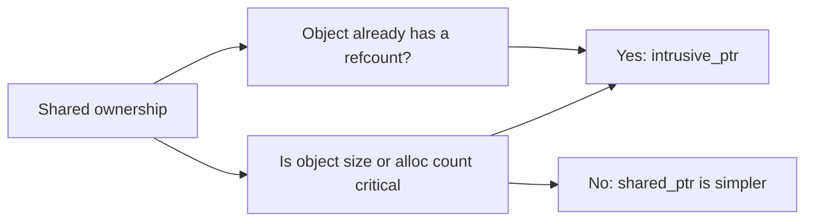

# boost::intrusive_ptr

`boost::intrusive_ptr<T>` is a reference-counting smart pointer that keeps the count **inside the
managed object** rather than in a separate control block. The pointer itself is just one machine word,
and grabbing or releasing a reference costs nothing more than an integer increment on memory you were
already touching.

:::info Intrusive vs non-intrusive
[`shared_ptr`](./shared-ptr.md) is *non-intrusive*: it allocates a control block beside the object.
`intrusive_ptr` is *intrusive*: the count is a member of the object, so there is no extra allocation
and `sizeof(intrusive_ptr<T>) == sizeof(T*)`.
:::

## The two hooks you must provide

`intrusive_ptr` does not know how to change your object's count, so you supply two free functions in
the object's namespace. The library calls them via argument-dependent lookup:

```cpp showLineNumbers title="intrusive_basics.cpp"
#include <boost/intrusive_ptr.hpp>
#include <atomic>

class Resource {
    std::atomic<int> refs_{0};
    friend void intrusive_ptr_add_ref(Resource* p) { p->refs_.fetch_add(1); }
    friend void intrusive_ptr_release(Resource* p) {
        if (p->refs_.fetch_sub(1) == 1) delete p;
    }
public:
    void use() {}
};

int main() {
    boost::intrusive_ptr<Resource> a(new Resource);  // refs == 1
    boost::intrusive_ptr<Resource> b = a;            // refs == 2
    a->use();
}                                                    // both gone -> delete
```

Boost provides `boost::intrusive_ref_counter` as a ready-made base class that implements both hooks
(in thread-safe or single-threaded flavours) so you rarely write them by hand.

## When it beats shared_ptr



- **Memory-tight code** — millions of small objects, where a 16-byte control block per object is
  unacceptable.
- **Objects that already carry a count** — COM interfaces, many game-engine and scripting objects, or
  C APIs with `AddRef`/`Release`. `intrusive_ptr` adapts to the existing scheme instead of bolting a
  second one on top.
- **Reconstructing a smart pointer from a raw `this`** — because the count lives in the object, you
  can safely create a new `intrusive_ptr` from a raw pointer at any time (unlike `shared_ptr`, which
  would create a second control block).

:::warning No weak_ptr equivalent
Because there is no separate control block, `intrusive_ptr` has **no companion `weak_ptr`**. If you
need non-owning observers that can detect destruction, use [`shared_ptr`/`weak_ptr`](./shared-ptr.md)
instead.
:::

:::danger Mixing raw delete and intrusive_ptr
The object frees itself when the count hits zero. Never `delete` an object that an `intrusive_ptr`
still owns, and never hand the same raw pointer to two independent count schemes.
:::

## See also

- [Smart Pointers Overview](./smart-ptr-overview.md) — the ownership decision guide.
- [boost::shared_ptr and weak_ptr](./shared-ptr.md) — when you need non-owning observers.
- [Boost.Pool](./boost-pool.md) — pairs well for pools of small refcounted objects.
