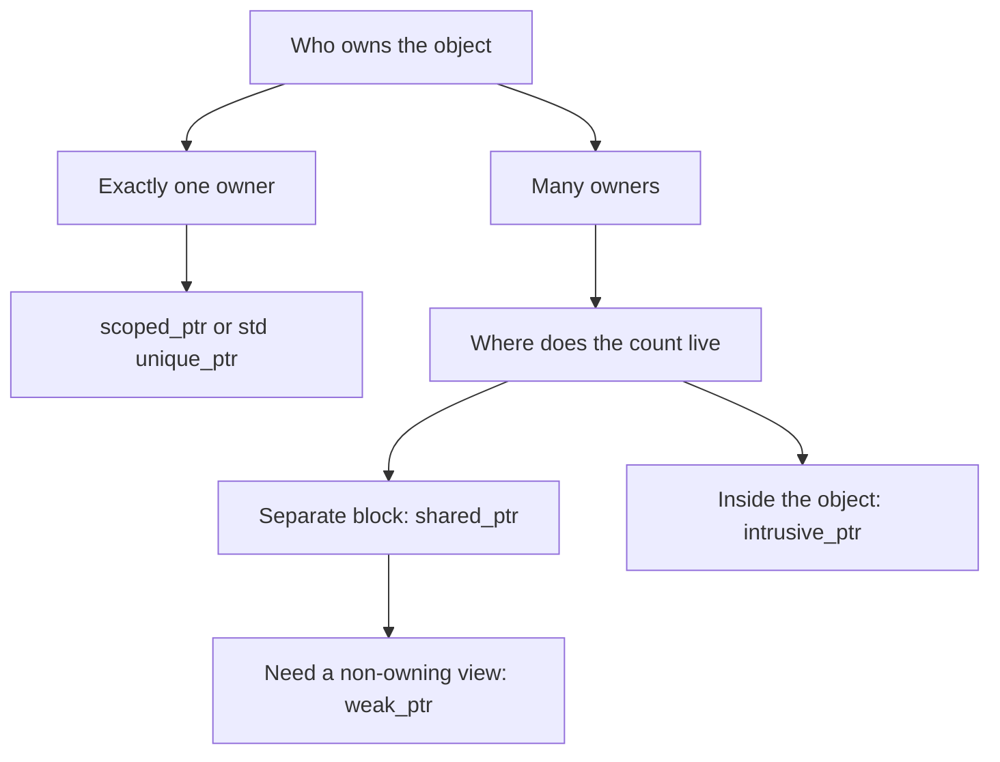

# Smart Pointers Overview

Boost.SmartPtr is where modern C++ ownership semantics were invented. Long before `std::shared_ptr`
and `std::unique_ptr` existed, Boost shipped a family of pointer-like class templates that tie a
raw pointer's lifetime to an object's scope, so memory and other resources are released automatically
and exception-safely. Most of the family was later folded into the standard library — but Boost still
offers a few members `std` never adopted.

:::info The whole family at a glance
`shared_ptr`, `weak_ptr`, `scoped_ptr`, `intrusive_ptr`, plus the array cousins `scoped_array` and
`shared_array`. Each encodes a different *ownership policy* — who owns the object, how many owners
there can be, and where the bookkeeping lives.
:::

## Ownership models

The single most important question a smart pointer answers is **who owns this object**. Boost's
pointers each pick a different answer:

| Pointer | Ownership | Copyable | Overhead | `std` equivalent |
|---------|-----------|----------|----------|------------------|
| `scoped_ptr` | Single, non-transferable | No | None (just a pointer) | `unique_ptr` (movable) |
| `shared_ptr` | Shared, reference-counted | Yes | Separate control block | `std::shared_ptr` |
| `weak_ptr` | Non-owning observer | Yes | Shares control block | `std::weak_ptr` |
| `intrusive_ptr` | Shared, count inside object | Yes | One pointer, no block | none |
| `scoped_array` / `shared_array` | As above, for `T[]` | — | — | `unique_ptr<T[]>` / `shared_ptr<T[]>` |

## Choosing one

- **One owner, lifetime bound to a scope** — reach for [`scoped_ptr`](./scoped-ptr.md), or in modern
  code `std::unique_ptr` (which adds move semantics). See [Boost and the standard](../00-overview/boost-and-the-standard.md).
- **Shared ownership** — [`shared_ptr`](./shared-ptr.md) is the default; use
  [`weak_ptr`](./shared-ptr.md) to break reference cycles and observe without owning.
- **Shared ownership where size or an existing refcount matters** — [`intrusive_ptr`](./intrusive-ptr.md)
  stores the count inside the object, so the pointer is a single machine word with no separate
  allocation.

:::tip Prefer `std` when you can
Since C++11 the standard versions cover the common cases and integrate with the rest of `std`.
Reach for the Boost versions when you need something they add — `intrusive_ptr` (no `std` analogue),
or when you must support a pre-C++11 toolchain.
:::

## Why smart pointers at all

The underlying idea is [RAII](../00-overview/what-is-boost.md): the pointer is an object whose
destructor releases the resource, so cleanup happens on every exit path — normal return, early
return, or a thrown exception — without a single explicit `delete`. This is the same principle that
underpins the rest of Boost's resource-owning types, from
[`Boost.Pool`](./boost-pool.md) allocators to file handles.

## See also

- <Icon icon="lucide:memory-stick" inline /> [boost::shared_ptr and weak_ptr](./shared-ptr.md) — the reference-counted workhorse.
- [boost::intrusive_ptr](./intrusive-ptr.md) — shared ownership with the count inside the object.
- [boost::scoped_ptr](./scoped-ptr.md) — the simplest single-owner pointer.
- [Boost and the C++ Standard](../00-overview/boost-and-the-standard.md) — how this family became `std`.
