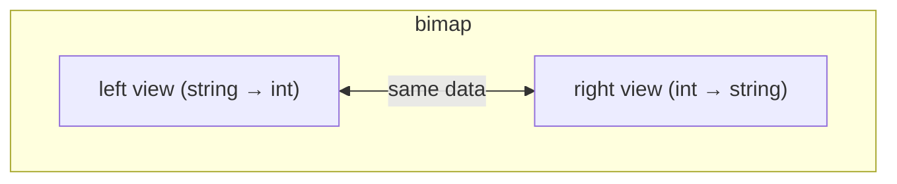

# Boost.Bimap

`boost::bimap` is a **bidirectional map** — a container where **both sides are keys**. Given a
mapping `A <-> B`, you can efficiently look up `B` from `A` *and* `A` from `B`. Internally it is
built on top of [Boost.MultiIndex](./boost-multi-index.md), but it exposes a much simpler,
map-like interface tuned for the two-key use case.

:::info The problem it solves
You have a one-to-one mapping (country codes to country names, enum values to strings, user IDs to
usernames) and need to search in both directions. The usual workaround — maintaining two
`std::map`s that mirror each other — is tedious, error-prone, and doubles the memory used for keys.
`bimap` stores each pair once and provides two views that behave like standard maps.
:::

## Left and right views

A `bimap` has two views: **left** (keyed by the first type) and **right** (keyed by the second
type). Each view acts like a `std::map`:

```cpp showLineNumbers title="country_codes.cpp"
#include <boost/bimap.hpp>
#include <string>
#include <iostream>

int main() {
    boost::bimap<std::string, int> codes;

    codes.insert({"US", 1});
    codes.insert({"GB", 44});
    codes.insert({"DE", 49});
    codes.insert({"JP", 81});

    // Left view: string -> int  (like a normal map)
    auto it = codes.left.find("DE");
    if (it != codes.left.end())
        std::cout << "DE -> " << it->second << "\n";   // 49

    // Right view: int -> string  (reverse lookup)
    auto rit = codes.right.find(81);
    if (rit != codes.right.end())
        std::cout << "81 -> " << rit->second << "\n";  // JP
}
```



## Collection types

By default both sides are **set-like** (unique keys, ordered). You can change either side to a
different collection type:

| Collection type | Behaviour | Equivalent |
|----------------|-----------|------------|
| `set_of<T>` (default) | ordered, unique | `std::map` side |
| `unordered_set_of<T>` | hashed, unique | `std::unordered_map` side |
| `multiset_of<T>` | ordered, duplicates allowed | `std::multimap` side |
| `list_of<T>` | sequenced, duplicates allowed | unconstrained side |

```cpp showLineNumbers title="multimap_bimap.cpp"
#include <boost/bimap.hpp>
#include <boost/bimap/multiset_of.hpp>
#include <string>

int main() {
    // Many employees can share a department
    boost::bimap<
        boost::bimaps::set_of<int>,           // employee ID — unique
        boost::bimaps::multiset_of<std::string>  // department — not unique
    > emp_dept;

    emp_dept.insert({1, "engineering"});
    emp_dept.insert({2, "engineering"});
    emp_dept.insert({3, "marketing"});

    // All employees in engineering (right view, equal_range)
    auto range = emp_dept.right.equal_range("engineering");
    for (auto it = range.first; it != range.second; ++it) {
        // it->second is the employee ID
        (void)it->second;
    }
}
```

## Tagged access

When both sides have the same type, positional access (`left` / `right`) is confusing. Tags give
each side a meaningful name:

```cpp showLineNumbers title="tagged.cpp"
#include <boost/bimap.hpp>
#include <string>

struct FromLang {};
struct ToLang {};

using TranslationMap = boost::bimap<
    boost::bimaps::tagged<std::string, FromLang>,
    boost::bimaps::tagged<std::string, ToLang>
>;

int main() {
    TranslationMap tm;
    tm.insert(TranslationMap::value_type("hello", "hola"));

    // Access by tag instead of left/right
    auto& by_from = tm.by<FromLang>();
    auto it = by_from.find("hello");
    if (it != by_from.end()) {
        (void)it->get<ToLang>();  // "hola"
    }
}
```

:::tip When bimap is the right choice
Use `bimap` when the mapping is genuinely **bidirectional** — you need to go from A to B and from B
to A with roughly equal frequency. If you only ever look up in one direction, a plain `std::map` is
simpler and sufficient.
:::

## Bimap versus two maps

| Concern | `boost::bimap` | Two `std::map`s |
|---------|---------------|-----------------|
| Consistency | automatic — one insert updates both views | manual — must insert into both maps |
| Memory | single copy of each pair | duplicate keys |
| Erase | single call, both views updated | must erase from both maps |
| Complexity | slightly more verbose type declaration | straightforward but error-prone |

:::warning Duplicates on either side
With the default `set_of` on both sides, inserting a pair whose left **or** right key already exists
will fail silently (returns an iterator to the existing element). If you need duplicates on one
side, switch that side to `multiset_of`.
:::

## See also

- <Icon icon="lucide:layers" inline /> [Boost.MultiIndex](./boost-multi-index.md) — the general engine behind bimap.
- <Icon icon="lucide:boxes" inline /> [Boost.Container](./boost-container.md) — `flat_map` and other extended containers.
- <Icon icon="lucide:puzzle" inline /> [Boost.Optional](../02-core-utilities/boost-optional.md) — handling "maybe no result" from lookups.
- <Icon icon="lucide:book-open" inline /> [Boost overview](../readme.md).
