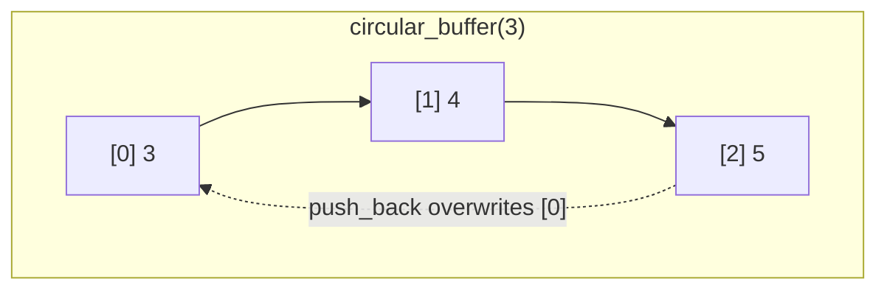

# Boost.CircularBuffer

`boost::circular_buffer<T>` is a **fixed-capacity ring buffer** that provides O(1) insertion and
removal at both ends. When the buffer is full, pushing a new element **overwrites the oldest** — no
reallocation, no shifting, just a modular index advance. This makes it the natural container for
sliding windows, bounded logs, streaming data, and any scenario where you want "the last N items."

:::info The problem it solves
A `std::deque` grows without bound. A `std::vector` with manual index wrapping is error-prone and
re-invents a known data structure. `circular_buffer` encapsulates the ring logic behind a
standard-container interface: random access, iterators, `push_back`, `push_front`, `pop_back`,
`pop_front` — all O(1), all correct, and the capacity is fixed at construction.
:::

## Basic usage

```cpp showLineNumbers title="ring.cpp"
#include <boost/circular_buffer.hpp>
#include <iostream>

int main() {
    boost::circular_buffer<int> cb(3);  // capacity 3

    cb.push_back(1);
    cb.push_back(2);
    cb.push_back(3);
    // buffer: [1, 2, 3]  — full

    cb.push_back(4);
    // buffer: [2, 3, 4]  — 1 was overwritten

    cb.push_back(5);
    // buffer: [3, 4, 5]  — 2 was overwritten

    for (int v : cb)
        std::cout << v << " ";   // prints: 3 4 5
    std::cout << "\n";

    std::cout << "front: " << cb.front() << "\n";  // 3 (oldest)
    std::cout << "back:  " << cb.back()  << "\n";  // 5 (newest)
}
```



## Sliding-window average

A common pattern: keep the last N measurements and compute a rolling statistic.

```cpp showLineNumbers title="sliding_avg.cpp"
#include <boost/circular_buffer.hpp>
#include <numeric>

class SlidingAverage {
    boost::circular_buffer<double> buf_;
public:
    explicit SlidingAverage(std::size_t window) : buf_(window) {}

    void add(double sample) { buf_.push_back(sample); }

    double average() const {
        if (buf_.empty()) return 0.0;
        return std::accumulate(buf_.begin(), buf_.end(), 0.0)
             / static_cast<double>(buf_.size());
    }

    bool full() const { return buf_.full(); }
};

int main() {
    SlidingAverage avg(5);
    for (double v : {1.0, 2.0, 3.0, 4.0, 5.0, 6.0, 7.0})
        avg.add(v);
    // window contains [3, 4, 5, 6, 7], average = 5.0
}
```

## Random access and iterators

`circular_buffer` supports **random-access iterators** and `operator[]`. Iteration always goes from
the logically oldest element to the newest, regardless of the internal head position:

```cpp showLineNumbers title="random_access.cpp"
#include <boost/circular_buffer.hpp>
#include <algorithm>
#include <cassert>

int main() {
    boost::circular_buffer<int> cb(5);
    for (int i = 0; i < 8; ++i)
        cb.push_back(i);   // after loop: [3, 4, 5, 6, 7]

    assert(cb[0] == 3);    // oldest
    assert(cb[4] == 7);    // newest
    assert(cb.size() == 5);

    // standard algorithms work
    auto it = std::find(cb.begin(), cb.end(), 5);
    assert(it != cb.end());
}
```

## push_front — the other end

You can also push to the **front** (overwriting the newest element when full) or pop from either
end:

```cpp showLineNumbers title="deque_ops.cpp"
#include <boost/circular_buffer.hpp>
#include <cassert>

int main() {
    boost::circular_buffer<int> cb(3);
    cb.push_back(1);
    cb.push_back(2);
    cb.push_back(3);   // [1, 2, 3]

    cb.push_front(0);  // overwrites the back: [0, 1, 2]
    assert(cb.front() == 0);
    assert(cb.back()  == 2);

    cb.pop_front();    // [1, 2]
    cb.pop_back();     // [1]
}
```

## Resizing and reserving

You can change the capacity after construction. Increasing capacity never loses data; decreasing
capacity drops the oldest elements that no longer fit:

```cpp showLineNumbers title="resize.cpp"
#include <boost/circular_buffer.hpp>
#include <cassert>

int main() {
    boost::circular_buffer<int> cb(3);
    cb.push_back(1);
    cb.push_back(2);
    cb.push_back(3);

    cb.set_capacity(5);   // [1, 2, 3] — room for 2 more
    cb.push_back(4);
    cb.push_back(5);      // [1, 2, 3, 4, 5]

    cb.set_capacity(2);   // keeps the newest 2: [4, 5]
    assert(cb.size() == 2);
}
```

:::tip When to use circular_buffer
- **Bounded logs** — keep the last N events without unbounded growth.
- **Sliding windows** — rolling averages, medians, or any windowed computation.
- **Producer/consumer queues** — fixed-size buffer between threads (combine with your own locking).
- **Audio / signal processing** — delay lines, sample history buffers.
:::

:::warning Not thread-safe by default
`circular_buffer` has no internal synchronisation. If one thread writes while another reads, you
must protect the buffer with a mutex or other synchronisation mechanism. For a lock-free
single-producer / single-consumer queue, see
[Boost.Lockfree](../09-concurrency-and-async/boost-lockfree.md).
:::

## circular_buffer versus alternatives

| Container | Capacity | Overwrites oldest | Random access | Push/pop both ends |
|-----------|----------|-------------------|---------------|-------------------|
| `circular_buffer` | fixed | yes | O(1) | O(1) |
| `std::deque` | unbounded | no | O(1) | O(1) amortised |
| `std::vector` + manual wrap | manual | manual | O(1) | manual |
| `std::queue` | unbounded | no | no | push back / pop front |

## See also

- <Icon icon="lucide:boxes" inline /> [Boost.Container](./boost-container.md) — `static_vector`, `small_vector`, and other fixed/bounded containers.
- <Icon icon="lucide:zap" inline /> [Boost.Lockfree](../09-concurrency-and-async/boost-lockfree.md) — lock-free queues for concurrent producers and consumers.
- <Icon icon="lucide:book-open" inline /> [Boost overview](../readme.md).
