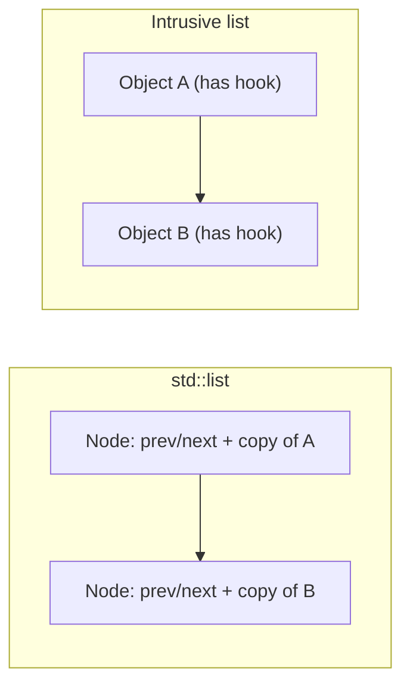

# Boost.Intrusive

`Boost.Intrusive` provides **containers where the link/hook metadata lives inside the elements
themselves** rather than in separately allocated nodes. This means zero per-element heap allocations,
better cache locality, and the ability to place a single object in **multiple containers
simultaneously** — something no standard container can do.

:::info The problem it solves
Standard containers own their elements: inserting into a `std::list` copies or moves the object into
a heap-allocated node. This has three costs — the allocation itself, the extra indirection on
traversal, and the fact that an object can only live in one container at a time. Intrusive containers
flip the model: *you* own the objects and manage their lifetime; the container merely links them
together through embedded hooks.
:::

## Intrusive versus standard containers



| Property | `std::list<T>` | `boost::intrusive::list<T>` |
|----------|---------------|-----------------------------|
| Element ownership | container owns copies | user owns objects |
| Heap allocs per insert | 1 node allocation | 0 |
| Object in multiple containers | no | yes (multiple hooks) |
| Cache locality | poor (scattered nodes) | depends on user allocation |
| Iterator invalidation on move | iterators stay valid | same |
| Container destruction | destroys elements | does **not** destroy elements |

## Defining an intrusive list

The simplest approach is to inherit from a hook base class:

```cpp showLineNumbers title="intrusive_list.cpp"
#include <boost/intrusive/list.hpp>
#include <iostream>
#include <string>

namespace bi = boost::intrusive;

struct Task : public bi::list_base_hook<> {
    int         id;
    std::string name;
    Task(int i, std::string n) : id(i), name(std::move(n)) {}
};

int main() {
    Task t1(1, "compile"), t2(2, "link"), t3(3, "run");

    bi::list<Task> pipeline;
    pipeline.push_back(t1);
    pipeline.push_back(t2);
    pipeline.push_back(t3);

    for (auto& task : pipeline)
        std::cout << task.id << ": " << task.name << "\n";

    pipeline.clear();  // unlinks — does NOT delete the Task objects
}
```

:::danger The container does not own the elements
When an intrusive container is destroyed or cleared, it **unlinks** elements but does **not** free
them. If your objects are heap-allocated, you must delete them yourself. Destroying an object that
is still linked into a container is undefined behaviour.
:::

## Member hooks — no inheritance required

If you cannot (or prefer not to) inherit from a hook, embed the hook as a data member:

```cpp showLineNumbers title="member_hook.cpp"
#include <boost/intrusive/list.hpp>

namespace bi = boost::intrusive;

struct Sensor {
    int    id;
    double reading;
    bi::list_member_hook<> hook;
};

using SensorList = bi::list<
    Sensor,
    bi::member_hook<Sensor, bi::list_member_hook<>, &Sensor::hook>
>;

int main() {
    Sensor s1{1, 23.5, {}}, s2{2, 18.0, {}};
    SensorList active;
    active.push_back(s1);
    active.push_back(s2);
    active.clear();
}
```

## One object, multiple containers

Because hooks are part of the object, you can embed **multiple hooks** and link the same object into
several containers at once:

```cpp showLineNumbers title="multi_container.cpp"
#include <boost/intrusive/list.hpp>
#include <boost/intrusive/set.hpp>

namespace bi = boost::intrusive;

struct Connection
    : public bi::list_base_hook<bi::tag<struct ByArrival>>
    , public bi::set_base_hook<bi::tag<struct ById>>
{
    int id;
    bool operator<(const Connection& o) const { return id < o.id; }
};

using ArrivalList = bi::list<Connection, bi::base_hook<bi::list_base_hook<bi::tag<ByArrival>>>>;
using IdSet       = bi::set<Connection, bi::base_hook<bi::set_base_hook<bi::tag<ById>>>>;

int main() {
    Connection c1{1}, c2{2}, c3{3};

    ArrivalList by_arrival;
    IdSet       by_id;

    by_arrival.push_back(c1);
    by_arrival.push_back(c2);
    by_arrival.push_back(c3);

    by_id.insert(c1);
    by_id.insert(c2);
    by_id.insert(c3);

    // c1 is simultaneously in both containers
    by_arrival.clear();
    by_id.clear();
}
```

## Available intrusive containers

| Container | Equivalent | Notes |
|-----------|-----------|-------|
| `list` | `std::list` | doubly-linked |
| `slist` | `std::forward_list` | singly-linked |
| `set` / `multiset` | `std::set` / `std::multiset` | red-black tree |
| `unordered_set` | `std::unordered_set` | hash table, separate chaining |
| `avl_set` | — | AVL-balanced tree |
| `splay_set` | — | self-adjusting splay tree |
| `treap` | — | tree + heap priority |

:::tip When intrusive containers shine
- **High-frequency insert/remove** where per-node allocation is too expensive (game engines, OS
  kernels, network stacks).
- **Objects that must live in multiple indexes** simultaneously (e.g. a connection tracked by both
  arrival order and priority).
- **Embedded / real-time** systems where heap allocation is forbidden or tightly budgeted.
:::

## Safe unlinking

By default, destroying a linked object is undefined behaviour. The `auto_unlink` option makes the
hook's destructor automatically remove the object from its container:

```cpp showLineNumbers title="auto_unlink.cpp"
#include <boost/intrusive/list.hpp>

namespace bi = boost::intrusive;

struct Item : public bi::list_base_hook<bi::link_mode<bi::auto_unlink>> {
    int value;
};

using ItemList = bi::list<Item, bi::constant_time_size<false>>;

int main() {
    ItemList items;
    {
        Item a{1}, b{2};
        items.push_back(a);
        items.push_back(b);
    }  // a and b auto-unlink on destruction — items is now empty
}
```

:::note auto_unlink disables constant-time size()
Containers using `auto_unlink` hooks cannot track their size in O(1) because elements may leave at
any time without notifying the container's size counter. You must pass
`constant_time_size<false>` to the container.
:::

## See also

- <Icon icon="lucide:boxes" inline /> [Boost.Container](./boost-container.md) — `stable_vector`, `flat_map`, and other non-intrusive extensions.
- <Icon icon="lucide:memory-stick" inline /> [Smart Pointers Overview](../03-smart-pointers-and-memory/smart-ptr-overview.md) — managing the lifetime of objects you link into intrusive containers.
- <Icon icon="lucide:layers" inline /> [Boost.MultiIndex](./boost-multi-index.md) — multiple indexes without intrusive hooks (but with node-based allocation).
- <Icon icon="lucide:book-open" inline /> [Boost overview](../readme.md).
