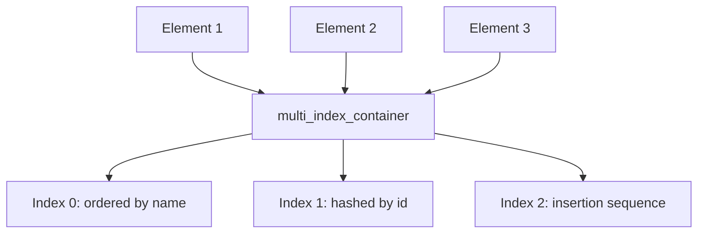

# Boost.MultiIndex

`Boost.MultiIndex` lets you build a **single container with multiple simultaneous indexes** over the
same set of elements. Instead of maintaining separate `std::map`s and `std::unordered_map`s that
you must keep in sync manually, you declare all your access patterns up front and the library
handles the bookkeeping. Think of it as an in-memory database table with multiple columns indexed.

:::info The problem it solves
You have a collection of records and you need to look them up by name (ordered), by ID (hashed),
and iterate them in insertion order. The naive approach — three separate containers pointing at the
same data — is error-prone: every insert, update, and erase must touch all three, and a missed
update means a corrupted index. `multi_index_container` eliminates this entire class of bugs.
:::

## How it works



Each element exists **once** in memory. The indexes are lightweight node structures that point into
the shared element storage. Inserting an element updates all indexes atomically; erasing removes it
from all indexes at once.

## Defining a multi-indexed container

```cpp showLineNumbers title="employee_index.cpp"
#include <boost/multi_index_container.hpp>
#include <boost/multi_index/ordered_index.hpp>
#include <boost/multi_index/hashed_index.hpp>
#include <boost/multi_index/sequenced_index.hpp>
#include <boost/multi_index/member.hpp>
#include <string>
#include <iostream>

namespace bmi = boost::multi_index;

struct Employee {
    int         id;
    std::string name;
    int         department;
};

using EmployeeTable = boost::multi_index_container<
    Employee,
    bmi::indexed_by<
        bmi::ordered_unique<bmi::member<Employee, int, &Employee::id>>,
        bmi::hashed_non_unique<bmi::member<Employee, std::string, &Employee::name>>,
        bmi::ordered_non_unique<bmi::member<Employee, int, &Employee::department>>
    >
>;

int main() {
    EmployeeTable table;
    table.insert({1, "Alice", 10});
    table.insert({2, "Bob",   20});
    table.insert({3, "Carol", 10});

    // Lookup by id (index 0 — ordered_unique)
    auto& by_id = table.get<0>();
    auto it = by_id.find(2);
    if (it != by_id.end())
        std::cout << "ID 2: " << it->name << "\n";

    // Lookup by name (index 1 — hashed)
    auto& by_name = table.get<1>();
    auto range = by_name.equal_range("Alice");
    for (auto r = range.first; r != range.second; ++r)
        std::cout << "Alice -> dept " << r->department << "\n";

    // All employees in department 10 (index 2 — ordered by dept)
    auto& by_dept = table.get<2>();
    auto dept_range = by_dept.equal_range(10);
    for (auto r = dept_range.first; r != dept_range.second; ++r)
        std::cout << "Dept 10: " << r->name << "\n";
}
```

## Index types

| Index type | Equivalent to | Use case |
|------------|---------------|----------|
| `ordered_unique` | `std::set` | primary key, sorted access |
| `ordered_non_unique` | `std::multiset` | sorted grouping (e.g. by department) |
| `hashed_unique` | `std::unordered_set` | fast exact lookup by unique key |
| `hashed_non_unique` | `std::unordered_multiset` | fast exact lookup, duplicates allowed |
| `sequenced` | `std::list` | preserves insertion order |
| `random_access` | `std::vector` | O(1) positional access by index |

## Modifying elements

Elements in a `multi_index_container` are conceptually **immutable through iterators** — you cannot
write through an iterator because a change to a key field would silently corrupt other indexes.
Instead, use `modify`:

```cpp showLineNumbers title="modify.cpp"
#include <boost/multi_index_container.hpp>
#include <boost/multi_index/ordered_index.hpp>
#include <boost/multi_index/member.hpp>
#include <string>

namespace bmi = boost::multi_index;

struct Record { int id; std::string label; };

using Table = boost::multi_index_container<
    Record,
    bmi::indexed_by<bmi::ordered_unique<bmi::member<Record, int, &Record::id>>>
>;

int main() {
    Table t;
    t.insert({1, "old"});

    auto& idx = t.get<0>();
    auto it = idx.find(1);
    idx.modify(it, [](Record& r) { r.label = "new"; });
    // all indexes stay consistent
}
```

:::danger Never cast away const to modify elements
Modifying an element through a const-cast on the iterator bypasses the index update logic. The
container's internal invariants break silently — lookups on other indexes will return wrong results
or crash. Always use the `modify` member function.
:::

## Composite keys

When you need to index by multiple fields together (like a compound database index), use
`composite_key`:

```cpp showLineNumbers title="composite.cpp"
#include <boost/multi_index_container.hpp>
#include <boost/multi_index/ordered_index.hpp>
#include <boost/multi_index/composite_key.hpp>
#include <boost/multi_index/member.hpp>
#include <string>

namespace bmi = boost::multi_index;

struct LogEntry { std::string host; int severity; std::string message; };

using LogTable = boost::multi_index_container<
    LogEntry,
    bmi::indexed_by<
        bmi::ordered_non_unique<
            bmi::composite_key<
                LogEntry,
                bmi::member<LogEntry, std::string, &LogEntry::host>,
                bmi::member<LogEntry, int, &LogEntry::severity>
            >
        >
    >
>;
```

:::tip Think of it as a database
If you find yourself maintaining parallel containers and writing synchronisation logic, stop and
consider `multi_index_container`. Declare the indexes you need, let the library maintain them, and
focus on your domain logic instead.
:::

## See also

- <Icon icon="lucide:arrow-left-right" inline /> [Boost.Bimap](./boost-bimap.md) — bidirectional map built on MultiIndex.
- <Icon icon="lucide:boxes" inline /> [Boost.Container](./boost-container.md) — `flat_map` and other extended containers.
- <Icon icon="lucide:search" inline /> [Boost.Unordered](./boost-unordered.md) — standalone hash containers.
- <Icon icon="lucide:book-open" inline /> [Boost overview](../readme.md).
