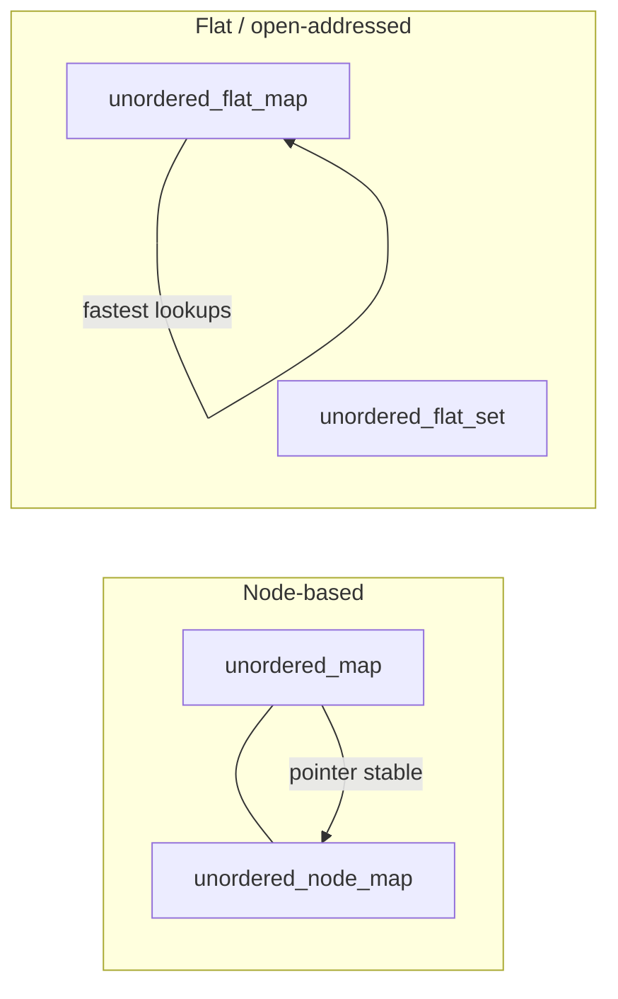

# Boost.Unordered

`Boost.Unordered` provides hash-based associative containers — `unordered_map`, `unordered_set`,
and their `multi` variants — that are API-compatible with the standard equivalents but ship with
additional implementations that the standard does not offer. The headline feature since Boost 1.81
is the **open-addressing family**: `boost::unordered_flat_map`, `boost::unordered_flat_set`,
`boost::unordered_node_map`, and `boost::unordered_node_set`, which consistently outperform
`std::unordered_map` in benchmarks.

:::info The problem it solves
`std::unordered_map` is specified to use separate chaining (a linked list per bucket). This
guarantees pointer stability on rehash but pays for it with poor cache locality and high per-node
memory overhead. Many real-world workloads — lookup tables, caches, symbol tables — do not need
pointer stability and would benefit from a flat, open-addressed layout. Boost ships both strategies
and lets you choose.
:::

## The open-addressing containers



| Container | Layout | Pointer stability | Relative speed |
|-----------|--------|-------------------|----------------|
| `boost::unordered_map` | chained (like `std`) | yes | baseline |
| `boost::unordered_node_map` | open-addressed, node-based | yes | faster |
| `boost::unordered_flat_map` | open-addressed, inline values | no | fastest |
| `boost::unordered_flat_set` | open-addressed, inline values | no | fastest |

### Basic usage

```cpp showLineNumbers title="flat_map_demo.cpp"
#include <boost/unordered/unordered_flat_map.hpp>
#include <string>
#include <iostream>

int main() {
    boost::unordered_flat_map<std::string, int> scores;
    scores["alice"] = 42;
    scores["bob"]   = 37;
    scores.emplace("carol", 55);

    for (auto& [name, score] : scores)
        std::cout << name << ": " << score << "\n";

    auto it = scores.find("alice");
    if (it != scores.end())
        std::cout << "alice found with score " << it->second << "\n";
}
```

## Heterogeneous lookup

Boost.Unordered supports **transparent hashing** — you can look up a `std::string`-keyed map with
a `std::string_view` or a `const char*` without constructing a temporary `std::string`. Enable it
by providing a hash and equality functor that are marked `is_transparent`:

```cpp showLineNumbers title="heterogeneous.cpp"
#include <boost/unordered/unordered_flat_map.hpp>
#include <string>
#include <string_view>
#include <iostream>

struct string_hash {
    using is_transparent = void;
    std::size_t operator()(std::string_view sv) const {
        return boost::hash<std::string_view>{}(sv);
    }
};

int main() {
    boost::unordered_flat_map<std::string, int, string_hash, std::equal_to<>> m;
    m["hello"] = 1;

    // looks up with string_view — no std::string temporary created
    std::string_view key = "hello";
    auto it = m.find(key);
    if (it != m.end())
        std::cout << it->second << "\n";
}
```

:::tip When heterogeneous lookup matters
In hot loops where you construct lookup keys from `const char*` or `string_view`, avoiding the
temporary `std::string` allocation can measurably reduce latency. The standard added transparent
hashing in C++20 for `std::unordered_map`; the Boost version works on C++11 and later.
:::

## Custom hash functions

Boost.Unordered integrates with `boost::hash` by default, which handles most standard types. For
user-defined types, specialize `boost::hash` or provide a callable:

```cpp showLineNumbers title="custom_hash.cpp"
#include <boost/unordered/unordered_flat_set.hpp>
#include <boost/container_hash/hash.hpp>

struct Point { int x, y; };

bool operator==(Point a, Point b) { return a.x == b.x && a.y == b.y; }

struct PointHash {
    std::size_t operator()(Point p) const {
        std::size_t seed = 0;
        boost::hash_combine(seed, p.x);
        boost::hash_combine(seed, p.y);
        return seed;
    }
};

int main() {
    boost::unordered_flat_set<Point, PointHash> points;
    points.insert({1, 2});
    points.insert({3, 4});
}
```

## Choosing the right container

:::note Decision guide
- Need **pointer / reference stability** across insertions? Use `unordered_node_map` (faster than
  `std::unordered_map`, still stable).
- Need **maximum lookup speed** and don't hold pointers into the container? Use
  `unordered_flat_map`.
- Need **exact `std::unordered_map` interface** for compatibility? Use `boost::unordered_map` — it
  is a conforming drop-in.
:::

## Boost.Unordered versus std::unordered_map

| Feature | `boost::unordered_flat_map` | `std::unordered_map` |
|---------|---------------------------|----------------------|
| Layout | open-addressed | chained buckets |
| Pointer stability | no | yes |
| Memory per entry | lower (inline storage) | higher (per-node allocation) |
| Cache performance | better (contiguous) | worse (pointer chasing) |
| Heterogeneous lookup | yes (C++11+) | yes (C++20) |
| Bucket API | not applicable | `bucket()`, `bucket_count()` |

:::warning Pointer invalidation in flat containers
`unordered_flat_map` and `unordered_flat_set` may **invalidate all iterators and references** on
insertion or rehash — just like `std::vector`. Do not hold pointers or references into a flat
container across mutations. If you need stability, use the `node` variants.
:::

## See also

- <Icon icon="lucide:boxes" inline /> [Boost.Container](./boost-container.md) — `flat_map`/`flat_set` (sorted, not hashed).
- <Icon icon="lucide:layers" inline /> [Boost.MultiIndex](./boost-multi-index.md) — multiple indexes over the same data.
- <Icon icon="lucide:arrow-left-right" inline /> [Boost and the C++ Standard](../00-overview/boost-and-the-standard.md) — how `std::unordered_map` originated from Boost.
- <Icon icon="lucide:book-open" inline /> [Boost overview](../readme.md).
