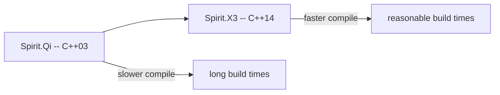

# Boost.Spirit

Boost.Spirit is a **parser and generator framework** that lets you write grammars directly in C++
using expression templates. Instead of an external grammar file and a code generator (like yacc or
ANTLR), you express the grammar as C++ expressions that the compiler turns into a recursive-descent
parser. The modern incarnation is **Spirit.X3**, a header-only, C++14-based rewrite that compiles
faster and is easier to use than its predecessor Spirit.Qi.

:::info The problem it solves
Regex handles flat patterns; hand-rolled parsers handle everything but are tedious and
error-prone. Spirit sits in between: you describe the grammar declaratively, and the library
compiles it into an efficient parser — no separate build step, no generated files, just C++.
:::

## Parsing a single integer

The simplest Spirit program parses one value:

```cpp showLineNumbers title="int_parse.cpp"
#include <boost/spirit/home/x3.hpp>
#include <iostream>
#include <string>

int main() {
    namespace x3 = boost::spirit::x3;

    std::string input = "42";
    int result = 0;
    auto it = input.begin();

    bool ok = x3::parse(it, input.end(), x3::int_, result);

    if (ok && it == input.end()) {
        std::cout << "parsed: " << result << "\n";  // 42
    }
}
```

`x3::parse` returns `true` if the parser matched; the iterator advances past what was consumed.
Checking `it == input.end()` ensures the entire input was consumed.

## Combining parsers

Spirit parsers compose with operators:

| Operator | Meaning | Example |
|----------|---------|---------|
| `>>` | sequence (then) | `x3::int_ >> ',' >> x3::int_` |
| `\|` | alternative (or) | `x3::int_ \| x3::double_` |
| `*` | Kleene star (zero or more) | `*x3::char_('a')` |
| `+` | one or more | `+x3::digit` |
| `-` | optional (zero or one) | `-x3::char_('+')` |
| `%` | list (item % delimiter) | `x3::int_ % ','` |

```cpp showLineNumbers title="csv_ints.cpp"
#include <boost/spirit/home/x3.hpp>
#include <iostream>
#include <string>
#include <vector>

int main() {
    namespace x3 = boost::spirit::x3;

    std::string input = "10,20,30,40";
    std::vector<int> values;
    auto it = input.begin();

    // "int list separated by commas"
    bool ok = x3::parse(it, input.end(), x3::int_ % ',', values);

    if (ok) {
        for (int v : values) std::cout << v << " ";
        // 10 20 30 40
    }
}
```

## Parsing into structs with BOOST_FUSION_ADAPT_STRUCT

Spirit can parse directly into user-defined structs when they are adapted as Fusion sequences:

```cpp showLineNumbers title="struct_parse.cpp"
#include <boost/spirit/home/x3.hpp>
#include <boost/fusion/adapted/struct.hpp>
#include <iostream>
#include <string>

struct Point {
    double x;
    double y;
};

BOOST_FUSION_ADAPT_STRUCT(Point, x, y)

int main() {
    namespace x3 = boost::spirit::x3;

    std::string input = "(3.14, 2.72)";
    Point pt{};
    auto it = input.begin();

    auto point_parser = '(' >> x3::double_ >> ',' >> x3::double_ >> ')';
    bool ok = x3::parse(it, input.end(), point_parser, pt);

    if (ok) {
        std::cout << "(" << pt.x << ", " << pt.y << ")\n";
    }
}
```

## Skipping whitespace with phrase_parse

`x3::parse` is whitespace-sensitive. Use `x3::phrase_parse` with a skipper to ignore whitespace
between tokens:

```cpp showLineNumbers title="skipper.cpp"
#include <boost/spirit/home/x3.hpp>
#include <string>
#include <vector>

int main() {
    namespace x3 = boost::spirit::x3;

    std::string input = "  10 ,  20 , 30  ";
    std::vector<int> values;
    auto it = input.begin();

    x3::phrase_parse(it, input.end(),
                     x3::int_ % ',',
                     x3::ascii::space,   // skipper
                     values);
    // values: {10, 20, 30}
}
```

## Spirit.X3 versus Spirit.Qi



| Aspect | Spirit.Qi (legacy) | Spirit.X3 (current) |
|--------|-------------------|---------------------|
| C++ standard | C++03 | C++14 |
| Compile time | slow (deep template recursion) | faster (constexpr, simpler types) |
| Header-only | yes | yes |
| Semantic actions | complex, Boost.Phoenix-based | lambdas |
| Learning curve | steep | moderate |

:::warning Compile times
Spirit is template-heavy. Even X3 can slow builds on large grammars. Keep parsers in dedicated
translation units to isolate the template cost. Consider precompiled headers for the Spirit
includes.
:::

## When to use Spirit

Spirit is powerful but not always the right tool:

| Situation | Better choice |
|-----------|---------------|
| Simple delimiter splitting | [Boost.Tokenizer](./boost-tokenizer.md) or [StringAlgo](./string-algo.md) |
| Pattern matching in text | [Boost.Regex](./boost-regex.md) |
| Full language grammar | Spirit.X3 or an external parser generator |
| Configuration file parsing | [Boost.PropertyTree](../12-serialization-and-data/boost-property-tree.md) |
| Performance-critical tight loops | hand-rolled parser or re2c |

:::tip Start small
Define small, testable parsers and compose them. Spirit's operator overloading makes it
tempting to write an entire grammar in one expression — resist that urge until the pieces work
individually.
:::

## See also

- <Icon icon="lucide:regex" inline /> [Boost.Regex](./boost-regex.md) — pattern matching when a full parser is overkill.
- <Icon icon="lucide:scissors" inline /> [Boost.Tokenizer](./boost-tokenizer.md) — simple token splitting.
- <Icon icon="lucide:type" inline /> [Boost.StringAlgo](./string-algo.md) — string manipulation utilities.
- <Icon icon="lucide:puzzle" inline /> [Boost.Fusion](../07-functional-and-metaprogramming/boost-fusion.md) — heterogeneous containers that Spirit parses into.
- <Icon icon="lucide:book-open" inline /> [Boost overview](../readme.md).
