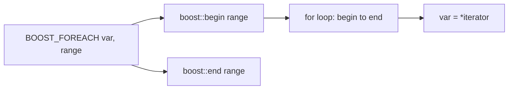

# BOOST_FOREACH

`BOOST_FOREACH` is a preprocessor macro that provides **range-based iteration** on compilers that
lack the C++11 range-for loop. It was an essential tool in the C++03 era; today it is obsolete —
the language-level `for (auto& x : container)` does the same thing, more safely and more readably.

:::info The problem it solved
Before C++11, iterating a container required writing `for (std::vector<int>::iterator it = v.begin();
it != v.end(); ++it)` — verbose, error-prone, and hard to read. `BOOST_FOREACH` compressed that
into a single macro call that looked almost like the range-for syntax that would come later.
:::

## Basic usage

```cpp showLineNumbers title="foreach_demo.cpp"
#include <boost/foreach.hpp>
#include <vector>
#include <iostream>

int main() {
    std::vector<int> v{1, 2, 3, 4, 5};

    BOOST_FOREACH(int x, v) {
        std::cout << x << " ";
    }
    std::cout << "\n";

    // Modifying elements: take by reference
    BOOST_FOREACH(int& x, v) {
        x *= 2;
    }
    // v is now {2, 4, 6, 8, 10}
}
```

## What it expands to

`BOOST_FOREACH(var, range)` roughly expands to a `for` loop using `boost::begin` / `boost::end`.
It handles arrays, standard containers, iterator pairs, and null-terminated strings.



## Supported range types

| Range type | Example | Works |
|------------|---------|-------|
| Standard container | `std::vector<int>` | yes |
| Raw array | `int arr[5]` | yes |
| C string | `const char*` | yes |
| `std::pair<Iter, Iter>` | iterator pair | yes |
| Custom type with `begin`/`end` | user-defined | yes |
| Rvalue temporary | `get_vector()` | yes (copies the range) |

:::warning Rvalue ranges are copied
When you pass a temporary (rvalue) to `BOOST_FOREACH`, it copies the entire container to prevent
dangling. This is safe but potentially expensive for large containers.
:::

## BOOST_REVERSE_FOREACH

Iterates in reverse order — equivalent to using `rbegin` / `rend`:

```cpp showLineNumbers title="reverse_foreach.cpp"
#include <boost/foreach.hpp>
#include <vector>
#include <iostream>

int main() {
    std::vector<int> v{1, 2, 3, 4, 5};

    BOOST_REVERSE_FOREACH(int x, v) {
        std::cout << x << " ";  // 5 4 3 2 1
    }
    std::cout << "\n";
}
```

## Why range-for replaces it entirely

The C++11 range-for loop does everything `BOOST_FOREACH` does, without the macro overhead:

```cpp showLineNumbers title="comparison.cpp"
#include <vector>
#include <iostream>

int main() {
    std::vector<int> v{1, 2, 3, 4, 5};

    // C++03 with BOOST_FOREACH:
    // BOOST_FOREACH(int x, v) { std::cout << x; }

    // C++11 range-for — same thing, no macro:
    for (int x : v) {
        std::cout << x << " ";
    }
    std::cout << "\n";

    // C++11 with references:
    for (int& x : v) {
        x *= 2;
    }
}
```

| | `BOOST_FOREACH` | Range-for (C++11) |
|-|-----------------|-------------------|
| Syntax | macro | language feature |
| Rvalue handling | copies (safe but slow) | well-defined since C++20 |
| Structured bindings | no | yes (C++17) |
| Debugger support | limited (macro expansion) | full |
| Init statement | no | yes (C++20) |
| Breakpoints | hit macro internals | clean single-step |

:::danger Do not use BOOST_FOREACH in new code
There is no reason to use this macro in any project compiled with C++11 or later. It exists only for
backwards compatibility with C++03 codebases. If you encounter it in legacy code, replacing it with
a range-for loop is a safe, mechanical refactor.
:::

## Migrating away

Replacing `BOOST_FOREACH` is straightforward:

```cpp showLineNumbers title="migration.cpp"
// Before:
// BOOST_FOREACH(const std::string& s, names) { process(s); }

// After:
// for (const std::string& s : names) { process(s); }

// Before (reverse):
// BOOST_REVERSE_FOREACH(int x, v) { process(x); }

// After:
// for (int x : v | boost::adaptors::reversed) { process(x); }
// or with std::ranges::views::reverse in C++20
```

## See also

- <Icon icon="lucide:repeat" inline /> [Boost.Range](./boost-range.md) — the modern Boost approach to range-based programming.
- <Icon icon="lucide:arrow-right" inline /> [Boost.Iterator](./boost-iterator.md) — building custom iterators.
- <Icon icon="lucide:search" inline /> [Boost.Algorithm](./boost-algorithm.md) — algorithms that complement the STL.
- <Icon icon="lucide:book-open" inline /> [Boost overview](../readme.md).
