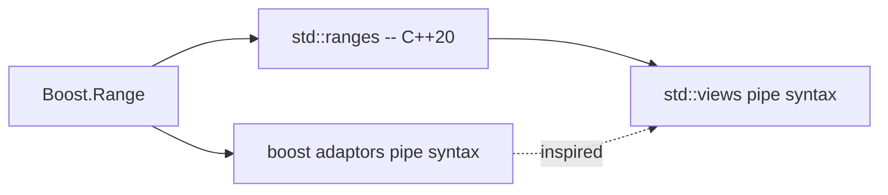

# Boost.Range

`Boost.Range` replaces iterator pairs with **range objects** and provides **range adaptors** —
composable, lazy transformations you pipe together with `|`. It is the direct ancestor of C++20
`std::ranges` and `std::views`, and it remains the only option on pre-C++20 toolchains.

:::info The problem it solves
STL algorithms take pairs of iterators, which is verbose and error-prone (mismatched begin/end from
different containers compiles but crashes). Boost.Range lets you pass a single range object instead,
and the adaptor pipeline replaces nested algorithm calls with a readable left-to-right flow.
:::

## Range-based algorithm calls

Every STL algorithm has a Boost.Range counterpart that accepts a range instead of two iterators:

```cpp showLineNumbers title="range_algo.cpp"
#include <boost/range/algorithm.hpp>
#include <vector>
#include <iostream>

int main() {
    std::vector<int> v{5, 3, 1, 4, 2};

    boost::range::sort(v);           // instead of std::sort(v.begin(), v.end())

    auto it = boost::range::find(v, 3);
    if (it != v.end()) {
        std::cout << "found " << *it << "\n";
    }

    int count = boost::range::count_if(v, [](int n){ return n > 2; });
    std::cout << count << " elements > 2\n";
}
```

## Range adaptors and the pipe syntax

Adaptors are lazy views that transform a range without copying data. They compose with `|`:

```cpp showLineNumbers title="adaptors.cpp"
#include <boost/range/adaptors.hpp>
#include <boost/range/algorithm.hpp>
#include <vector>
#include <iostream>

int main() {
    std::vector<int> v{1, 2, 3, 4, 5, 6, 7, 8, 9, 10};

    // Keep evens, square them, take the first 3
    auto result = v
        | boost::adaptors::filtered([](int n){ return n % 2 == 0; })
        | boost::adaptors::transformed([](int n){ return n * n; })
        | boost::adaptors::sliced(0, 3);

    for (int x : result) {
        std::cout << x << " ";  // 4 16 36
    }
    std::cout << "\n";
}
```

:::tip Reading adaptor pipelines
Read the pipe left to right: "start with `v`, keep evens, square each, take the first three." Each
adaptor returns a view — no intermediate containers are allocated, and elements are computed on
demand during iteration.
:::

## Common adaptors

| Adaptor | Effect | `std::views` equivalent |
|---------|--------|-------------------------|
| `filtered(pred)` | Keep elements where `pred` is true | `std::views::filter` |
| `transformed(fn)` | Apply `fn` to each element | `std::views::transform` |
| `reversed` | Reverse iteration order | `std::views::reverse` |
| `sliced(start, end)` | Sub-range by index | `std::views::drop` + `take` |
| `uniqued` | Skip consecutive duplicates | none (algorithm only) |
| `strided(n)` | Every n-th element | `std::views::stride` (C++23) |
| `indexed(base)` | Pair each element with its index | `std::views::enumerate` (C++23) |
| `map_keys` / `map_values` | Project keys or values from pairs | `std::views::keys` / `values` |

## Building your own range

Any type that exposes `begin()` and `end()` — or free functions `boost::begin` / `boost::end` —
is a valid Boost range. This includes raw arrays, standard containers, and custom types:

```cpp showLineNumbers title="custom_range.cpp"
#include <boost/range/iterator_range.hpp>
#include <iostream>

int main() {
    int arr[] = {10, 20, 30, 40, 50};

    // Make a sub-range from a raw array
    auto sub = boost::make_iterator_range(arr + 1, arr + 4);
    for (int x : sub) {
        std::cout << x << " ";  // 20 30 40
    }
    std::cout << "\n";
}
```

## Combining adaptors with algorithms

The real power shows when you pipe adaptors into a range algorithm:

```cpp showLineNumbers title="pipeline.cpp"
#include <boost/range/adaptors.hpp>
#include <boost/range/algorithm.hpp>
#include <boost/range/numeric.hpp>
#include <vector>
#include <iostream>

int main() {
    std::vector<int> v{1, 2, 3, 4, 5, 6, 7, 8, 9, 10};

    // Sum of squares of odd numbers
    int total = boost::accumulate(
        v | boost::adaptors::filtered([](int n){ return n % 2 != 0; })
          | boost::adaptors::transformed([](int n){ return n * n; }),
        0);

    std::cout << total << "\n";  // 1+9+25+49+81 = 165
}
```

## Boost.Range versus std::ranges



| Feature | Boost.Range | `std::ranges` (C++20) |
|---------|-------------|------------------------|
| Pipe syntax | `v \| boost::adaptors::filtered(p)` | `v \| std::views::filter(p)` |
| Lazy views | yes | yes |
| Concepts/constraints | SFINAE-based | C++20 concepts |
| Projection support | no (use `transformed`) | yes (built into algorithms) |
| Minimum standard | C++03 | C++20 |

:::note Which to choose
On C++20 and later, prefer `std::ranges` and `std::views` — they have concept-based error messages,
projection support, and deeper compiler integration. Use Boost.Range when you need the adaptor
pipeline on a C++11/14/17 codebase.
:::

## See also

- <Icon icon="lucide:repeat" inline /> [Boost.Algorithm](./boost-algorithm.md) — standalone algorithms that pair with ranges.
- <Icon icon="lucide:arrow-right" inline /> [Boost.Iterator](./boost-iterator.md) — custom iterator building blocks.
- <Icon icon="lucide:book-open" inline /> [Boost overview](../readme.md).
