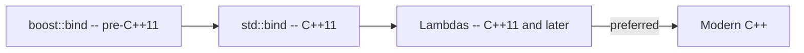

# Boost.Bind

`boost::bind` creates a new function object by **partially applying** arguments to an existing
callable — fixing some parameters while leaving others as placeholders (`_1`, `_2`, ...). It was the
direct predecessor of `std::bind` (C++11) and, for over a decade, the standard way to adapt
callbacks and connect member functions to generic algorithms.

:::info The problem it solves
Generic algorithms and callback APIs expect a callable with a specific arity. If you have a function
that takes three arguments but the algorithm needs one, you need to *bind* the extra arguments.
Before C++11 lambdas, `boost::bind` was the only ergonomic way to do this without writing a
dedicated functor class.
:::

## Binding free functions

```cpp showLineNumbers title="bind_free.cpp"
#include <boost/bind/bind.hpp>
#include <iostream>

using namespace boost::placeholders;

int add(int a, int b) { return a + b; }

int main() {
    auto add5 = boost::bind(add, _1, 5);   // fix second arg to 5
    std::cout << add5(10) << "\n";          // 15

    auto swap_args = boost::bind(add, _2, _1);
    std::cout << swap_args(1, 100) << "\n"; // 101
}
```

Placeholders `_1` through `_9` mark which argument of the *resulting* function object maps to which
parameter of the *original* callable.

## Binding member functions

This is where `boost::bind` was most useful — adapting a member function for use with algorithms
that expect a unary or binary functor.

```cpp showLineNumbers title="bind_member.cpp"
#include <boost/bind/bind.hpp>
#include <vector>
#include <algorithm>
#include <iostream>

using namespace boost::placeholders;

struct Widget {
    int id;
    void describe() const {
        std::cout << "Widget #" << id << "\n";
    }
    bool has_id(int target) const { return id == target; }
};

int main() {
    std::vector<Widget> ws{{1}, {2}, {3}};

    // Call a member function on each element
    std::for_each(ws.begin(), ws.end(),
                  boost::bind(&Widget::describe, _1));

    // Find by predicate — bind the search value
    auto it = std::find_if(ws.begin(), ws.end(),
                           boost::bind(&Widget::has_id, _1, 2));

    if (it != ws.end())
        std::cout << "found: " << it->id << "\n";
}
```

The first argument after the member-function pointer is the object (or pointer/reference to it).
`_1` means "the element the algorithm passes in".

## Binding with references

By default `boost::bind` copies its bound arguments. Use `boost::ref` or `boost::cref` to bind by
reference when copying is expensive or when the callback must mutate the original.

```cpp showLineNumbers title="bind_ref.cpp"
#include <boost/bind/bind.hpp>
#include <boost/ref.hpp>
#include <iostream>

using namespace boost::placeholders;

void increment(int& counter) { ++counter; }

int main() {
    int n = 0;
    auto inc = boost::bind(increment, boost::ref(n));
    inc();
    inc();
    std::cout << n << "\n";   // 2
}
```

:::warning Dangling references
`boost::ref` does not extend lifetime. If the referenced object is destroyed before the bound
function object is called, the behaviour is undefined.
:::

## Nesting binds

Bind expressions can be composed — the result of one bind can serve as an argument to another:

```cpp showLineNumbers title="bind_nested.cpp"
#include <boost/bind/bind.hpp>
#include <iostream>

using namespace boost::placeholders;

int mul(int a, int b) { return a * b; }
int add(int a, int b) { return a + b; }

int main() {
    // f(x) = add(mul(x, 2), 10) = x*2 + 10
    auto f = boost::bind(add, boost::bind(mul, _1, 2), 10);
    std::cout << f(3) << "\n";   // 16
}
```

:::note Readability
Nested binds quickly become hard to read. In modern C++ a lambda is almost always clearer:
`auto f = [](int x) { return x * 2 + 10; };`
:::

## Boost.Bind versus std::bind versus lambdas



| Feature | `boost::bind` | `std::bind` | Lambda |
|---------|---------------|-------------|--------|
| Available | pre-C++11 | C++11 | C++11 |
| Readability | moderate | moderate | high |
| Captures by name | no (positional) | no (positional) | yes |
| Move captures | no | no | yes (C++14) |
| Debuggability | poor | poor | good |
| Nesting | supported but hard to read | supported but hard to read | natural |

:::tip Modern advice
Prefer lambdas in any codebase targeting C++11 or later. They are more readable, debuggable, and
flexible (move captures, `auto` parameters). Use `boost::bind` only in legacy code or pre-C++11
projects. See [Boost and the C++ Standard](../00-overview/boost-and-the-standard.md) for the
broader migration story.
:::

## See also

- <Icon icon="lucide:link" inline /> [Boost.Function](./boost-function.md) — polymorphic wrapper often paired with `bind`.
- <Icon icon="lucide:flame" inline /> [Boost.Phoenix](./boost-phoenix.md) — a more powerful functional toolkit that supersedes `bind` for complex composition.
- <Icon icon="lucide:arrow-left-right" inline /> [Boost and the C++ Standard](../00-overview/boost-and-the-standard.md) — the `std::bind` lineage.
- <Icon icon="lucide:book-open" inline /> [Boost overview](../readme.md).
