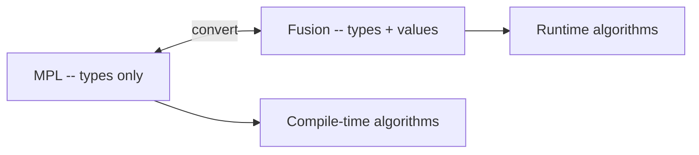

# Boost.Fusion

Boost.Fusion is a library for working with **heterogeneous collections** — containers whose elements
have different types, like tuples and structs. It sits between [MPL](./boost-mpl.md) (purely
compile-time) and the STL (purely runtime): Fusion sequences carry real values but support
compile-time iteration, access by index, and adaptation of user-defined structs into iterable
sequences.

:::info The problem it solves
`std::tuple` stores heterogeneous values but has no algorithm library. You cannot `for_each` over a
tuple, filter it, or transform it without writing recursive template boilerplate. Fusion provides
exactly that: STL-like algorithms for heterogeneous sequences, including the ability to treat a
plain `struct` as a sequence of named fields.
:::

## Fusion sequences

The primary containers are `fusion::vector` (fixed-size, like `std::tuple`) and `fusion::list`
(recursive cons-cell structure).

```cpp showLineNumbers title="fusion_basics.cpp"
#include <boost/fusion/include/vector.hpp>
#include <boost/fusion/include/at_c.hpp>
#include <boost/fusion/include/size.hpp>
#include <iostream>
#include <string>

namespace fusion = boost::fusion;

int main() {
    fusion::vector<int, double, std::string> v(42, 3.14, "hello");

    std::cout << fusion::at_c<0>(v) << "\n";   // 42
    std::cout << fusion::at_c<2>(v) << "\n";   // hello

    constexpr int len = fusion::result_of::size<decltype(v)>::value;
    static_assert(len == 3);
}
```

## Iterating over heterogeneous elements

`fusion::for_each` calls a polymorphic functor on every element — the functor's `operator()` must be
a template (or use `auto`).

```cpp showLineNumbers title="fusion_for_each.cpp"
#include <boost/fusion/include/vector.hpp>
#include <boost/fusion/include/for_each.hpp>
#include <iostream>
#include <string>

namespace fusion = boost::fusion;

struct Printer {
    template <typename T>
    void operator()(const T& x) const {
        std::cout << x << "\n";
    }
};

int main() {
    fusion::vector<int, double, std::string> v(1, 2.5, "three");
    fusion::for_each(v, Printer{});
    // 1
    // 2.5
    // three
}
```

## Adapting structs with BOOST_FUSION_ADAPT_STRUCT

This is Fusion's most practical feature: turning a plain `struct` into a Fusion sequence so you can
iterate over its members generically.

```cpp showLineNumbers title="fusion_adapt.cpp"
#include <boost/fusion/include/adapt_struct.hpp>
#include <boost/fusion/include/for_each.hpp>
#include <iostream>
#include <string>

struct Person {
    std::string name;
    int age;
    double height;
};

BOOST_FUSION_ADAPT_STRUCT(Person, name, age, height)

int main() {
    Person p{"Ada", 36, 1.65};

    boost::fusion::for_each(p, [](const auto& field) {
        std::cout << field << "\n";
    });
    // Ada
    // 36
    // 1.65
}
```

:::tip Serialization and reflection
`BOOST_FUSION_ADAPT_STRUCT` is a lightweight form of compile-time reflection. It is commonly used
to build generic serializers, loggers, and ORM-like mappings without hand-written per-field code.
:::

## Transform and filter

Fusion provides compile-time `transform` and `filter` that produce new sequences with potentially
different element types.

```cpp showLineNumbers title="fusion_transform.cpp"
#include <boost/fusion/include/vector.hpp>
#include <boost/fusion/include/transform.hpp>
#include <boost/fusion/include/for_each.hpp>
#include <iostream>

namespace fusion = boost::fusion;

struct Double {
    template <typename T>
    auto operator()(const T& x) const { return x + x; }
};

int main() {
    fusion::vector<int, double> v(3, 1.5);
    auto doubled = fusion::transform(v, Double{});

    fusion::for_each(doubled, [](auto x) {
        std::cout << x << " ";
    });
    // 6 3
}
```

## Fusion as a bridge to MPL

Fusion can interoperate with MPL: you can extract the type sequence from a Fusion container and pass
it to MPL algorithms, or convert an MPL type sequence into a Fusion container to give it runtime
values.



## Fusion versus std::tuple versus Hana

| Feature | `std::tuple` | Boost.Fusion | Boost.Hana |
|---------|-------------|-------------|------------|
| Algorithms | none built-in | `for_each`, `transform`, `filter`, `fold` | full algorithm suite |
| Struct adaptation | no | `BOOST_FUSION_ADAPT_STRUCT` | `BOOST_HANA_DEFINE_STRUCT` |
| MPL interop | no | yes | via `hana::type_c` |
| Required standard | C++11 | C++03 | C++14 |
| Compile speed | fast | moderate | fast |

:::note When to use Fusion
If you need struct introspection on C++03/C++11, or your project already uses MPL/Spirit heavily,
Fusion is the right choice. For new C++14+ projects, [Boost.Hana](./boost-hana.md) provides the
same capabilities with cleaner syntax and faster compile times.
:::

## See also

- <Icon icon="lucide:layers" inline /> [Boost.MPL](./boost-mpl.md) — purely compile-time type sequences that Fusion can bridge to runtime.
- <Icon icon="lucide:layers" inline /> [Boost.Hana](./boost-hana.md) — the modern successor to both MPL and Fusion.
- <Icon icon="lucide:type" inline /> [Boost.Spirit](../05-strings-and-text/boost-spirit.md) — parser framework that uses Fusion-adapted structs as attributes.
- <Icon icon="lucide:book-open" inline /> [Boost overview](../readme.md).
