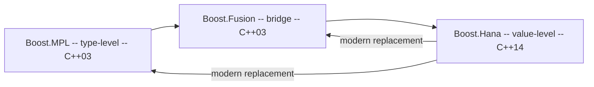

# Boost.Hana

Boost.Hana is a **modern C++14 metaprogramming library** that replaces the template-heavy
style of [MPL](./boost-mpl.md) and [Fusion](./boost-fusion.md) with a value-based approach:
type computations are expressed as ordinary value computations on heterogeneous containers.
The result is metaprogramming code that reads like regular C++ — `constexpr` functions,
algorithms, and containers instead of nested `typename` and `::type` boilerplate.

:::info The problem it solves
Traditional C++ metaprogramming (MPL-style) works entirely in the type system — `mpl::vector`,
`mpl::transform`, `mpl::at<>` — producing unreadable code and brutal compiler errors. Hana moves
this work into the value domain using `constexpr`, so you write `hana::transform(tuple, f)` instead
of `mpl::transform<Sequence, MetaFunction>::type`. Same compile-time results, far better syntax.
:::

## Heterogeneous containers

Hana provides containers that can hold elements of **different types** — like `std::tuple`, but with
a rich algorithm library attached.

```cpp showLineNumbers title="hana_basics.cpp"
#include <boost/hana.hpp>
#include <iostream>
#include <string>

namespace hana = boost::hana;

int main() {
    auto xs = hana::make_tuple(1, 2.5, std::string("hello"));

    // Access by compile-time index
    std::cout << hana::at_c<0>(xs) << "\n";   // 1
    std::cout << hana::at_c<2>(xs) << "\n";   // hello

    // Length is a compile-time value
    constexpr auto len = hana::length(xs);
    static_assert(len == hana::size_c<3>);
}
```

## Compile-time algorithms

Hana provides the familiar algorithm vocabulary — `transform`, `filter`, `fold`, `any_of`,
`sort` — but they operate at compile time on heterogeneous sequences.

```cpp showLineNumbers title="hana_algorithms.cpp"
#include <boost/hana.hpp>
#include <iostream>

namespace hana = boost::hana;

int main() {
    auto xs = hana::make_tuple(1, 2, 3, 4, 5);

    // Transform: double each element
    auto doubled = hana::transform(xs, [](auto x) { return x * 2; });

    hana::for_each(doubled, [](auto x) {
        std::cout << x << " ";
    });
    // 2 4 6 8 10

    // Filter: keep only values > 3
    auto big = hana::filter(hana::make_tuple(1, 5, 2, 8),
                            [](auto x) { return hana::bool_c<(x > 3)>; });
    // big == hana::make_tuple(5, 8)  — type changes at compile time
}
```

:::warning filter requires compile-time predicates
Unlike runtime `std::remove_if`, `hana::filter` changes the *type* of the resulting tuple (different
elements, different length). The predicate must return a compile-time boolean — a `hana::bool_c`, not
a runtime `bool`.
:::

## Type computations as value computations

Hana wraps types as values using `hana::type_c<T>`, letting you manipulate types with the same
algorithms you use for values.

```cpp showLineNumbers title="hana_types.cpp"
#include <boost/hana.hpp>
#include <type_traits>

namespace hana = boost::hana;

int main() {
    auto types = hana::make_tuple(
        hana::type_c<int>,
        hana::type_c<double>,
        hana::type_c<char>
    );

    // Find all arithmetic types (they all are, in this case)
    auto arith = hana::filter(types, [](auto t) {
        return hana::bool_c<std::is_arithmetic<typename decltype(t)::type>::value>;
    });

    static_assert(hana::length(arith) == hana::size_c<3>);
}
```

## Compile-time maps

`hana::map` is an associative container keyed by compile-time values (often types). It is the
Hana equivalent of `mpl::map` but with value-level syntax.

```cpp showLineNumbers title="hana_map.cpp"
#include <boost/hana.hpp>
#include <string>
#include <iostream>

namespace hana = boost::hana;

int main() {
    auto config = hana::make_map(
        hana::make_pair(hana::type_c<int>,    42),
        hana::make_pair(hana::type_c<double>, 3.14),
        hana::make_pair(hana::type_c<std::string>, std::string("hello"))
    );

    std::cout << config[hana::type_c<int>] << "\n";          // 42
    std::cout << config[hana::type_c<std::string>] << "\n";  // hello
}
```

## Struct introspection

Hana can adapt user-defined structs into heterogeneous sequences, enabling iteration over struct
members at compile time.

```cpp showLineNumbers title="hana_struct.cpp"
#include <boost/hana.hpp>
#include <iostream>
#include <string>

namespace hana = boost::hana;

struct Person {
    BOOST_HANA_DEFINE_STRUCT(Person,
        (std::string, name),
        (int, age)
    );
};

int main() {
    Person p{"Ada", 36};

    hana::for_each(hana::members(p), [](auto& member) {
        std::cout << member << "\n";
    });
    // Ada
    // 36
}
```

## Hana versus MPL and Fusion



| Feature | MPL | Fusion | Hana |
|---------|-----|--------|------|
| C++ standard | C++03 | C++03 | C++14 |
| Domain | types only | types + values | values (types as values) |
| Syntax | `mpl::transform<S, F>::type` | `fusion::transform(s, f)` | `hana::transform(s, f)` |
| Error messages | very poor | moderate | good |
| Compile times | slow | moderate | fast |

:::tip When to choose Hana
For any new metaprogramming on C++14 or later, prefer Hana over MPL and Fusion. It is faster to
compile, easier to read, and produces better error messages. Use MPL/Fusion only when maintaining
legacy code or targeting C++03/C++11.
:::

## See also

- <Icon icon="lucide:layers" inline /> [Boost.MPL](./boost-mpl.md) — the original type-level metaprogramming library.
- <Icon icon="lucide:combine" inline /> [Boost.Fusion](./boost-fusion.md) — bridge between compile-time and runtime heterogeneous sequences.
- <Icon icon="lucide:scan" inline /> [Boost.TypeTraits](./boost-type-traits.md) — compile-time type introspection, often used alongside Hana.
- <Icon icon="lucide:arrow-left-right" inline /> [Boost and the C++ Standard](../00-overview/boost-and-the-standard.md).
- <Icon icon="lucide:book-open" inline /> [Boost overview](../readme.md).
