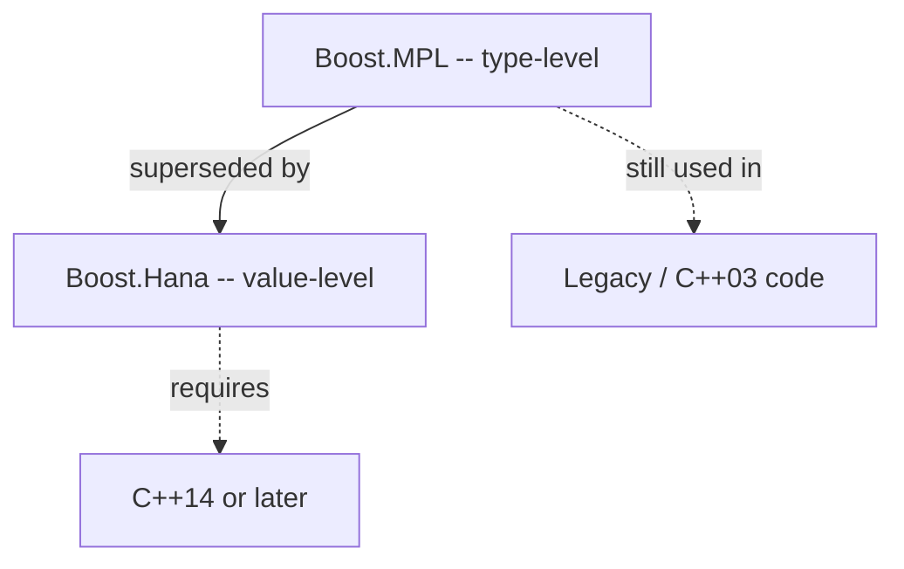

# Boost.MPL

The **Boost Metaprogramming Library** (MPL) is the original framework for compile-time programming
in C++. It provides type-level equivalents of the STL — sequences of types (`mpl::vector`,
`mpl::list`), iterators, and algorithms (`mpl::transform`, `mpl::find`, `mpl::fold`) — all
evaluated entirely by the compiler. MPL made template metaprogramming accessible and structured
when C++03 was the only game in town.

:::info The problem it solves
Template metaprogramming before MPL was ad hoc: recursive template specialisations, `enum` hacks,
and undiscoverable patterns. MPL brought the STL mental model — containers, iterators, algorithms —
to the type level, giving metaprogramming a vocabulary and a set of composable building blocks.
:::

## Type sequences

MPL's primary containers hold *types*, not values. The most commonly used are `mpl::vector` and
`mpl::list`.

```cpp showLineNumbers title="mpl_vector.cpp"
#include <boost/mpl/vector.hpp>
#include <boost/mpl/at.hpp>
#include <boost/mpl/size.hpp>
#include <type_traits>

namespace mpl = boost::mpl;

using Types = mpl::vector<int, double, char>;

// Compile-time access
using First = mpl::at_c<Types, 0>::type;   // int
using Last  = mpl::at_c<Types, 2>::type;   // char

static_assert(std::is_same<First, int>::value);
static_assert(mpl::size<Types>::value == 3);
```

## Algorithms on types

MPL algorithms mirror the STL: `transform` applies a metafunction to every element,
`find_if` searches, `fold` accumulates.

```cpp showLineNumbers title="mpl_transform.cpp"
#include <boost/mpl/vector.hpp>
#include <boost/mpl/transform.hpp>
#include <boost/mpl/at.hpp>
#include <type_traits>

namespace mpl = boost::mpl;

// Metafunction: add pointer
template <typename T>
struct add_ptr { using type = T*; };

using Types = mpl::vector<int, double, char>;
using PtrTypes = mpl::transform<Types, add_ptr<mpl::_1>>::type;

static_assert(std::is_same<mpl::at_c<PtrTypes, 0>::type, int*>::value);
static_assert(std::is_same<mpl::at_c<PtrTypes, 1>::type, double*>::value);
```

The `mpl::_1` placeholder is analogous to `boost::bind`'s `_1` — it marks "the element being
transformed".

## Compile-time predicates and find

```cpp showLineNumbers title="mpl_find.cpp"
#include <boost/mpl/vector.hpp>
#include <boost/mpl/find_if.hpp>
#include <boost/mpl/deref.hpp>
#include <boost/mpl/end.hpp>
#include <type_traits>

namespace mpl = boost::mpl;

template <typename T>
struct is_floating : std::is_floating_point<T> {};

using Types = mpl::vector<int, double, char>;
using Iter = mpl::find_if<Types, is_floating<mpl::_1>>::type;

// Iter points to double
static_assert(std::is_same<mpl::deref<Iter>::type, double>::value);
```

## Fold — compile-time accumulation

`mpl::fold` is the type-level equivalent of `std::accumulate`. It walks a sequence, applying a
binary metafunction to an accumulator and each element.

```cpp showLineNumbers title="mpl_fold.cpp"
#include <boost/mpl/vector.hpp>
#include <boost/mpl/fold.hpp>
#include <boost/mpl/plus.hpp>
#include <boost/mpl/int.hpp>
#include <boost/mpl/sizeof.hpp>

namespace mpl = boost::mpl;

using Types = mpl::vector<int, double, char>;

// Sum the sizeof of all types
using TotalSize = mpl::fold<
    Types,
    mpl::int_<0>,
    mpl::plus<mpl::_1, mpl::sizeof_<mpl::_2>>
>::type;

static_assert(TotalSize::value == sizeof(int) + sizeof(double) + sizeof(char));
```

## Compile-time conditionals

```cpp showLineNumbers title="mpl_if.cpp"
#include <boost/mpl/if.hpp>
#include <type_traits>

namespace mpl = boost::mpl;

template <typename T>
struct safe_ptr {
    using type = typename mpl::if_<
        std::is_pointer<T>,
        T,            // already a pointer — keep it
        T*            // not a pointer — add one
    >::type;
};

static_assert(std::is_same<safe_ptr<int>::type, int*>::value);
static_assert(std::is_same<safe_ptr<int*>::type, int*>::value);
```

:::warning Compile-time cost
MPL algorithms instantiate many templates. Large type sequences or deeply nested metafunctions can
significantly increase compile times. Profile with `-ftime-report` or similar before scaling up.
:::

## MPL versus Hana



| Aspect | MPL | Hana |
|--------|-----|------|
| Domain | types (`mpl::vector<int, double>`) | values (`hana::tuple_t<int, double>`) |
| Syntax | `mpl::transform<S, F>::type` | `hana::transform(s, f)` |
| Error messages | deep template chains | comparatively clean |
| Compile speed | slow on large sequences | fast |
| Required standard | C++03 | C++14 |

:::note Migration advice
For new code on C++14+, prefer [Boost.Hana](./boost-hana.md). MPL is stable and maintained but
receives no new features. Existing MPL code does not need rewriting unless compile times or
readability demand it.
:::

## See also

- <Icon icon="lucide:layers" inline /> [Boost.Hana](./boost-hana.md) — the modern successor.
- <Icon icon="lucide:combine" inline /> [Boost.Fusion](./boost-fusion.md) — bridges MPL type sequences to runtime values.
- <Icon icon="lucide:scan" inline /> [Boost.TypeTraits](./boost-type-traits.md) — compile-time type queries used as MPL predicates.
- <Icon icon="lucide:book-open" inline /> [Boost overview](../readme.md).
