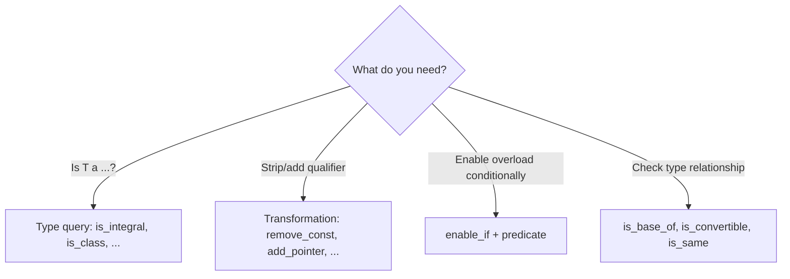

# Boost.TypeTraits

Boost.TypeTraits provides a collection of **compile-time type introspection** and **type
transformation** templates — `is_integral`, `is_pointer`, `remove_const`, `add_reference`, and
dozens more. It was the direct ancestor of the `<type_traits>` header standardised in C++11, and
remains relevant for the handful of traits the standard does not include.

:::info The problem it solves
Generic code often needs to ask questions about types at compile time: "Is this an integer?" "Is
this a pointer?" "What is this type without its `const`?" Before C++11, the language provided no
built-in way to answer these questions. Boost.TypeTraits filled that gap and established the
patterns that the standard later adopted wholesale.
:::

## Basic type queries

```cpp showLineNumbers title="type_queries.cpp"
#include <boost/type_traits.hpp>
#include <iostream>

int main() {
    std::cout << std::boolalpha;
    std::cout << boost::is_integral<int>::value        << "\n";  // true
    std::cout << boost::is_floating_point<double>::value << "\n"; // true
    std::cout << boost::is_pointer<int*>::value         << "\n";  // true
    std::cout << boost::is_const<const int>::value      << "\n";  // true
    std::cout << boost::is_reference<int&>::value       << "\n";  // true
    std::cout << boost::is_class<std::string>::value    << "\n";  // true
}
```

## Type transformations

Transformation traits modify a type at compile time — stripping qualifiers, adding pointers,
decaying function types.

```cpp showLineNumbers title="type_transforms.cpp"
#include <boost/type_traits.hpp>
#include <type_traits>

// Remove const
static_assert(std::is_same<
    boost::remove_const<const int>::type,
    int
>::value);

// Add pointer
static_assert(std::is_same<
    boost::add_pointer<int>::type,
    int*
>::value);

// Remove reference
static_assert(std::is_same<
    boost::remove_reference<int&>::type,
    int
>::value);

// Decay (array → pointer, function → function pointer, strip cv/ref)
static_assert(std::is_same<
    boost::decay<const int(&)[5]>::type,
    const int*
>::value);
```

## SFINAE with enable_if

`boost::enable_if` (the predecessor of `std::enable_if`) lets you enable or disable template
overloads based on compile-time type predicates.

```cpp showLineNumbers title="sfinae.cpp"
#include <boost/type_traits.hpp>
#include <boost/core/enable_if.hpp>
#include <iostream>

// Only enabled for integral types
template <typename T>
typename boost::enable_if<boost::is_integral<T>, T>::type
twice(T x) {
    return x * 2;
}

// Only enabled for floating-point types
template <typename T>
typename boost::enable_if<boost::is_floating_point<T>, T>::type
twice(T x) {
    return x * 2.0;
}

int main() {
    std::cout << twice(5)    << "\n";  // 10
    std::cout << twice(2.5)  << "\n";  // 5.0
}
```

:::tip Modern alternative
In C++17 and later, prefer `if constexpr` over SFINAE for most conditional compilation. It is
dramatically easier to read and produces better error messages.
:::

## Composite type traits

Boost provides traits that classify types into broader categories, useful for writing generic
containers and algorithms.

```cpp showLineNumbers title="composite.cpp"
#include <boost/type_traits.hpp>
#include <vector>

// is_arithmetic = is_integral || is_floating_point
static_assert(boost::is_arithmetic<int>::value);
static_assert(boost::is_arithmetic<double>::value);

// is_fundamental = is_arithmetic || is_void
static_assert(boost::is_fundamental<void>::value);

// is_compound = !is_fundamental
static_assert(boost::is_compound<std::vector<int>>::value);
```

## Relationship traits

```cpp showLineNumbers title="relationships.cpp"
#include <boost/type_traits.hpp>

struct Base {};
struct Derived : Base {};

static_assert(boost::is_base_of<Base, Derived>::value);
static_assert(boost::is_convertible<Derived*, Base*>::value);
static_assert(boost::is_same<int, int>::value);
```

## Boost.TypeTraits versus std type_traits

| Feature | `boost::` | `std::` (C++11+) |
|---------|-----------|------------------|
| Header | `<boost/type_traits.hpp>` | `<type_traits>` |
| Core traits | identical interface | identical interface |
| `_v` shorthand | no | yes (C++17): `is_integral_v<T>` |
| `_t` alias | no | yes (C++14): `remove_const_t<T>` |
| Extra traits | `has_plus`, `has_nothrow_assign`, ... | not provided |
| Pre-C++11 | yes | no |

:::note Which to choose
On C++11 and later, prefer `std::` type traits — they have the `_v` and `_t` conveniences and need
no dependency. Use `boost::` only for the extra traits not in the standard (`has_plus`,
`has_trivial_copy`, etc.) or when targeting a pre-C++11 compiler. See
[Boost and the C++ Standard](../00-overview/boost-and-the-standard.md) for the full lineage.
:::

## Common patterns



## See also

- <Icon icon="lucide:layers" inline /> [Boost.MPL](./boost-mpl.md) — compile-time algorithms on type sequences, uses TypeTraits as predicates.
- <Icon icon="lucide:layers" inline /> [Boost.Hana](./boost-hana.md) — modern metaprogramming, wraps type queries as value computations.
- <Icon icon="lucide:puzzle" inline /> [Boost.Core](../02-core-utilities/boost-core.md) — `enable_if` lives in `<boost/core/enable_if.hpp>`.
- <Icon icon="lucide:arrow-left-right" inline /> [Boost and the C++ Standard](../00-overview/boost-and-the-standard.md) — the `<type_traits>` lineage.
- <Icon icon="lucide:book-open" inline /> [Boost overview](../readme.md).
