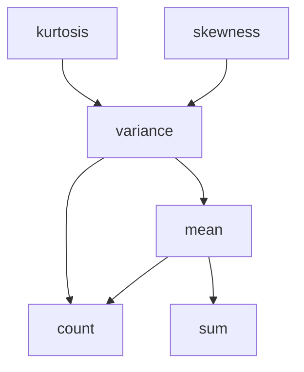

# Boost.Accumulators

`Boost.Accumulators` is a framework for **incremental statistical computation**. You push data
points into an accumulator one at a time, and it maintains running statistics — mean, variance,
min, max, count, moments, quantiles — in a single pass, without storing the entire dataset. It
uses a dependency-resolution system to share intermediate results between features automatically.

:::info The problem it solves
Computing statistics the naive way — store all values, then iterate — requires O(n) memory and
multiple passes. Streaming data (sensor readings, log events, network telemetry) may be unbounded.
Boost.Accumulators computes statistics incrementally in O(1) memory per feature, updating on each
new data point.
:::

## Basic usage

Declare an accumulator set with the features you need, push values, then extract results:

```cpp showLineNumbers title="basic_stats.cpp"
#include <boost/accumulators/accumulators.hpp>
#include <boost/accumulators/statistics/stats.hpp>
#include <boost/accumulators/statistics/mean.hpp>
#include <boost/accumulators/statistics/variance.hpp>
#include <boost/accumulators/statistics/min.hpp>
#include <boost/accumulators/statistics/max.hpp>
#include <boost/accumulators/statistics/count.hpp>
#include <iostream>

namespace acc = boost::accumulators;

int main() {
    acc::accumulator_set<double, acc::stats<
        acc::tag::mean,
        acc::tag::variance,
        acc::tag::min,
        acc::tag::max,
        acc::tag::count
    >> stats;

    for (double x : {2.0, 4.0, 6.0, 8.0, 10.0})
        stats(x);   // push each data point

    std::cout << "count:    " << acc::count(stats)    << "\n";  // 5
    std::cout << "mean:     " << acc::mean(stats)     << "\n";  // 6
    std::cout << "variance: " << acc::variance(stats) << "\n";  // 8
    std::cout << "min:      " << acc::min(stats)      << "\n";  // 2
    std::cout << "max:      " << acc::max(stats)      << "\n";  // 10
}
```

## How features depend on each other

Features declare dependencies. Requesting `variance` automatically pulls in `mean` and `count`.
You never compute the same intermediate value twice.



:::tip Only declare what you need
You only list the *leaf* features you want to extract. Dependencies are resolved automatically.
Asking for `variance` gives you `mean` and `count` for free — no need to list them explicitly,
though doing so is harmless.
:::

## Weighted accumulators

Accumulators can weight each sample. Use `acc::weight` to specify per-sample weights:

```cpp showLineNumbers title="weighted.cpp"
#include <boost/accumulators/accumulators.hpp>
#include <boost/accumulators/statistics/stats.hpp>
#include <boost/accumulators/statistics/weighted_mean.hpp>
#include <iostream>

namespace acc = boost::accumulators;

int main() {
    acc::accumulator_set<double, acc::stats<
        acc::tag::weighted_mean
    >, double> stats;   // third template param = weight type

    stats(10.0, acc::weight = 1.0);
    stats(20.0, acc::weight = 3.0);

    // Weighted mean: (10*1 + 20*3) / (1+3) = 17.5
    std::cout << "weighted mean: " << acc::weighted_mean(stats) << "\n";
}
```

## Rolling (windowed) statistics

For sliding-window computations, Boost.Accumulators provides rolling variants that consider only
the last N samples:

```cpp showLineNumbers title="rolling.cpp"
#include <boost/accumulators/accumulators.hpp>
#include <boost/accumulators/statistics/stats.hpp>
#include <boost/accumulators/statistics/rolling_mean.hpp>
#include <boost/accumulators/statistics/rolling_count.hpp>
#include <iostream>

namespace acc = boost::accumulators;

int main() {
    acc::accumulator_set<double, acc::stats<
        acc::tag::rolling_mean
    >> stats(acc::tag::rolling_window::window_size = 3);

    for (double x : {1.0, 2.0, 3.0, 4.0, 5.0}) {
        stats(x);
        std::cout << "rolling mean after " << x << ": "
                  << acc::rolling_mean(stats) << "\n";
    }
    // Last three values: 3, 4, 5 → mean = 4
}
```

## Available features

| Feature | Tag | What it computes |
|---------|-----|-----------------|
| Count | `tag::count` | Number of samples |
| Sum | `tag::sum` | Running sum |
| Mean | `tag::mean` | Arithmetic mean |
| Variance | `tag::variance` | Population variance |
| Min / Max | `tag::min` / `tag::max` | Extremes |
| Skewness | `tag::skewness` | Third standardised moment |
| Kurtosis | `tag::kurtosis` | Fourth standardised moment |
| Median | `tag::median` | Approximate median (P-square) |
| Rolling mean | `tag::rolling_mean` | Windowed mean |
| Weighted mean | `tag::weighted_mean` | Weight-adjusted mean |

:::note P-square quantile estimation
The `median` and `extended_p_square_quantile` features use the P-square algorithm — an
incremental quantile estimator that does not store all data points. The estimate is approximate;
for exact quantiles you must store and sort.
:::

## Practical example: monitoring latency

```cpp showLineNumbers title="latency_monitor.cpp"
#include <boost/accumulators/accumulators.hpp>
#include <boost/accumulators/statistics/stats.hpp>
#include <boost/accumulators/statistics/mean.hpp>
#include <boost/accumulators/statistics/variance.hpp>
#include <boost/accumulators/statistics/max.hpp>
#include <cmath>
#include <iostream>

namespace acc = boost::accumulators;

int main() {
    acc::accumulator_set<double, acc::stats<
        acc::tag::mean, acc::tag::variance, acc::tag::max
    >> latency;

    // Simulated request latencies in milliseconds
    for (double ms : {12.3, 15.1, 11.8, 45.2, 13.0, 14.7, 12.1, 88.5, 13.4, 11.9}) {
        latency(ms);
    }

    double avg = acc::mean(latency);
    double stddev = std::sqrt(acc::variance(latency));
    double peak = acc::max(latency);

    std::cout << "avg latency:  " << avg    << " ms\n";
    std::cout << "stddev:       " << stddev  << " ms\n";
    std::cout << "peak latency: " << peak   << " ms\n";
}
```

:::warning Header-heavy compile times
Boost.Accumulators is heavily templated. Including many features in one translation unit can
noticeably increase compile times. Limit includes to the specific feature headers you need
rather than pulling in a catch-all header.
:::

## See also

- <Icon icon="lucide:calculator" inline /> [Boost.Math](./boost-math.md) — statistical distributions for analytical probability.
- <Icon icon="lucide:dice" inline /> [Boost.Random](./boost-random.md) — generate data to feed into accumulators.
- <Icon icon="lucide:grid-3x3" inline /> [Boost.uBLAS](./boost-ublas.md) — linear algebra for vector/matrix statistics.
- <Icon icon="lucide:book-open" inline /> [Boost overview](../readme.md).
