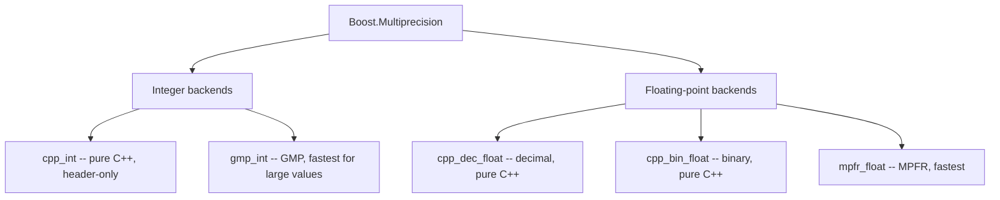

# Boost.Multiprecision

`Boost.Multiprecision` provides integer, rational, and floating-point types with **arbitrary or
extended precision**. It ships its own pure-C++ backends (`cpp_int`, `cpp_dec_float`, `cpp_bin_float`)
and optional wrappers around GMP, MPFR, and other external libraries — all behind a single,
expression-template-powered interface that looks and feels like built-in arithmetic.

:::info The problem it solves
Built-in types cap out at 64 bits for integers and ~18 significant digits for `double`. Cryptography,
combinatorics, financial calculations, and scientific computing regularly need more. Writing bignum
arithmetic from scratch is error-prone; Multiprecision gives you drop-in types that work with standard
operators and with [Boost.Math](./boost-math.md) special functions.
:::

## Arbitrary-precision integers with cpp_int

`cpp_int` is an unbounded integer — it grows as large as memory allows.

```cpp showLineNumbers title="big_factorial.cpp"
#include <boost/multiprecision/cpp_int.hpp>
#include <iostream>

int main() {
    using boost::multiprecision::cpp_int;

    cpp_int result = 1;
    for (int i = 2; i <= 100; ++i)
        result *= i;

    std::cout << "100! = " << result << "\n";
    // 100! has 158 digits — no overflow, no loss
}
```

For fixed-width big integers, use `int128_t`, `int256_t`, `int512_t`, or `int1024_t`:

```cpp showLineNumbers title="fixed_width.cpp"
#include <boost/multiprecision/cpp_int.hpp>
#include <iostream>

int main() {
    using boost::multiprecision::int256_t;

    int256_t a = 1;
    a <<= 200;   // 2^200 — far beyond uint64_t
    std::cout << "2^200 = " << a << "\n";
}
```

## High-precision floating point

`cpp_dec_float` gives you decimal floating point with a configurable number of significant digits.
`cpp_bin_float` does the same in binary.

```cpp showLineNumbers title="high_precision_pi.cpp"
#include <boost/multiprecision/cpp_dec_float.hpp>
#include <boost/math/constants/constants.hpp>
#include <iostream>

int main() {
    using boost::multiprecision::cpp_dec_float_50;  // 50 decimal digits

    cpp_dec_float_50 pi = boost::math::constants::pi<cpp_dec_float_50>();
    std::cout << std::setprecision(50) << "pi = " << pi << "\n";
}
```

| Type | Precision | Backend |
|------|-----------|---------|
| `cpp_dec_float_50` | 50 decimal digits | pure C++ |
| `cpp_dec_float_100` | 100 decimal digits | pure C++ |
| `cpp_bin_float_50` | 50 decimal digits (binary) | pure C++ |
| `mpz_int` | unlimited integer | GMP (external) |
| `mpfr_float_50` | 50 decimal digits | MPFR (external) |

:::tip When to use GMP/MPFR backends
The `cpp_*` backends are portable and header-only — no external dependency. GMP and MPFR backends
are significantly faster for large operands (thousands of digits) because they use hand-tuned
assembly. If performance matters and you can accept the dependency, prefer them.
:::

## Expression templates

By default, Multiprecision uses **expression templates** — compound expressions like `a * b + c`
are evaluated without creating temporaries. This is transparent in most cases, but it means the
type of `a + b` is *not* `cpp_int` — it is an expression-template proxy.

```cpp showLineNumbers title="expression_templates.cpp"
#include <boost/multiprecision/cpp_int.hpp>

int main() {
    using boost::multiprecision::cpp_int;

    cpp_int a = 100, b = 200, c = 300;

    // Fine: the proxy is implicitly converted to cpp_int
    cpp_int result = a * b + c;

    // auto deduces the proxy type, not cpp_int
    // auto expr = a * b + c;  // compiles, but expr is NOT a cpp_int
}
```

:::warning auto and expression templates
Using `auto` with Multiprecision arithmetic can capture the expression-template proxy instead of
the evaluated result. If you need the actual value, assign to an explicit type or use
`cpp_int result = ...;`. Alternatively, disable expression templates:
`typedef number<cpp_int_backend<>, et_off> my_int;`
:::

## Interoperability with Boost.Math

Multiprecision types plug directly into Boost.Math for high-precision special functions:

```cpp showLineNumbers title="math_interop.cpp"
#include <boost/multiprecision/cpp_dec_float.hpp>
#include <boost/math/special_functions/gamma.hpp>
#include <iostream>

int main() {
    using boost::multiprecision::cpp_dec_float_50;

    cpp_dec_float_50 x("0.5");
    cpp_dec_float_50 g = boost::math::tgamma(x);

    // tgamma(0.5) = sqrt(pi) to 50-digit precision
    std::cout << std::setprecision(50) << g << "\n";
}
```

## Conversions and I/O

Multiprecision types convert from strings, integers, and other numeric types. Narrowing conversions
(large to small) must be explicit.

```cpp showLineNumbers title="conversions.cpp"
#include <boost/multiprecision/cpp_int.hpp>
#include <iostream>

int main() {
    using boost::multiprecision::cpp_int;

    cpp_int from_string("123456789012345678901234567890");
    cpp_int from_int = 42;

    // Narrowing: must be explicit
    int small = static_cast<int>(from_int);  // OK, value fits

    // Output works with standard streams
    std::cout << from_string << "\n";

    (void)small;
}
```

## Common backends at a glance



## See also

- <Icon icon="lucide:calculator" inline /> [Boost.Math](./boost-math.md) — special functions and distributions at arbitrary precision.
- <Icon icon="lucide:divide" inline /> [Boost.Rational](./boost-rational.md) — exact rational arithmetic for a different kind of precision.
- <Icon icon="lucide:arrow-right-left" inline /> [Numeric Conversion](./numeric-conversion.md) — safe narrowing casts for built-in types.
- <Icon icon="lucide:book-open" inline /> [Boost overview](../readme.md).
