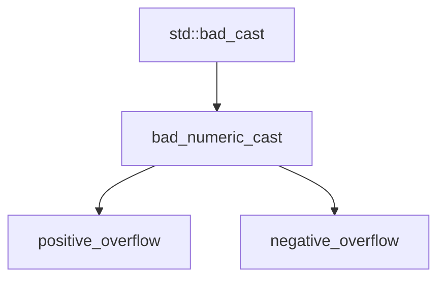

# Boost.NumericConversion

`boost::numeric_cast<Target>(source)` is a **checked numeric conversion** that throws
`boost::numeric::bad_numeric_cast` (or a subclass) when the value does not fit in the target type.
It replaces `static_cast<int>(some_double)` — which silently truncates, wraps, or loses precision —
with a conversion that either succeeds exactly or fails loudly.

:::info The problem it solves
C++ implicit and `static_cast` numeric conversions are silent: assigning a `long long` to an `int`
wraps on overflow, converting a negative value to `unsigned` wraps modulo 2^N, and casting a large
`double` to `int` is undefined behaviour. These bugs are hard to find because the code compiles
without warning and "works" until the value is out of range. `numeric_cast` makes every such
conversion a checked, documented decision point.
:::

## Basic usage

```cpp showLineNumbers title="numeric_cast.cpp"
#include <boost/numeric/conversion/cast.hpp>
#include <iostream>

int main() {
    long long big = 42;

    // Safe: 42 fits in int
    int a = boost::numeric_cast<int>(big);
    std::cout << a << "\n";  // 42

    // Overflow: throws boost::numeric::positive_overflow
    big = 3'000'000'000LL;
    try {
        int b = boost::numeric_cast<int>(big);
        (void)b;
    } catch (const boost::numeric::positive_overflow& e) {
        std::cout << "overflow: " << e.what() << "\n";
    }
}
```

## What it catches

| Conversion | `static_cast` | `numeric_cast` |
|------------|---------------|----------------|
| `long long` 3B to `int` | silent wrap | throws `positive_overflow` |
| `-1` to `unsigned int` | wraps to `UINT_MAX` | throws `negative_overflow` |
| `1e20` (double) to `int` | undefined behaviour | throws `positive_overflow` |
| `3.14` to `int` | truncates to `3` | throws (loss of fractional part) |
| `42` to `double` | exact | succeeds |

```cpp showLineNumbers title="signed_unsigned.cpp"
#include <boost/numeric/conversion/cast.hpp>
#include <iostream>

int main() {
    int neg = -5;

    try {
        unsigned int u = boost::numeric_cast<unsigned int>(neg);
        (void)u;
    } catch (const boost::numeric::negative_overflow& e) {
        std::cout << "caught: " << e.what() << "\n";
    }
}
```

:::danger static_cast is not a safe alternative
`static_cast<int>(3'000'000'000LL)` compiles and runs — it produces a garbage value. There is
no warning, no exception, no signal. This class of bug is responsible for real-world failures
(Ariane 5, integer overflow CVEs). `numeric_cast` exists to make this impossible.
:::

## Exception hierarchy

All exceptions derive from `boost::numeric::bad_numeric_cast`, which itself derives from
`std::bad_cast`:



You can catch the base `bad_numeric_cast` for any failure, or catch `positive_overflow` /
`negative_overflow` specifically.

## The converter class template

For advanced use, `boost::numeric::converter<Target, Source, Traits, OverflowHandler, ...>` lets
you customise overflow behaviour without exceptions — for instance, clamping to the target's
min/max instead of throwing.

```cpp showLineNumbers title="clamping.cpp"
#include <boost/numeric/conversion/converter.hpp>
#include <iostream>
#include <limits>

struct clamp_overflow {
    static int handle(double value) {
        if (value > 0) return std::numeric_limits<int>::max();
        return std::numeric_limits<int>::min();
    }
};

int main() {
    // Custom converter that clamps instead of throwing
    using clamped = boost::numeric::converter<int, double,
        boost::numeric::conversion_traits<int, double>,
        boost::numeric::def_overflow_handler  // default: throw
    >;

    // Default converter throws on overflow
    try {
        int v = clamped::convert(1e18);
        (void)v;
    } catch (...) {
        std::cout << "overflow caught\n";
    }
}
```

:::tip Use numeric_cast for boundaries
`numeric_cast` is most valuable at **system boundaries**: user input, network protocol fields,
file format values, and API return values. Interior arithmetic in a tight loop rarely needs it —
the cost of the range check matters there, and the values should already be validated.
:::

## Compile-time traits

`boost::numeric::bounds<T>` and `boost::numeric::conversion_traits<Target, Source>` provide
compile-time information about type ranges and conversion categories:

```cpp showLineNumbers title="traits.cpp"
#include <boost/numeric/conversion/bounds.hpp>
#include <boost/numeric/conversion/conversion_traits.hpp>
#include <iostream>

int main() {
    std::cout << "int max: " << boost::numeric::bounds<int>::highest() << "\n";
    std::cout << "int min: " << boost::numeric::bounds<int>::lowest()  << "\n";

    using traits = boost::numeric::conversion_traits<int, double>;
    // traits::supertype, traits::subtype, etc.
}
```

## numeric_cast versus alternatives

| Approach | Overflow detection | Exception | Compile-time | Notes |
|----------|-------------------|-----------|-------------|-------|
| `static_cast` | no | no | no | silent truncation/wrap |
| `boost::numeric_cast` | yes | yes | no | header-only, well-tested |
| C++20 `std::in_range` | partial | no (returns bool) | no | only for integer-to-integer |
| `gsl::narrow_cast` | no | no | no | documentation-only cast |
| `gsl::narrow` | yes | yes | no | similar to numeric_cast |

:::note No standard equivalent
There is no `std::numeric_cast` in the C++ standard. C++20 added `std::in_range` for querying
whether a value fits in an integer type, but it does not perform the conversion itself. For a
throwing checked cast, `boost::numeric_cast` remains the standard approach.
:::

## See also

- <Icon icon="lucide:calculator" inline /> [Boost.Multiprecision](./boost-multiprecision.md) — when the target type itself is too small.
- <Icon icon="lucide:divide" inline /> [Boost.Rational](./boost-rational.md) — exact fractions as an alternative to floating-point conversion.
- <Icon icon="lucide:arrow-right-left" inline /> [lexical_cast](../02-core-utilities/lexical-cast.md) — string-to-number conversions.
- <Icon icon="lucide:book-open" inline /> [Boost overview](../readme.md).
