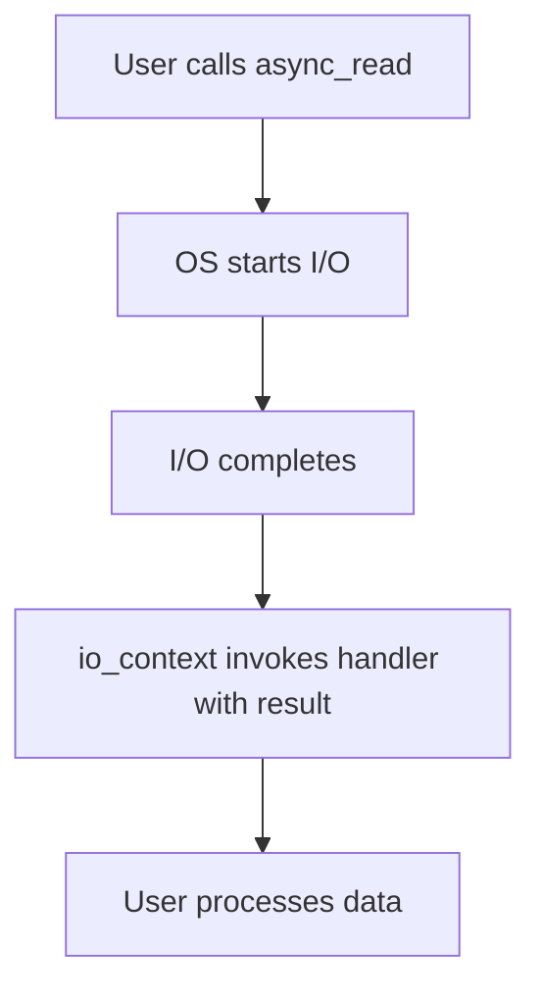

# Boost.Asio

`Boost.Asio` is the **asynchronous I/O framework** at the heart of modern C++ networking and
concurrency. It provides an `io_context` event loop, asynchronous operations with completion handlers,
strands for serialization, timers, signal handling, and the foundation on which
[networking](../11-networking/asio-networking.md) and [Beast](../11-networking/boost-beast.md) are
built. Asio is the basis of the Networking TS and a strong candidate for future standardisation.

:::info The problem it solves
Blocking I/O wastes threads — one thread per connection does not scale. Asio implements the
**proactor pattern**: you initiate an operation (read, write, connect, wait) and supply a callback;
the library delivers the result when the OS completes the operation, all driven by a single event
loop. This lets a handful of threads serve thousands of concurrent connections.
:::

## The io_context event loop

`io_context` (formerly `io_service`) is the central scheduler. You post work into it — async
operations, timers, plain handlers — and call `run()` to process completions.

```cpp showLineNumbers title="io_context_basics.cpp"
#include <boost/asio.hpp>
#include <iostream>

int main() {
    boost::asio::io_context io;

    // Post a plain handler
    boost::asio::post(io, [] {
        std::cout << "hello from the event loop\n";
    });

    io.run();  // processes all posted work, then returns
}
```


## Asynchronous timers

Timers are the simplest async operation and a good introduction to the pattern.

```cpp showLineNumbers title="timer.cpp"
#include <boost/asio.hpp>
#include <iostream>

int main() {
    boost::asio::io_context io;
    boost::asio::steady_timer timer(io, boost::asio::chrono::seconds(2));

    timer.async_wait([](const boost::system::error_code& ec) {
        if (!ec)
            std::cout << "timer fired\n";
    });

    io.run();  // blocks until all async work completes
}
```

:::tip Always check the error code
Every Asio completion handler receives a `boost::system::error_code` as its first argument. A
cancelled operation delivers `boost::asio::error::operation_aborted` — do not treat it as a fatal
error.
:::

## Strands — serializing handlers

When multiple threads call `io_context::run()`, handlers can execute concurrently. A **strand**
guarantees that handlers posted through it never run in parallel, removing the need for explicit
mutexes on the data they access.

```cpp showLineNumbers title="strand.cpp"
#include <boost/asio.hpp>

int main() {
    boost::asio::io_context io;
    auto strand = boost::asio::make_strand(io);

    for (int i = 0; i < 10; ++i)
        boost::asio::post(strand, [i] {
            // these never overlap, even with multiple io.run() threads
        });

    boost::asio::thread_pool pool(4);
    boost::asio::post(pool, [&] { io.run(); });
    boost::asio::post(pool, [&] { io.run(); });
    pool.join();
}
```

## The proactor pattern

Asio follows the proactor model: the OS (or a simulation layer) performs the actual I/O, and Asio
delivers the completed result to your handler. This contrasts with the reactor model (like `epoll`
raw), where you are notified that an operation *can* proceed and then perform it yourself.



## Coroutine support

Since Boost 1.80+, Asio integrates with C++20 coroutines via `boost::asio::awaitable` and
`co_await`, making async code read like synchronous code:

```cpp showLineNumbers title="coro_timer.cpp"
#include <boost/asio.hpp>
#include <iostream>

boost::asio::awaitable<void> tick() {
    auto executor = co_await boost::asio::this_coro::executor;
    boost::asio::steady_timer timer(executor, boost::asio::chrono::seconds(1));
    co_await timer.async_wait(boost::asio::use_awaitable);
    std::cout << "tick\n";
}

int main() {
    boost::asio::io_context io;
    boost::asio::co_spawn(io, tick(), boost::asio::detached);
    io.run();
}
```

:::note Header-only or compiled
Asio can be used header-only by defining `BOOST_ASIO_HEADER_ONLY`, but the default build links
against Boost.System. With Boost 1.69+, `boost::system::error_code` is header-only, making
standalone Asio effectively header-only too.
:::

## Common patterns

| Pattern | Description |
|---------|-------------|
| One thread, one `io_context` | Simplest model — no strand needed |
| Thread pool calling `run()` | Scale I/O across cores; use strands for shared state |
| `io_context`-per-thread | Each thread owns its context; partition work by connection |
| Coroutines (`co_await`) | Modern async: readable, composable, no callback nesting |

:::warning Do not block inside a handler
A handler that blocks (sleeps, does heavy CPU work, calls a synchronous API) stalls the entire
`io_context`. Offload blocking work to a separate thread or thread pool.
:::

## See also

- <Icon icon="lucide:network" inline /> [Asio Networking](../11-networking/asio-networking.md) — TCP/UDP with Asio.
- <Icon icon="lucide:globe" inline /> [Boost.Beast](../11-networking/boost-beast.md) — HTTP/WebSocket built on Asio.
- <Icon icon="lucide:waypoints" inline /> [Boost.Thread](./boost-thread.md) — OS threads when you need them alongside Asio.
- <Icon icon="lucide:zap" inline /> [Boost.Coroutine2](./boost-coroutine2.md) — stackful coroutines, an older alternative.
- <Icon icon="lucide:book-open" inline /> [Boost overview](../readme.md).
