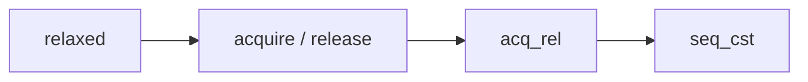

# Boost.Atomic

`Boost.Atomic` provides **atomic operations** with explicit memory-ordering guarantees — the building
blocks of lock-free programming. It is the predecessor of `std::atomic` from C++11, and it continues
to be useful on platforms where compiler support for atomics is incomplete or where you need features
like `atomic_ref` or `wait/notify` before C++20.

:::info The problem it solves
When two threads touch the same variable without synchronization, the result is a data race — undefined
behaviour. Mutexes fix this but are expensive. Atomic operations give you fine-grained, lock-free
access to individual variables with precise control over how memory operations are ordered across cores.
:::

## Basic usage

An `boost::atomic<T>` wraps a value and provides atomic `load`, `store`, `exchange`, and
compare-and-swap (`compare_exchange_weak` / `compare_exchange_strong`) operations.

```cpp showLineNumbers title="atomic_counter.cpp"
#include <boost/atomic.hpp>
#include <boost/thread.hpp>
#include <iostream>

boost::atomic<int> counter(0);

void increment(int n) {
    for (int i = 0; i < n; ++i)
        counter.fetch_add(1, boost::memory_order_relaxed);
}

int main() {
    boost::thread t1(increment, 100000);
    boost::thread t2(increment, 100000);
    t1.join();
    t2.join();
    std::cout << counter.load() << "\n";  // always 200000
}
```

## Memory ordering

Every atomic operation accepts a memory-order argument that controls how surrounding non-atomic
memory accesses may be reordered:

| Order | Meaning |
|-------|---------|
| `memory_order_relaxed` | No ordering constraints — only atomicity is guaranteed |
| `memory_order_acquire` | Reads after this load see writes from the releasing thread |
| `memory_order_release` | Writes before this store are visible to the acquiring thread |
| `memory_order_acq_rel` | Both acquire and release in one operation |
| `memory_order_seq_cst` | Total order across all seq_cst operations (the default) |



:::warning Relaxed is not "free"
`memory_order_relaxed` is the cheapest ordering but the hardest to reason about. It guarantees
atomicity (no torn reads) but nothing about the order in which other threads see surrounding writes.
Use it only for independent counters or statistics — never for flags that guard shared data.
:::

## Compare-and-swap

The fundamental building block of lock-free algorithms. `compare_exchange_strong` atomically compares
the current value with `expected`, and if they match, writes `desired`.

```cpp showLineNumbers title="cas_spinlock.cpp"
#include <boost/atomic.hpp>

class spinlock {
    boost::atomic<bool> flag_{false};
public:
    void lock() {
        bool expected = false;
        while (!flag_.compare_exchange_weak(
                   expected, true, boost::memory_order_acquire)) {
            expected = false;
        }
    }
    void unlock() {
        flag_.store(false, boost::memory_order_release);
    }
};
```

:::tip weak versus strong
`compare_exchange_weak` may fail spuriously (return `false` even when the value matches `expected`).
It is cheaper on some architectures and is the right choice inside a retry loop. Use
`compare_exchange_strong` when you need a single, definitive attempt.
:::

## Atomic fences

Standalone fences enforce ordering without being tied to a particular variable:

```cpp showLineNumbers
#include <boost/atomic.hpp>

boost::atomic<int> data(0);
boost::atomic<bool> ready(false);

void producer() {
    data.store(42, boost::memory_order_relaxed);
    boost::atomic_thread_fence(boost::memory_order_release);
    ready.store(true, boost::memory_order_relaxed);
}

void consumer() {
    while (!ready.load(boost::memory_order_relaxed)) {}
    boost::atomic_thread_fence(boost::memory_order_acquire);
    assert(data.load(boost::memory_order_relaxed) == 42);  // guaranteed
}
```

## Wait and notify (pre-C++20)

Boost.Atomic provides `wait` and `notify_one` / `notify_all` for efficient blocking on atomic
values — functionality that only entered the standard in C++20.

```cpp showLineNumbers
#include <boost/atomic.hpp>

boost::atomic<int> signal(0);

void waiter() {
    signal.wait(0);  // blocks until signal != 0
}

void notifier() {
    signal.store(1);
    signal.notify_one();
}
```

## Boost.Atomic versus std::atomic

| Feature | `boost::atomic` | `std::atomic` |
|---------|-----------------|---------------|
| Header | `<boost/atomic.hpp>` | `<atomic>` |
| `wait` / `notify` | yes | C++20 |
| `atomic_ref` | yes | C++20 |
| Lock-free queries | `is_lock_free()` | `is_lock_free()` |
| Platform portability | high (fallback to locks) | compiler-dependent |
| Needs linking | `-lboost_atomic` | no |

:::note Which to choose
On C++11 and later, prefer `std::atomic` for most work — it is always available and needs no extra
dependency. Reach for `boost::atomic` when you need wait/notify on pre-C++20 compilers, or when
targeting a platform where the compiler's built-in atomics are unreliable.
:::

## See also

- <Icon icon="lucide:waypoints" inline /> [Boost.Thread](./boost-thread.md) — higher-level threading primitives.
- <Icon icon="lucide:lock" inline /> [Boost.Lockfree](./boost-lockfree.md) — data structures built on atomic operations.
- <Icon icon="lucide:arrow-left-right" inline /> [Boost and the C++ Standard](../00-overview/boost-and-the-standard.md) — the `std::atomic` lineage.
- <Icon icon="lucide:book-open" inline /> [Boost overview](../readme.md).
