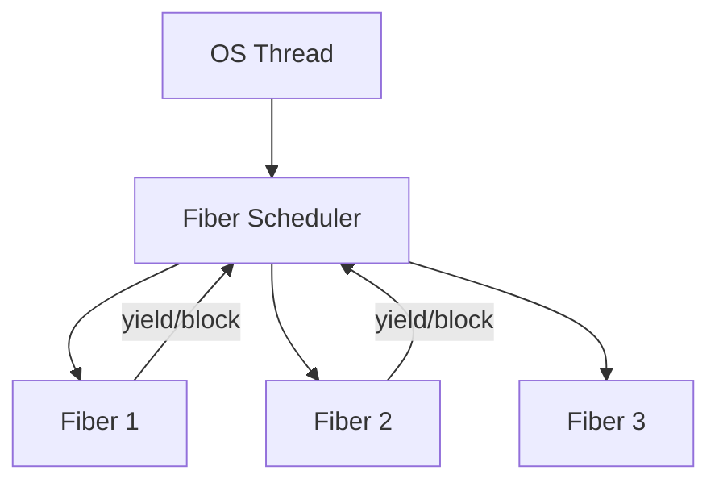

# Boost.Fiber

`Boost.Fiber` provides **user-space cooperative threads** (fibers). A fiber looks like a thread — it
has its own stack and can block on mutexes, condition variables, and channels — but it is scheduled
cooperatively within a single OS thread, not preemptively by the kernel. This makes fibers extremely
lightweight: creating thousands of fibers is practical where creating thousands of OS threads is not.

:::info The problem it solves
OS threads are expensive — each one consumes kernel resources and a megabyte or more of stack. When you
have thousands of concurrent tasks that spend most of their time waiting (I/O, timers, channel reads),
fibers give you the concurrency model of goroutines or Erlang processes in plain C++.
:::

## Launching fibers

A fiber is created like a thread — pass it a callable, and it begins executing. Fibers run on the
thread that created them (or the thread running the fiber scheduler) until they yield, block, or
complete.

```cpp showLineNumbers title="fiber_basics.cpp"
#include <boost/fiber/all.hpp>
#include <iostream>

void task(int id) {
    std::cout << "fiber " << id << " start\n";
    boost::this_fiber::yield();    // cooperatively yield to another fiber
    std::cout << "fiber " << id << " resume\n";
}

int main() {
    boost::fibers::fiber f1(task, 1);
    boost::fibers::fiber f2(task, 2);
    f1.join();
    f2.join();
}
```

## Fiber synchronization

Fibers have their own versions of mutex, condition_variable, and barrier — these yield the fiber
instead of blocking the OS thread.

```cpp showLineNumbers title="fiber_mutex.cpp"
#include <boost/fiber/all.hpp>

boost::fibers::mutex mtx;
int shared = 0;

void increment(int n) {
    for (int i = 0; i < n; ++i) {
        std::lock_guard<boost::fibers::mutex> lock(mtx);
        ++shared;
    }
}

int main() {
    boost::fibers::fiber f1(increment, 1000);
    boost::fibers::fiber f2(increment, 1000);
    f1.join();
    f2.join();
    // shared == 2000
}
```

:::warning Do not mix fiber and thread primitives
Using `std::mutex` or `boost::mutex` inside a fiber blocks the entire OS thread, stalling all fibers
on that thread. Always use `boost::fibers::mutex` and `boost::fibers::condition_variable` inside
fiber code.
:::

## Channels

Fibers can communicate through **unbuffered** or **buffered channels**, similar to Go channels.

```cpp showLineNumbers title="fiber_channel.cpp"
#include <boost/fiber/all.hpp>
#include <iostream>

int main() {
    boost::fibers::buffered_channel<int> ch(4);

    boost::fibers::fiber producer([&] {
        for (int i = 0; i < 5; ++i)
            ch.push(i);
        ch.close();
    });

    boost::fibers::fiber consumer([&] {
        int val;
        while (ch.pop(val) == boost::fibers::channel_op_status::success)
            std::cout << val << " ";
        std::cout << "\n";
    });

    producer.join();
    consumer.join();
}
```

## Scheduling

The default scheduler is `round_robin` — fibers run in the order they become ready. Custom schedulers
can implement work-stealing across threads or priority-based dispatch.



## Fibers versus threads versus coroutines

| Aspect | OS Thread | Fiber | C++20 Coroutine |
|--------|-----------|-------|-----------------|
| Stack | kernel-allocated (~1MB) | user-allocated (~64KB) | stackless (frame only) |
| Scheduling | preemptive (kernel) | cooperative (user) | cooperative (user) |
| Creation cost | high (syscall) | low (allocation) | very low (frame) |
| Blocking I/O | blocks one thread | yields fiber | must use async I/O |
| Sync primitives | std::mutex, etc. | fiber::mutex, channels | awaitable objects |
| Scalability | thousands at most | millions possible | millions possible |

:::note Integration with Asio
Boost.Fiber ships with an Asio integration scheduler (`boost::fibers::asio::round_robin`) that lets
fibers yield on Asio async operations. This combines the readable, synchronous-looking fiber code with
Asio's efficient I/O multiplexing.
:::

## See also

- <Icon icon="lucide:zap" inline /> [Boost.Coroutine2](./boost-coroutine2.md) — stackful coroutines without the threading abstraction.
- <Icon icon="lucide:waypoints" inline /> [Boost.Asio](./boost-asio.md) — async I/O that fibers can integrate with.
- <Icon icon="lucide:waypoints" inline /> [Boost.Thread](./boost-thread.md) — OS threads for preemptive concurrency.
- <Icon icon="lucide:book-open" inline /> [Boost overview](../readme.md).
