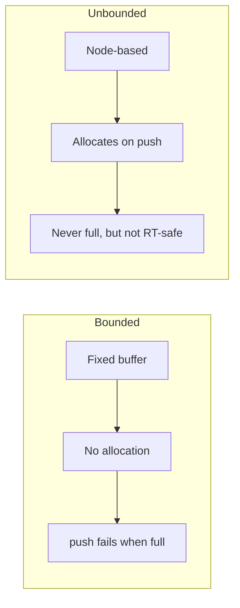

# Boost.Lockfree

`Boost.Lockfree` provides **lock-free** and **wait-free** data structures — concurrent queues and
stacks that never take a mutex, never block on a lock, and never cause priority inversion. They are
the right tool when latency spikes from mutex contention are unacceptable: audio pipelines, market
data feeds, inter-thread messaging in real-time systems.

:::info The problem it solves
A mutex-based queue is correct, but under contention one thread can block while another holds the lock.
In latency-sensitive code, even brief blocking is a problem. Lock-free structures guarantee that at
least one thread always makes progress, and wait-free structures guarantee that *every* thread makes
progress — no thread can starve.
:::

## The three containers

| Container | Producers | Consumers | Bounded | Wait-free |
|-----------|-----------|-----------|---------|-----------|
| `boost::lockfree::queue<T>` | multiple | multiple | optional | no (lock-free) |
| `boost::lockfree::stack<T>` | multiple | multiple | optional | no (lock-free) |
| `boost::lockfree::spsc_queue<T>` | single | single | yes (fixed) | yes |

:::tip spsc_queue for the common case
If your design has exactly one producer and one consumer (logging, audio callback to processing
thread), `spsc_queue` is the best choice — it is wait-free, cache-friendly, and has the lowest
overhead.
:::

## Producer-consumer with queue

```cpp showLineNumbers title="lockfree_queue.cpp"
#include <boost/lockfree/queue.hpp>
#include <boost/thread.hpp>
#include <boost/atomic.hpp>
#include <iostream>

boost::lockfree::queue<int> q(128);  // bounded capacity
boost::atomic<bool> done(false);

void producer() {
    for (int i = 0; i < 1000; ++i)
        while (!q.push(i)) {}        // retry if full
    done = true;
}

void consumer() {
    int val;
    while (!done || !q.empty()) {
        while (q.pop(val))
            ;  // process val
    }
}

int main() {
    boost::thread p(producer);
    boost::thread c(consumer);
    p.join();
    c.join();
}
```

:::warning push and pop can fail
`push` returns `false` when the queue is full (bounded mode). `pop` returns `false` when empty. You
must handle these cases — typically with a retry loop or a fallback strategy.
:::

## Single-producer single-consumer queue

```cpp showLineNumbers title="spsc.cpp"
#include <boost/lockfree/spsc_queue.hpp>
#include <boost/thread.hpp>
#include <iostream>

boost::lockfree::spsc_queue<int, boost::lockfree::capacity<1024>> ring;

void producer() {
    for (int i = 0; i < 10000; ++i)
        while (!ring.push(i)) {}
}

void consumer() {
    int val;
    int count = 0;
    while (count < 10000) {
        while (ring.pop(val))
            ++count;
    }
    std::cout << "consumed " << count << " items\n";
}

int main() {
    boost::thread p(producer);
    boost::thread c(consumer);
    p.join();
    c.join();
}
```

## Bounded versus unbounded

By default, `queue` and `stack` are node-based and can grow dynamically (unbounded). Passing a
capacity at construction or using `boost::lockfree::capacity<N>` makes them bounded and
avoids heap allocation during push/pop — important for real-time code.



## Type requirements

Lock-free containers require `T` to be **trivially copyable** and **trivially destructible**. This
means no `std::string`, no `std::vector` — use indices, pointers, or POD structs.

:::danger Non-trivial types are rejected
If `T` has a non-trivial copy constructor or destructor, the code will not compile. For complex data,
push a pointer or an index into a separate pre-allocated buffer.
:::

## See also

- <Icon icon="lucide:atom" inline /> [Boost.Atomic](./boost-atomic.md) — the atomic primitives underneath lock-free structures.
- <Icon icon="lucide:waypoints" inline /> [Boost.Thread](./boost-thread.md) — mutex-based threading when lock-free is overkill.
- <Icon icon="lucide:memory-stick" inline /> [Boost.Pool](../03-smart-pointers-and-memory/boost-pool.md) — pool allocation for real-time scenarios.
- <Icon icon="lucide:book-open" inline /> [Boost overview](../readme.md).
