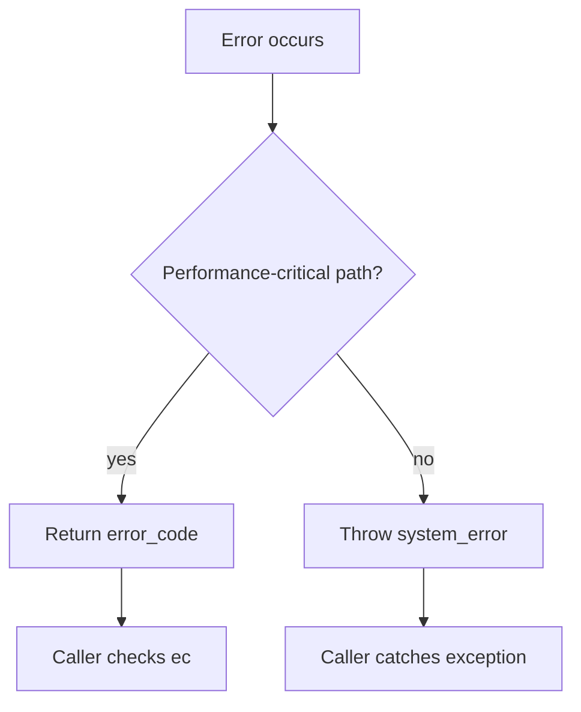

# Boost.System

`boost::system` provides the **error_code and error_category framework** — a structured, extensible
way to represent and propagate errors without exceptions. It was so successful that C++11 adopted it
nearly verbatim as `std::error_code` and `std::error_category`. Today, Boost.System goes further
with `boost::system::result<T>` (Boost 1.81+), which bundles a value *or* an error in a single
return type.

:::info The problem it solves
C has `errno`, Windows has `GetLastError()`, and every library invents its own error integers. These
are all incompatible: a Winsock error code means something completely different from a POSIX errno.
Boost.System introduces `error_code` (a code + a *category*) so that error values from different
domains can coexist, compare, and display human-readable messages — all without exceptions.
:::

## error_code basics

An `error_code` pairs an integer value with a pointer to its `error_category`, which knows how to
name and describe the error:

```cpp showLineNumbers title="error_code_basics.cpp"
#include <boost/system/error_code.hpp>
#include <iostream>

namespace sys = boost::system;

void open_file(const std::string& path, sys::error_code& ec) {
    FILE* f = std::fopen(path.c_str(), "r");
    if (!f) {
        ec.assign(errno, sys::generic_category());
        return;
    }
    ec.clear();
    std::fclose(f);
}

int main() {
    sys::error_code ec;
    open_file("/no/such/file", ec);

    if (ec) {
        std::cout << "error " << ec.value()
                  << " (" << ec.category().name() << "): "
                  << ec.message() << "\n";
    }
}
```

The contextual `bool` conversion makes `if (ec)` the idiomatic check — true means an error
occurred.

## error_category — defining your own error domain

```cpp showLineNumbers title="custom_category.cpp"
#include <boost/system/error_code.hpp>
#include <string>

namespace sys = boost::system;

enum class app_error {
    success = 0,
    invalid_input = 1,
    timeout = 2,
    connection_lost = 3
};

class app_category_impl : public sys::error_category {
public:
    const char* name() const noexcept override { return "app"; }

    std::string message(int ev) const override {
        switch (static_cast<app_error>(ev)) {
            case app_error::success:         return "success";
            case app_error::invalid_input:   return "invalid input";
            case app_error::timeout:         return "operation timed out";
            case app_error::connection_lost: return "connection lost";
            default:                         return "unknown app error";
        }
    }
};

const sys::error_category& app_category() {
    static app_category_impl instance;
    return instance;
}

sys::error_code make_error_code(app_error e) {
    return {static_cast<int>(e), app_category()};
}
```

:::tip error_code vs error_condition
`error_code` represents a *specific* error from a *specific* source (e.g., POSIX errno 2).
`error_condition` represents a *portable* error class (e.g., "file not found") that you can compare
against codes from any category. Use `error_condition` for cross-platform error handling in generic
code.
:::

## error_code versus exceptions



Most Boost libraries (Filesystem, Asio, Beast) offer **both** patterns: a throwing overload and an
`error_code&` overload. The `error_code` path avoids exception overhead in hot loops or
expected-failure scenarios.

## result&lt;T&gt; — value-or-error returns (Boost 1.81+)

`boost::system::result<T>` is a modern alternative: it holds either a `T` value or an `error_code`,
similar to Rust's `Result`:

```cpp showLineNumbers title="result.cpp"
#include <boost/system/result.hpp>
#include <iostream>
#include <string>

namespace sys = boost::system;

sys::result<int> parse_int(const std::string& s) {
    try {
        return std::stoi(s);
    } catch (...) {
        return sys::error_code{EINVAL, sys::generic_category()};
    }
}

int main() {
    auto r = parse_int("42");
    if (r) {
        std::cout << "parsed: " << *r << "\n";
    }

    auto bad = parse_int("abc");
    if (!bad) {
        std::cout << "error: " << bad.error().message() << "\n";
    }
}
```

:::note result vs std::expected
C++23 introduced `std::expected<T, E>`, which serves a similar purpose. `boost::system::result<T>`
is fixed to `error_code` as its error type, making it lighter-weight and directly compatible with
the Boost error framework. If you need a custom error type, `std::expected` is more flexible.
:::

## Boost.System versus std::system_error

| Feature | `boost::system` | `std::system_error` (C++11) |
|---------|----------------|-----------------------------|
| Header | `<boost/system/error_code.hpp>` | `<system_error>` |
| `error_code` | `boost::system::error_code` | `std::error_code` |
| `error_category` | `boost::system::error_category` | `std::error_category` |
| `result<T>` | yes (Boost 1.81+) | no (use `std::expected` in C++23) |
| Interop | implicit conversion to `std` types | native |

Since Boost 1.68, `boost::system::error_code` is implicitly convertible to `std::error_code`,
so the two ecosystems interoperate seamlessly.

## Linking

Since Boost 1.69, Boost.System is **header-only** — no library to link. Older versions required
`-lboost_system`, but current Boost inlines everything.

## See also

- <Icon icon="lucide:hard-drive" inline /> [Boost.Filesystem](./boost-filesystem.md) — uses `error_code` for its non-throwing overloads.
- <Icon icon="lucide:waypoints" inline /> [Boost.Asio](../09-concurrency-and-async/boost-asio.md) — pervasive `error_code` usage in async I/O.
- <Icon icon="lucide:arrow-left-right" inline /> [Boost and the C++ Standard](../00-overview/boost-and-the-standard.md) — the `std::error_code` lineage.
- <Icon icon="lucide:book-open" inline /> [Boost overview](../readme.md).
