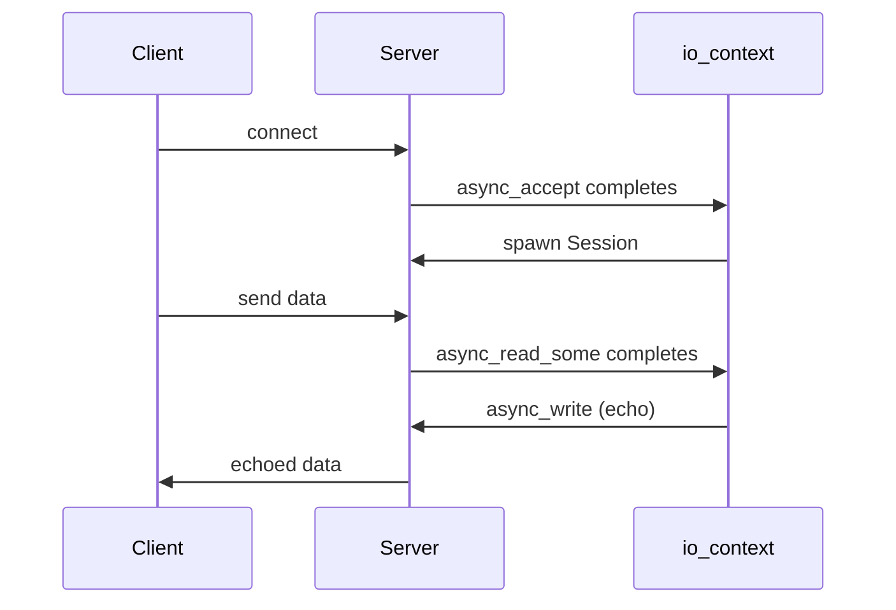

# Asio Networking (TCP / UDP)

Boost.Asio is not just an async I/O framework — it is also the de-facto C++ networking library.
Everything network-related in Boost builds on Asio's socket layer: TCP streams, UDP datagrams,
name resolution, SSL/TLS, and higher-level protocols like HTTP (via [Beast](./boost-beast.md)).
This page covers the **networking** side of Asio; for the core event-loop and async model see
[Boost.Asio](../09-concurrency-and-async/boost-asio.md).

:::info The problem it solves
The C++ standard has no networking library (the Networking TS has stalled). Asio fills that gap with a
portable, production-grade socket API that works identically on Linux, macOS, and Windows — and does
so asynchronously, so a single thread can manage thousands of connections.
:::

## TCP basics — connect, send, receive

A TCP workflow has two roles: a **client** that connects and a **server** that listens and accepts.

```cpp showLineNumbers title="tcp_client.cpp"
#include <boost/asio.hpp>
#include <iostream>

namespace net = boost::asio;
using tcp = net::ip::tcp;

int main() {
    net::io_context io;
    tcp::resolver resolver(io);
    tcp::socket sock(io);

    auto endpoints = resolver.resolve("example.com", "80");
    net::connect(sock, endpoints);

    std::string req = "GET / HTTP/1.1\r\nHost: example.com\r\nConnection: close\r\n\r\n";
    net::write(sock, net::buffer(req));

    boost::system::error_code ec;
    std::string response;
    for (;;) {
        char buf[512];
        std::size_t n = sock.read_some(net::buffer(buf), ec);
        if (ec == net::error::eof) break;
        response.append(buf, n);
    }
    std::cout << response.substr(0, 200) << "\n";
}
```

:::note Linking
Asio requires linking against Boost.System and platform threading libraries:
`g++ -std=c++17 tcp_client.cpp -lboost_system -pthread`
:::

## Async TCP echo server

The canonical Asio example — an echo server that handles many clients on one thread.

```cpp showLineNumbers title="echo_server.cpp"
#include <boost/asio.hpp>
#include <memory>
#include <iostream>

namespace net = boost::asio;
using tcp = net::ip::tcp;

class Session : public std::enable_shared_from_this<Session> {
    tcp::socket sock_;
    char data_[1024];
public:
    explicit Session(tcp::socket s) : sock_(std::move(s)) {}

    void start() { do_read(); }

private:
    void do_read() {
        auto self = shared_from_this();
        sock_.async_read_some(net::buffer(data_),
            [this, self](boost::system::error_code ec, std::size_t n) {
                if (!ec) do_write(n);
            });
    }
    void do_write(std::size_t n) {
        auto self = shared_from_this();
        net::async_write(sock_, net::buffer(data_, n),
            [this, self](boost::system::error_code ec, std::size_t) {
                if (!ec) do_read();
            });
    }
};

class Server {
    tcp::acceptor acceptor_;
public:
    Server(net::io_context& io, unsigned short port)
        : acceptor_(io, tcp::endpoint(tcp::v4(), port)) {
        do_accept();
    }
private:
    void do_accept() {
        acceptor_.async_accept(
            [this](boost::system::error_code ec, tcp::socket sock) {
                if (!ec)
                    std::make_shared<Session>(std::move(sock))->start();
                do_accept();
            });
    }
};

int main() {
    net::io_context io;
    Server srv(io, 7777);
    std::cout << "listening on port 7777\n";
    io.run();
}
```



:::tip shared_from_this pattern
Every async callback captures a `shared_ptr` to the session (`self`). This ensures the session stays
alive until all pending operations complete — even if the server forgets about it. This pattern is
universal in Asio-based code.
:::

## UDP — fire and forget

UDP sockets are simpler: no connection, no stream, just individual datagrams.

```cpp showLineNumbers title="udp_sender.cpp"
#include <boost/asio.hpp>

namespace net = boost::asio;
using udp = net::ip::udp;

int main() {
    net::io_context io;
    udp::socket sock(io, udp::endpoint(udp::v4(), 0));
    udp::endpoint target(net::ip::make_address("127.0.0.1"), 9000);

    std::string msg = "hello via udp";
    sock.send_to(net::buffer(msg), target);
}
```

## Name resolution

`tcp::resolver` translates hostnames to endpoints. It supports both synchronous and async resolution.

```cpp showLineNumbers
tcp::resolver resolver(io);

// Synchronous
auto results = resolver.resolve("example.com", "https");
for (auto& entry : results)
    std::cout << entry.endpoint() << "\n";

// Asynchronous
resolver.async_resolve("example.com", "443",
    [](boost::system::error_code ec, tcp::resolver::results_type results) {
        if (!ec)
            for (auto& e : results)
                std::cout << e.endpoint() << "\n";
    });
```

## SSL/TLS

Asio integrates with OpenSSL via `boost::asio::ssl`. Wrap a socket in an `ssl::stream` to get
encrypted communication.

```cpp showLineNumbers
#include <boost/asio/ssl.hpp>

net::ssl::context ctx(net::ssl::context::tlsv13_client);
ctx.set_default_verify_paths();

net::ssl::stream<tcp::socket> stream(io, ctx);
stream.set_verify_mode(net::ssl::verify_peer);

// connect the underlying socket, then handshake
net::connect(stream.next_layer(), endpoints);
stream.handshake(net::ssl::stream_base::client);

// now read/write through 'stream' as usual
```

:::warning OpenSSL dependency
SSL support requires linking `-lssl -lcrypto` in addition to `-lboost_system`. The OpenSSL
development headers must be installed.
:::

## Asio networking versus the Networking TS

| Aspect | Boost.Asio | Networking TS (std) |
|--------|-----------|---------------------|
| Status | Shipping since 2003 | Stalled, not in C++23/26 |
| Portability | Linux, macOS, Windows, FreeBSD | N/A |
| SSL/TLS | Yes (OpenSSL) | Unspecified |
| HTTP/WebSocket | Via [Beast](./boost-beast.md) | No |
| Coroutine support | `co_await` with `use_awaitable` | Planned |

## See also

- <Icon icon="lucide:cpu" inline /> [Boost.Asio (core)](../09-concurrency-and-async/boost-asio.md) — the async model, io_context, strands, timers.
- <Icon icon="lucide:network" inline /> [Boost.Beast](./boost-beast.md) — HTTP and WebSocket on top of Asio.
- <Icon icon="lucide:book-open" inline /> [Boost overview](../readme.md).
