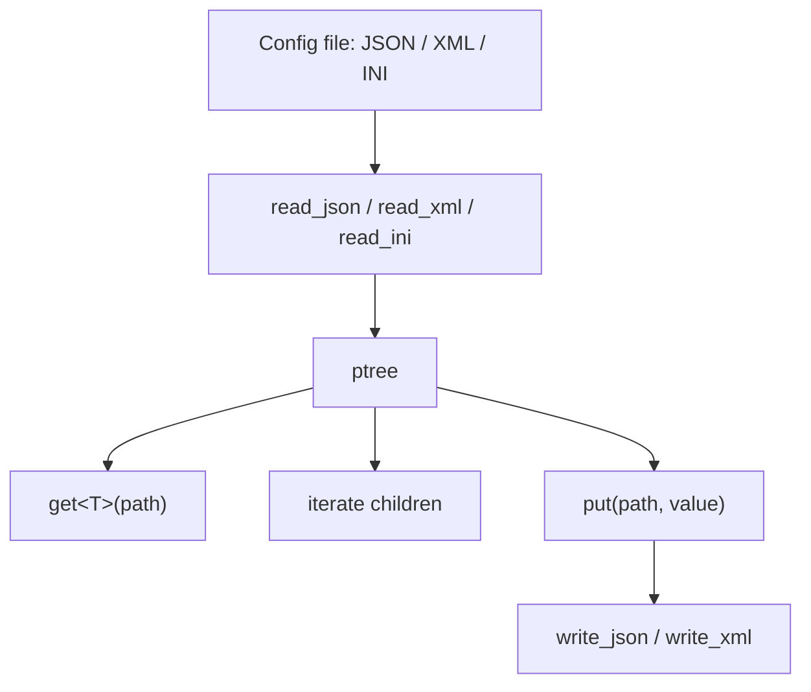

# Boost.PropertyTree

Boost.PropertyTree provides a **tree-shaped data structure** (`ptree`) with parsers and generators
for JSON, XML, INI, and INFO formats. It is designed for reading and writing configuration files —
the kind of task where you want `config.get<int>("server.port")` without pulling in a full-blown
parsing library.

:::info The problem it solves
C++ has no built-in config-file reader. Hand-rolling parsers for JSON or INI is tedious and
fragile. PropertyTree gives you a single tree type that can ingest multiple formats and lets you
navigate values with dot-separated paths.
:::

## Reading a JSON config

```cpp showLineNumbers title="read_config.cpp"
#include <boost/property_tree/ptree.hpp>
#include <boost/property_tree/json_parser.hpp>
#include <iostream>

namespace pt = boost::property_tree;

int main() {
    pt::ptree tree;
    pt::read_json("config.json", tree);

    std::string host = tree.get<std::string>("server.host");
    int port         = tree.get<int>("server.port");
    bool debug       = tree.get<bool>("server.debug", false);  // default

    std::cout << host << ":" << port << " debug=" << debug << "\n";
}
```

Given this `config.json`:

```bash
{
    "server": {
        "host": "0.0.0.0",
        "port": 8080,
        "debug": true
    }
}
```

## Writing a config file

Build a tree programmatically and serialize it:

```cpp showLineNumbers title="write_config.cpp"
#include <boost/property_tree/ptree.hpp>
#include <boost/property_tree/json_parser.hpp>

namespace pt = boost::property_tree;

int main() {
    pt::ptree tree;
    tree.put("database.host", "localhost");
    tree.put("database.port", 5432);
    tree.put("database.name", "myapp");

    pt::write_json("db.json", tree);
}
```

## Supported formats

| Format | Read | Write | Header |
|--------|------|-------|--------|
| JSON | `read_json` | `write_json` | `boost/property_tree/json_parser.hpp` |
| XML | `read_xml` | `write_xml` | `boost/property_tree/xml_parser.hpp` |
| INI | `read_ini` | `write_ini` | `boost/property_tree/ini_parser.hpp` |
| INFO | `read_info` | `write_info` | `boost/property_tree/info_parser.hpp` |

## Iterating over children

A `ptree` node can have an ordered list of children, each with a key:

```cpp showLineNumbers title="iterate.cpp"
#include <boost/property_tree/ptree.hpp>
#include <boost/property_tree/json_parser.hpp>
#include <iostream>

namespace pt = boost::property_tree;

int main() {
    pt::ptree tree;
    pt::read_json("config.json", tree);

    // Iterate children of "server"
    for (auto& [key, child] : tree.get_child("server")) {
        std::cout << key << " = " << child.data() << "\n";
    }
}
```

## Arrays in JSON

PropertyTree represents JSON arrays as children with empty keys:

```cpp showLineNumbers title="arrays.cpp"
pt::ptree tree;
pt::read_json("list.json", tree);

// list.json: { "tags": ["web", "api", "v2"] }
for (auto& [_, item] : tree.get_child("tags")) {
    std::cout << item.data() << "\n";  // web, api, v2
}
```

:::warning PropertyTree is not a JSON library
PropertyTree's JSON parser is intentionally simple: it does not preserve types (everything is a
string internally), does not handle `null`, and does not distinguish numbers from strings. For
rigorous JSON processing, use [Boost.JSON](./boost-json.md).
:::

## XML example

```cpp showLineNumbers title="xml_config.cpp"
#include <boost/property_tree/ptree.hpp>
#include <boost/property_tree/xml_parser.hpp>

namespace pt = boost::property_tree;

int main() {
    pt::ptree tree;
    pt::read_xml("settings.xml", tree);

    // <settings><window><width>800</width></window></settings>
    int width = tree.get<int>("settings.window.width");
}
```

:::note XML attributes
XML attributes are accessible under a special `<xmlattr>` key:
`tree.get<std::string>("root.element.<xmlattr>.id")`.
:::

## Optional values and defaults

```cpp showLineNumbers
// Throws pt::ptree_bad_path if missing:
int port = tree.get<int>("server.port");

// Returns boost::optional — no throw:
auto port_opt = tree.get_optional<int>("server.port");

// Returns a default if missing:
int port_safe = tree.get<int>("server.port", 3000);
```



## See also

- <Icon icon="lucide:braces" inline /> [Boost.JSON](./boost-json.md) — full-fidelity JSON parsing when PropertyTree's simplicity is not enough.
- <Icon icon="lucide:database" inline /> [Boost.Serialization](./boost-serialization.md) — when you need to persist full C++ object graphs, not key-value configs.
- <Icon icon="lucide:book-open" inline /> [Boost overview](../readme.md).
