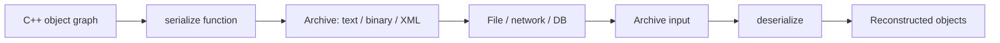

# Boost.Serialization

Boost.Serialization converts C++ objects to and from a sequence of bytes — **serialization** and
**deserialization** — so they can be saved to files, sent over a network, or stored in a database.
It handles arbitrarily complex object graphs, including pointers, shared ownership, polymorphism,
and versioning, all without requiring you to write parsing code by hand.

:::info The problem it solves
Hand-written save/load code is tedious and error-prone: you must track pointer aliasing (two
pointers to the same object), handle class hierarchies, manage version skew when formats evolve,
and repeat it all for every archive format. Boost.Serialization automates all of this with a single
`serialize` function per class.
:::

## Intrusive serialization

The simplest form: add a `serialize` member template to your class.

```cpp showLineNumbers title="intrusive.cpp"
#include <boost/archive/text_oarchive.hpp>
#include <boost/archive/text_iarchive.hpp>
#include <fstream>
#include <string>

struct Employee {
    std::string name;
    int id;
    double salary;

    template <class Archive>
    void serialize(Archive& ar, unsigned int /*version*/) {
        ar & name;
        ar & id;
        ar & salary;
    }
};

int main() {
    // Save
    {
        std::ofstream ofs("employee.txt");
        boost::archive::text_oarchive oa(ofs);
        Employee e{"Ada", 42, 120000.0};
        oa << e;
    }
    // Load
    {
        std::ifstream ifs("employee.txt");
        boost::archive::text_iarchive ia(ifs);
        Employee e;
        ia >> e;
        // e.name == "Ada", e.id == 42
    }
}
```

The `&` operator works in both directions: it writes when the archive is an output archive and reads
when it is an input archive.

## Non-intrusive serialization

When you cannot modify the class (third-party types), define a free function instead:

```cpp showLineNumbers title="non_intrusive.cpp"
#include <boost/serialization/string.hpp>

struct Point { double x, y; };

namespace boost { namespace serialization {
template <class Archive>
void serialize(Archive& ar, Point& p, unsigned int /*version*/) {
    ar & p.x;
    ar & p.y;
}
}} // namespace boost::serialization
```

## Archive formats

Boost.Serialization ships several archive types. Swap one line and your data is stored differently:

| Archive | Header | Use case |
|---------|--------|----------|
| `text_oarchive` / `text_iarchive` | `boost/archive/text_*archive.hpp` | Human-readable, debugging |
| `binary_oarchive` / `binary_iarchive` | `boost/archive/binary_*archive.hpp` | Compact, fast, not portable across platforms |
| `xml_oarchive` / `xml_iarchive` | `boost/archive/xml_*archive.hpp` | Interop, human-readable with structure |

:::warning Binary archives are not portable
A binary archive written on a little-endian 64-bit Linux machine may not load on a big-endian or
32-bit system. Use text or XML archives when portability matters.
:::

## Versioning

Classes evolve. Boost.Serialization supports version numbers so old archives can still be loaded
after a class gains new fields:

```cpp showLineNumbers title="versioning.cpp"
#include <boost/serialization/version.hpp>

struct Config {
    std::string host;
    int port;
    int timeout; // added in version 1

    template <class Archive>
    void serialize(Archive& ar, unsigned int version) {
        ar & host;
        ar & port;
        if (version >= 1)
            ar & timeout;
    }
};

BOOST_CLASS_VERSION(Config, 1)
```

## Pointers and shared ownership

Serializing raw pointers, `shared_ptr`, and polymorphic base classes just works — the library
tracks object identity so that two pointers to the same object produce a single copy in the archive.

```cpp showLineNumbers title="pointers.cpp"
#include <boost/serialization/shared_ptr.hpp>
#include <boost/archive/text_oarchive.hpp>
#include <memory>
#include <fstream>

struct Node {
    int value;
    std::shared_ptr<Node> next;

    template <class Archive>
    void serialize(Archive& ar, unsigned int) {
        ar & value;
        ar & next;
    }
};
```

:::tip STL container support
Include the matching header to serialize standard containers:
`boost/serialization/vector.hpp`, `boost/serialization/map.hpp`,
`boost/serialization/string.hpp`, etc.
:::

## Polymorphic types

Register derived classes so the library can reconstruct the correct type from a base pointer:

```cpp showLineNumbers
#include <boost/serialization/export.hpp>

struct Shape {
    virtual ~Shape() = default;
    template <class Archive>
    void serialize(Archive&, unsigned int) {}
};

struct Circle : Shape {
    double radius;
    template <class Archive>
    void serialize(Archive& ar, unsigned int) {
        ar & boost::serialization::base_object<Shape>(*this);
        ar & radius;
    }
};

BOOST_CLASS_EXPORT(Circle)
```



## Linking

Boost.Serialization is a compiled library:

```bash
g++ -std=c++17 main.cpp -lboost_serialization
```

## See also

- <Icon icon="lucide:database" inline /> [Boost.PropertyTree](./boost-property-tree.md) — config-file oriented tree structure with JSON/XML/INI parsers.
- <Icon icon="lucide:braces" inline /> [Boost.JSON](./boost-json.md) — RFC-compliant JSON for data exchange.
- <Icon icon="lucide:book-open" inline /> [Boost overview](../readme.md).
