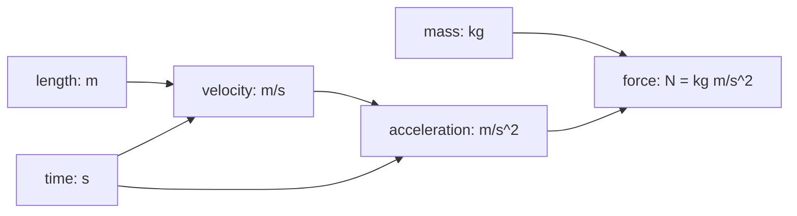

# Boost.Units

Boost.Units brings **compile-time dimensional analysis** to C++. It wraps numeric values in
`quantity<Unit, T>` types so that the compiler checks physical-unit compatibility: adding metres
to seconds is a compile error, multiplying metres by metres gives square metres, and converting
between compatible unit systems (SI to CGS) is automatic and exact.

:::info The problem it solves
The Mars Climate Orbiter was lost because one team used pound-seconds and another used newton-seconds
and no one caught the mismatch until the spacecraft burned up. Boost.Units makes that class of bug
impossible — the compiler rejects unit-incompatible arithmetic.
:::

## Basic usage

```cpp showLineNumbers title="units_basic.cpp"
#include <boost/units/systems/si.hpp>
#include <boost/units/io.hpp>
#include <iostream>

namespace bu = boost::units;
namespace si = bu::si;

int main() {
    bu::quantity<si::length>  dist = 100.0 * si::meters;
    bu::quantity<si::time>    dur  = 9.58 * si::seconds;
    bu::quantity<si::velocity> vel = dist / dur;

    std::cout << "distance: " << dist << "\n";  // 100 m
    std::cout << "time:     " << dur  << "\n";  // 9.58 s
    std::cout << "velocity: " << vel  << "\n";  // 10.438... m s^-1
}
```

## Compile-time safety

```cpp showLineNumbers title="safety.cpp"
#include <boost/units/systems/si.hpp>

namespace bu = boost::units;
namespace si = bu::si;

int main() {
    bu::quantity<si::length> d = 10.0 * si::meters;
    bu::quantity<si::time>   t = 2.0  * si::seconds;

    // auto bad = d + t;   // COMPILE ERROR: incompatible dimensions
    auto vel = d / t;      // OK: length / time = velocity
    auto area = d * d;     // OK: length * length = area
    (void)vel; (void)area;
}
```

:::danger The compiler catches the bug
If you try to add a length to a time, or assign a velocity to an acceleration variable, the code
will not compile. The error messages can be verbose, but the safety is absolute — no unit mismatch
escapes to runtime.
:::

## Unit systems

Boost.Units ships with several predefined systems:

| System | Header | Base units |
|--------|--------|------------|
| SI | `boost/units/systems/si.hpp` | metre, kilogram, second, ampere, kelvin, mole, candela |
| CGS | `boost/units/systems/cgs.hpp` | centimetre, gram, second |
| Angle | `boost/units/systems/angle/degrees.hpp` | degrees, radians |

## Converting between units

```cpp showLineNumbers title="conversion.cpp"
#include <boost/units/systems/si.hpp>
#include <boost/units/systems/cgs.hpp>
#include <boost/units/conversion.hpp>
#include <boost/units/io.hpp>
#include <iostream>

namespace bu = boost::units;
namespace si = bu::si;
namespace cgs = bu::cgs;

int main() {
    bu::quantity<si::length> d_si = 1.5 * si::meters;
    bu::quantity<cgs::length> d_cgs(d_si);  // implicit conversion: 150 cm

    std::cout << d_si  << "\n";  // 1.5 m
    std::cout << d_cgs << "\n";  // 150 cm
}
```

## Derived units

Combine base units through arithmetic to get derived quantities automatically:

```cpp showLineNumbers title="derived.cpp"
#include <boost/units/systems/si.hpp>
#include <boost/units/io.hpp>
#include <iostream>

namespace bu = boost::units;
namespace si = bu::si;

int main() {
    bu::quantity<si::mass>         m = 70.0 * si::kilograms;
    bu::quantity<si::acceleration> a = 9.81 * si::meters_per_second_squared;
    bu::quantity<si::force>        f = m * a;

    std::cout << "force: " << f << "\n";  // 686.7 N (= kg m s^-2)
}
```



## Custom units

Define your own unit systems for domain-specific quantities:

```cpp showLineNumbers title="custom.cpp"
#include <boost/units/systems/si.hpp>
#include <boost/units/quantity.hpp>
#include <boost/units/make_scaled_unit.hpp>
#include <iostream>

namespace bu = boost::units;
namespace si = bu::si;

// Kilometres as a scaled SI length
using kilometres = bu::make_scaled_unit<si::length,
    bu::scale<10, bu::static_rational<3>>>::type;

int main() {
    bu::quantity<kilometres> marathon = 42.195 * kilometres();
    bu::quantity<si::length> in_metres(marathon);  // 42195 m
    std::cout << in_metres << "\n";
}
```

## Practical tips

:::tip Keep quantity types in interfaces
Declare function parameters and return types as `quantity<si::length>` rather than plain `double`.
This pushes unit checking to the API boundary — callers cannot accidentally pass a time where a
length is expected.
:::

:::warning Compile times
Boost.Units is heavily template-based. Large translation units with many unit computations can
compile slowly. Consider isolating physics-heavy code behind a compiled interface (pimpl or
separate translation units).
:::

## See also

- <Icon icon="lucide:clock" inline /> [Boost.Date_Time](./date-time.md) — date and time types (different domain, same library family).
- <Icon icon="lucide:clock" inline /> [Boost.Chrono](./boost-chrono.md) — durations and clocks.
- <Icon icon="lucide:sigma" inline /> [Boost.Math](../08-math-and-numerics/boost-math.md) — mathematical functions that operate on the raw numeric values.
- <Icon icon="lucide:book-open" inline /> [Boost overview](../readme.md).
