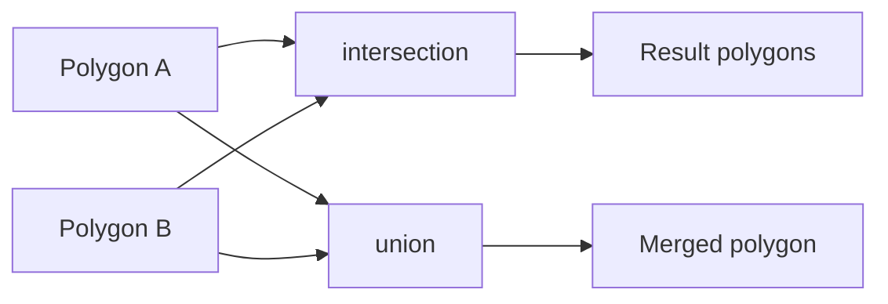

# Boost.Geometry

Boost.Geometry is a **computational geometry library** that works with points, linestrings,
polygons, and multi-geometries in two or three dimensions. It supports Cartesian, spherical, and
geographic coordinate systems, and provides a wide set of spatial algorithms — distance, area,
intersection, union, convex hull, and more.

:::info The problem it solves
Spatial computation is tricky: intersection tests need numerical robustness, geographic
calculations involve geodesics, and API designs vary wildly between geometry libraries.
Boost.Geometry provides one generic interface that works whether your coordinates are pixel
positions on a screen or latitude/longitude pairs on a globe.
:::

## Core geometry types

Boost.Geometry uses concepts, not inheritance. Any type that models the right concept (Point,
Linestring, Polygon, ...) works with every algorithm. The library ships ready-made models:

```cpp showLineNumbers title="geometry_types.cpp"
#include <boost/geometry.hpp>
#include <boost/geometry/geometries/point_xy.hpp>
#include <boost/geometry/geometries/polygon.hpp>
#include <boost/geometry/geometries/linestring.hpp>

namespace bg = boost::geometry;

using Point   = bg::model::d2::point_xy<double>;
using Line    = bg::model::linestring<Point>;
using Polygon = bg::model::polygon<Point>;
```

| Model | Description |
|-------|-------------|
| `point_xy<T>` | 2D point with `.x()` / `.y()` |
| `point<T, Dim, CS>` | N-dimensional point with coordinate system |
| `linestring<Point>` | Open polyline |
| `polygon<Point>` | Closed area with optional inner rings (holes) |
| `multi_point`, `multi_linestring`, `multi_polygon` | Collections |
| `box<Point>` | Axis-aligned bounding box |
| `ring<Point>` | A single closed ring (no holes) |

## Distance and area

```cpp showLineNumbers title="distance_area.cpp"
#include <boost/geometry.hpp>
#include <boost/geometry/geometries/point_xy.hpp>
#include <boost/geometry/geometries/polygon.hpp>
#include <iostream>

namespace bg = boost::geometry;
using Point = bg::model::d2::point_xy<double>;

int main() {
    Point a(0.0, 0.0), b(3.0, 4.0);
    std::cout << "distance: " << bg::distance(a, b) << "\n";  // 5.0

    bg::model::polygon<Point> poly;
    bg::read_wkt("POLYGON((0 0, 4 0, 4 3, 0 3, 0 0))", poly);
    std::cout << "area: " << bg::area(poly) << "\n";           // 12.0
}
```

## Boolean operations

Intersection, union, difference, and symmetric difference produce new geometries:

```cpp showLineNumbers title="boolean_ops.cpp"
#include <boost/geometry.hpp>
#include <boost/geometry/geometries/point_xy.hpp>
#include <boost/geometry/geometries/polygon.hpp>
#include <vector>
#include <iostream>

namespace bg = boost::geometry;
using Point   = bg::model::d2::point_xy<double>;
using Polygon = bg::model::polygon<Point>;

int main() {
    Polygon a, b;
    bg::read_wkt("POLYGON((0 0, 4 0, 4 4, 0 4, 0 0))", a);
    bg::read_wkt("POLYGON((2 2, 6 2, 6 6, 2 6, 2 2))", b);

    std::vector<Polygon> result;
    bg::intersection(a, b, result);

    for (auto& p : result)
        std::cout << "intersection area: " << bg::area(p) << "\n";  // 4.0
}
```



## Coordinate systems and strategies

The same algorithm adapts its math to the coordinate system. For geographic coordinates,
Boost.Geometry uses geodesic formulas automatically:

```cpp showLineNumbers title="geographic.cpp"
#include <boost/geometry.hpp>
#include <iostream>

namespace bg = boost::geometry;

using GeoPoint = bg::model::point<double, 2, bg::cs::geographic<bg::degree>>;

int main() {
    GeoPoint london(  -0.1278, 51.5074);
    GeoPoint paris (   2.3522, 48.8566);

    double d = bg::distance(london, paris);  // metres, Vincenty by default
    std::cout << "London-Paris: " << d / 1000.0 << " km\n";
}
```

:::tip Strategy pattern
Every algorithm accepts an optional **strategy** parameter that controls the underlying formula.
For geographic distance you can choose Vincenty (default, accurate), Haversine (faster, less
precise), or Thomas. Pass the strategy as the last argument:
`bg::distance(a, b, bg::strategy::distance::haversine<>(6371000.0))`.
:::

## Spatial predicates

```cpp showLineNumbers
bool inside  = bg::within(point, polygon);
bool touches = bg::touches(poly_a, poly_b);
bool crosses = bg::crosses(line, polygon);
bool overlap = bg::overlaps(poly_a, poly_b);
```

## WKT input/output

Boost.Geometry reads and writes **Well-Known Text**, the standard text format for geometries used
by PostGIS, Shapely, and most GIS tools:

```cpp showLineNumbers
bg::model::linestring<Point> line;
bg::read_wkt("LINESTRING(0 0, 1 1, 2 0)", line);
std::cout << bg::wkt(line) << "\n";
```

:::note Registering custom types
You don't have to use the built-in models. Macros like `BOOST_GEOMETRY_REGISTER_POINT_2D` adapt
your own point struct to the Boost.Geometry concept, so algorithms work on your existing data
without wrappers.
:::

## See also

- <Icon icon="lucide:hexagon" inline /> [Boost.Polygon](./boost-polygon.md) — integer-coordinate polygon operations and Voronoi diagrams.
- <Icon icon="lucide:git-fork" inline /> [Boost.Graph](./boost-graph.md) — when your spatial data has a network/graph structure.
- <Icon icon="lucide:book-open" inline /> [Boost overview](../readme.md).
