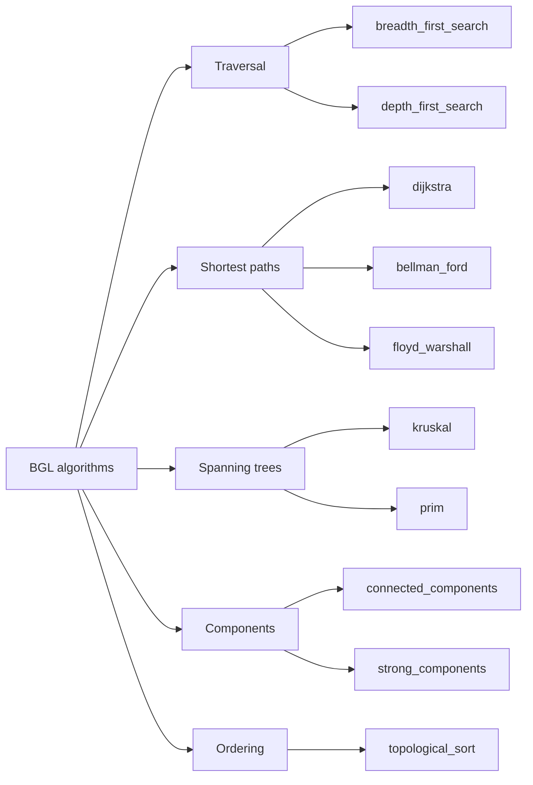

# Boost Graph Library (BGL)

The Boost Graph Library is a **generic framework for graph data structures and algorithms**. It
separates the *representation* of a graph from the *algorithms* that run on it, so a single
implementation of Dijkstra or BFS works with adjacency lists, adjacency matrices, or any
user-defined graph type that models the right concepts.

:::info The problem it solves
Graphs show up everywhere — dependency resolution, network routing, task scheduling, social
networks — yet the C++ standard library has no graph abstraction. BGL fills that gap with a rich
set of algorithms and a generic interface that lets you plug in your own data structure if the
built-in ones don't fit.
:::

## Graph representations

BGL ships two primary containers, both parameterised on vertex/edge storage:

```cpp showLineNumbers title="graph_types.cpp"
#include <boost/graph/adjacency_list.hpp>
#include <boost/graph/adjacency_matrix.hpp>

// Directed graph, vertices in a vector, edges in a set (no parallel edges)
using DiGraph = boost::adjacency_list<
    boost::setS,      // out-edge container
    boost::vecS,      // vertex container
    boost::directedS  // directed edges
>;

// Undirected dense graph stored as a matrix
using DenseGraph = boost::adjacency_matrix<boost::undirectedS>;
```

| Container | Best for | Edge lookup | Memory |
|-----------|----------|-------------|--------|
| `adjacency_list` | Sparse graphs, most use cases | O(out-degree) | O(V + E) |
| `adjacency_matrix` | Dense graphs, frequent edge-existence queries | O(1) | O(V^2) |

## Adding vertices and edges

```cpp showLineNumbers title="build_graph.cpp"
#include <boost/graph/adjacency_list.hpp>
#include <iostream>

using Graph = boost::adjacency_list<
    boost::vecS, boost::vecS, boost::directedS,
    boost::no_property,                          // vertex property
    boost::property<boost::edge_weight_t, int>   // edge property: weight
>;

int main() {
    Graph g(5);  // 5 vertices: 0..4

    boost::add_edge(0, 1, 4, g);   // edge 0->1 weight 4
    boost::add_edge(0, 2, 1, g);
    boost::add_edge(2, 1, 2, g);
    boost::add_edge(1, 3, 1, g);
    boost::add_edge(2, 3, 5, g);
    boost::add_edge(3, 4, 3, g);

    std::cout << "vertices: " << boost::num_vertices(g) << "\n";
    std::cout << "edges:    " << boost::num_edges(g)    << "\n";
}
```

## Property maps

Properties (weights, labels, colours) are accessed through **property maps** — an abstraction that
decouples storage from access. BGL algorithms accept property maps as parameters, so the algorithm
never knows *where* the data lives.

```cpp showLineNumbers
auto weight_map = boost::get(boost::edge_weight, g);

for (auto [ei, ei_end] = boost::edges(g); ei != ei_end; ++ei) {
    std::cout << boost::source(*ei, g) << " -> "
              << boost::target(*ei, g) << "  w="
              << boost::get(weight_map, *ei) << "\n";
}
```

## Dijkstra's shortest path

```cpp showLineNumbers title="dijkstra.cpp"
#include <boost/graph/adjacency_list.hpp>
#include <boost/graph/dijkstra_shortest_paths.hpp>
#include <iostream>
#include <vector>

using Graph = boost::adjacency_list<
    boost::vecS, boost::vecS, boost::directedS,
    boost::no_property,
    boost::property<boost::edge_weight_t, int>
>;

int main() {
    Graph g(5);
    boost::add_edge(0, 1, 4, g);
    boost::add_edge(0, 2, 1, g);
    boost::add_edge(2, 1, 2, g);
    boost::add_edge(1, 3, 1, g);
    boost::add_edge(2, 3, 5, g);
    boost::add_edge(3, 4, 3, g);

    std::vector<int> dist(5);
    std::vector<Graph::vertex_descriptor> pred(5);

    boost::dijkstra_shortest_paths(g, 0,
        boost::distance_map(&dist[0]).predecessor_map(&pred[0]));

    for (int i = 0; i < 5; ++i)
        std::cout << "0 -> " << i << " : " << dist[i] << "\n";
}
```

:::tip Named parameters
BGL uses **named parameters** (`distance_map(...)`, `predecessor_map(...)`, `weight_map(...)`) so
you only supply the maps you care about. Defaults exist for the rest — weight defaults to 1 for
unweighted algorithms.
:::

## Algorithm catalogue



| Category | Algorithms |
|----------|-----------|
| Traversal | `breadth_first_search`, `depth_first_search` |
| Shortest paths | `dijkstra_shortest_paths`, `bellman_ford_shortest_paths`, `floyd_warshall_all_pairs` |
| Spanning trees | `kruskal_minimum_spanning_tree`, `prim_minimum_spanning_tree` |
| Components | `connected_components`, `strong_components`, `biconnected_components` |
| Ordering | `topological_sort` |
| Flow | `edmonds_karp_max_flow`, `push_relabel_max_flow` |
| Matching | `maximum_weighted_matching` |

## BFS with a visitor

Visitors let you hook into algorithm events (discover vertex, examine edge, finish vertex) without
modifying the algorithm itself:

```cpp showLineNumbers title="bfs_visitor.cpp"
#include <boost/graph/adjacency_list.hpp>
#include <boost/graph/breadth_first_search.hpp>
#include <iostream>

using Graph = boost::adjacency_list<boost::vecS, boost::vecS, boost::undirectedS>;

struct PrintVisitor : boost::default_bfs_visitor {
    void discover_vertex(Graph::vertex_descriptor v, const Graph&) const {
        std::cout << "discovered " << v << "\n";
    }
};

int main() {
    Graph g(4);
    boost::add_edge(0, 1, g);
    boost::add_edge(0, 2, g);
    boost::add_edge(1, 3, g);
    boost::breadth_first_search(g, 0, boost::visitor(PrintVisitor{}));
}
```

:::warning Compile times
BGL is heavily templated. Complex graph types with bundled properties can produce long compile
times and verbose error messages. Using `adjacency_list` with `vecS`/`vecS` keeps things
manageable.
:::

## See also

- <Icon icon="lucide:compass" inline /> [Boost.Geometry](./boost-geometry.md) — spatial algorithms on geometric primitives.
- <Icon icon="lucide:boxes" inline /> [Boost.Intrusive](../04-containers/boost-intrusive.md) — when your graph nodes need to live in multiple containers.
- <Icon icon="lucide:book-open" inline /> [Boost overview](../readme.md).
