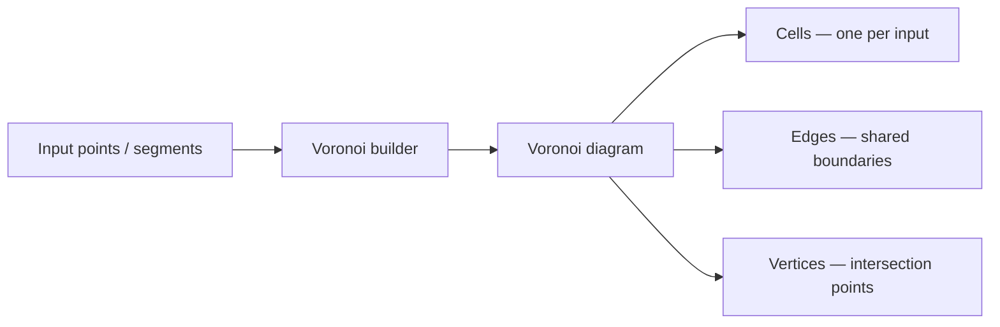

# Boost.Polygon

Boost.Polygon is a **computational geometry library focused on integer-coordinate polygon
operations and Voronoi diagrams**. It was originally developed for Electronic Design Automation
(EDA) and VLSI layout, where coordinates are on a fixed grid and exact integer arithmetic avoids
the robustness issues of floating-point geometry.

:::info The problem it solves
Floating-point polygon operations can fail on edge cases — cracks appear at intersections,
containment tests give wrong answers near boundaries. When your domain uses integer or
fixed-point coordinates (chip layout, pixel grids, tile maps), Boost.Polygon gives you exact
boolean operations without the numerical headaches.
:::

## Polygon types

Boost.Polygon defines its own polygon types based on integer coordinates:

```cpp showLineNumbers title="polygon_types.cpp"
#include <boost/polygon/polygon.hpp>

namespace bp = boost::polygon;

using Point   = bp::point_data<int>;
using Polygon = bp::polygon_data<int>;
using PolygonSet = bp::polygon_set_data<int>;
```

| Type | Description |
|------|-------------|
| `point_data<T>` | 2D point with integer coordinate type |
| `polygon_data<T>` | Simple polygon (outer boundary, no holes) |
| `polygon_with_holes_data<T>` | Polygon with inner rings |
| `polygon_set_data<T>` | Set of polygons — the primary type for boolean operations |
| `rectangle_data<T>` | Axis-aligned rectangle |

## Boolean operations

The core strength is robust polygon boolean operations. The `polygon_set_data` type accumulates
polygons and computes results lazily:

```cpp showLineNumbers title="boolean_ops.cpp"
#include <boost/polygon/polygon.hpp>
#include <vector>
#include <iostream>

namespace bp = boost::polygon;
using namespace bp::operators;

using Polygon = bp::polygon_data<int>;
using PolygonSet = bp::polygon_set_data<int>;
using Point = bp::point_data<int>;

int main() {
    Polygon a, b;
    Point pts_a[] = {{0,0},{10,0},{10,10},{0,10}};
    Point pts_b[] = {{5,5},{15,5},{15,15},{5,15}};
    bp::set_points(a, pts_a, pts_a + 4);
    bp::set_points(b, pts_b, pts_b + 4);

    PolygonSet ps;
    ps += a;         // union: add polygon a
    ps += b;         // union: add polygon b

    std::vector<Polygon> result;
    ps.get(result);  // extract merged polygons

    for (auto& p : result)
        std::cout << "area: " << bp::area(p) << "\n";
}
```

:::tip Operator overloads
Boost.Polygon overloads `+=` (union), `*=` (intersection), `-=` (difference), and `^=`
(symmetric difference) on polygon sets, making boolean expressions read naturally:
`result = (a + b) - c`.
:::

## Voronoi diagrams

Boost.Polygon includes a high-quality **Voronoi diagram** builder that handles both point and
segment inputs:

```cpp showLineNumbers title="voronoi.cpp"
#include <boost/polygon/voronoi.hpp>
#include <vector>
#include <iostream>

namespace bp = boost::polygon;

int main() {
    std::vector<bp::point_data<int>> points = {
        {0, 0}, {10, 0}, {5, 8}, {0, 10}, {10, 10}
    };

    bp::voronoi_diagram<double> vd;
    bp::construct_voronoi(points.begin(), points.end(), &vd);

    std::cout << "cells: " << vd.cells().size()   << "\n";
    std::cout << "edges: " << vd.edges().size()    << "\n";
    std::cout << "verts: " << vd.vertices().size() << "\n";
}
```



The Voronoi builder also accepts **line segments** as input, which is unusual — most Voronoi
implementations only handle points. This makes it useful for medial axis computation and offset
curves.

## Boost.Polygon vs Boost.Geometry

| Aspect | Boost.Polygon | Boost.Geometry |
|--------|---------------|----------------|
| Coordinate types | Integer / fixed-point | Floating-point, geographic, any |
| Focus | Boolean ops, Voronoi, EDA | General spatial algorithms |
| Robustness | Exact (integer arithmetic) | Depends on coordinate type |
| Coordinate systems | Cartesian only | Cartesian, spherical, geographic |
| Typical domain | Chip layout, pixel grids | GIS, CAD, game engines |
| WKT support | No | Yes |

:::note When to choose which
Use **Boost.Polygon** when coordinates are integers and you need robust boolean operations or
Voronoi diagrams. Use **Boost.Geometry** when you work with floating-point, geographic
coordinates, or need the broader algorithm set (convex hull, buffer, spatial indices).
:::

## Connectivity and concept adaptation

Like Boost.Geometry, Boost.Polygon uses concepts. You can register your own types:

```cpp showLineNumbers
struct MyPoint { int x, y; };

namespace boost { namespace polygon {
    template <> struct geometry_concept<MyPoint> { using type = point_concept; };
    template <> struct point_traits<MyPoint> {
        using coordinate_type = int;
        static int get(const MyPoint& p, orientation_2d orient) {
            return orient == HORIZONTAL ? p.x : p.y;
        }
    };
}}
```

:::warning Header weight
Boost.Polygon is header-only but pulls in a significant amount of template machinery. Isolate
heavy Voronoi or boolean-op code in its own translation unit to limit compile-time impact on the
rest of your build.
:::

## See also

- <Icon icon="lucide:compass" inline /> [Boost.Geometry](./boost-geometry.md) — floating-point and geographic spatial algorithms.
- <Icon icon="lucide:git-fork" inline /> [Boost.Graph](./boost-graph.md) — if your polygons form a network or adjacency structure.
- <Icon icon="lucide:book-open" inline /> [Boost overview](../readme.md).
