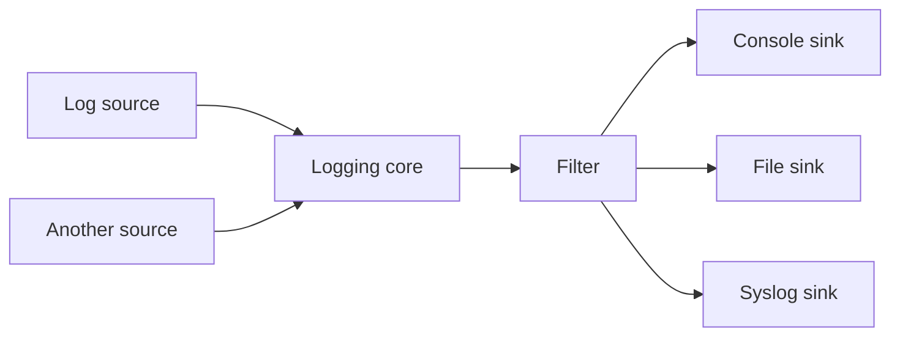

# Boost.Log

Boost.Log is a **structured logging framework** for C++ that separates the concerns of *producing*
log records from *consuming* them. It supports multiple sinks (console, file, syslog), filtering
by severity or custom attributes, configurable formatting, and features like automatic file
rotation and scoped attributes.

:::info The problem it solves
`std::cerr << "error: " << msg << "\n"` does not scale. You need severity levels, timestamps,
thread IDs, structured fields, log rotation, and the ability to turn logging categories on and
off without recompiling. Boost.Log provides all of this with a framework that separates what you
log from where it goes.
:::

## Architecture



- **Sources** produce log records (macros like `BOOST_LOG_TRIVIAL` or custom loggers).
- **Core** is the central hub that routes records to sinks.
- **Sinks** consume records — write to console, files, syslog, or custom destinations.
- **Filters** decide which records reach each sink.
- **Formatters** control the output layout.

## Trivial logging

The simplest way to start — no setup required:

```cpp showLineNumbers title="trivial.cpp"
#include <boost/log/trivial.hpp>

int main() {
    BOOST_LOG_TRIVIAL(trace)   << "trace message";
    BOOST_LOG_TRIVIAL(debug)   << "debug message";
    BOOST_LOG_TRIVIAL(info)    << "info message";
    BOOST_LOG_TRIVIAL(warning) << "warning message";
    BOOST_LOG_TRIVIAL(error)   << "error message";
    BOOST_LOG_TRIVIAL(fatal)   << "fatal message";
}
```

```bash
g++ -std=c++17 trivial.cpp -lboost_log -lboost_log_setup -lboost_thread -lpthread -o trivial
./trivial
```

:::note Compiled library
Boost.Log is one of the few Boost libraries that **must be compiled** — you link against
`-lboost_log`. For CMake, use `find_package(Boost REQUIRED COMPONENTS log log_setup)`.
:::

## Severity filtering

Filter out low-severity messages so only important ones reach the sink:

```cpp showLineNumbers title="filtered.cpp"
#include <boost/log/trivial.hpp>
#include <boost/log/core.hpp>
#include <boost/log/expressions.hpp>

namespace logging = boost::log;

int main() {
    logging::core::get()->set_filter(
        logging::trivial::severity >= logging::trivial::info
    );

    BOOST_LOG_TRIVIAL(debug) << "this is suppressed";
    BOOST_LOG_TRIVIAL(info)  << "this is visible";
    BOOST_LOG_TRIVIAL(error) << "this is visible too";
}
```

## File sink with rotation

Write to files with automatic rotation by size or time:

```cpp showLineNumbers title="file_sink.cpp"
#include <boost/log/trivial.hpp>
#include <boost/log/utility/setup/file.hpp>
#include <boost/log/utility/setup/common_attributes.hpp>

namespace logging = boost::log;
namespace keywords = logging::keywords;

int main() {
    logging::add_file_log(
        keywords::file_name = "app_%N.log",       // %N = rotation counter
        keywords::rotation_size = 10 * 1024 * 1024, // rotate at 10 MB
        keywords::format = "[%TimeStamp%] [%Severity%] %Message%"
    );
    logging::add_common_attributes();  // adds TimeStamp, ThreadID, etc.

    BOOST_LOG_TRIVIAL(info)  << "application started";
    BOOST_LOG_TRIVIAL(error) << "something went wrong";
}
```

## Custom severity levels

Define your own severity enum for finer-grained control:

```cpp showLineNumbers title="custom_severity.cpp"
#include <boost/log/sources/severity_logger.hpp>
#include <boost/log/sources/record_ostream.hpp>
#include <boost/log/utility/setup/console.hpp>
#include <boost/log/utility/setup/common_attributes.hpp>

namespace logging = boost::log;
namespace src = logging::sources;

enum class severity { trace, debug, info, warn, error, fatal };

int main() {
    logging::add_console_log();
    logging::add_common_attributes();

    src::severity_logger<severity> lg;
    BOOST_LOG_SEV(lg, severity::info)  << "custom severity works";
    BOOST_LOG_SEV(lg, severity::error) << "something failed";
}
```

## Scoped attributes

Attach contextual information that automatically applies to all log records within a scope:

```cpp showLineNumbers
#include <boost/log/attributes/scoped_attribute.hpp>

void handle_request(int id) {
    BOOST_LOG_SCOPED_THREAD_ATTR("RequestID",
        boost::log::attributes::constant<int>(id));

    BOOST_LOG_TRIVIAL(info) << "processing request";
    // all records in this scope carry RequestID=id
}
```

:::tip Structured logging
Scoped attributes are the key to structured logging in Boost.Log. Attach user IDs, request IDs,
or transaction IDs as attributes, then format or filter on them — this is far more useful than
embedding them in the message string.
:::

:::warning Thread safety
Boost.Log is thread-safe by default — the core serialises access to sinks. However, this means
high-throughput logging can become a contention point. For hot paths, consider an asynchronous
sink (`asynchronous_sink`) that buffers records and writes them on a background thread.
:::

## See also

- <Icon icon="lucide:flask-conical" inline /> [Boost.Test](./boost-test.md) — log test results alongside application logs.
- <Icon icon="lucide:bug" inline /> [Boost.Stacktrace](./boost-stacktrace.md) — attach stack traces to log records on errors.
- <Icon icon="lucide:book-open" inline /> [Boost overview](../readme.md).
