# Boost.Signals2

Boost.Signals2 is a header-only implementation of the **signal/slot** mechanism — a type-safe,
managed form of the *observer pattern*. One object (the **signal**) announces that something happened;
any number of interested callbacks (the **slots**) are invoked in response, without the signal knowing
or caring who they are. It is the C++ analogue of Qt's signals and slots, the event systems in GUI
toolkits, and the publish/subscribe pattern generally.

:::info Signals2, not Signals
The original Boost.Signals library is **deprecated**. Signals2 is its thread-safe successor and the
one you should use today — the headers live under `<boost/signals2/...>` and the API lives in
`boost::signals2`. The "2" is the only thing that changed in the name; conceptually it is the same
library made safe for concurrent use.
:::

## The observer pattern, made concrete

In the classic observer pattern you write an `Observer` interface, a `Subject` that holds a list of
observers, and registration/notification methods by hand. Signals2 collapses all of that boilerplate
into one object. A slot can be any callable with a matching signature — a free function, a lambda, a
`std::function`, a member function bound with `std::bind` — so subjects and observers are completely
decoupled.

```mermaid
flowchart LR
    E[Event occurs] --> S[signal&#40;args&#41;]
    S --> A[slot A: lambda]
    S --> B[slot B: member fn]
    S --> C[slot C: free fn]
```



## boost::signals2::signal

A `signal` is templated on the **call signature** of its slots. Connecting a slot returns a
`connection` object; calling the signal invokes every connected slot in order.

```cpp showLineNumbers title="basic_signal.cpp"
#include <boost/signals2/signal.hpp>
#include <iostream>

int main() {
    boost::signals2::signal<void(int, const std::string&)> on_event;

    on_event.connect([](int code, const std::string& msg) {
        std::cout << "logger: [" << code << "] " << msg << "\n";
    });
    on_event.connect([](int code, const std::string&) {
        if (code >= 500) std::cout << "alert: server error!\n";
    });

    on_event(503, "service unavailable");  // fires both slots
}
```

## Connections and disconnection

`connect()` returns a `boost::signals2::connection` — a handle you can query with `connected()` and
sever with `disconnect()`. Managing connections is the heart of using the library correctly: a slot
that outlives the object it refers to is a dangling-call waiting to happen.

```cpp showLineNumbers title="connections.cpp"
#include <boost/signals2/signal.hpp>
#include <iostream>

int main() {
    boost::signals2::signal<void()> sig;

    boost::signals2::connection c = sig.connect([] { std::cout << "tick\n"; });
    sig();                       // prints "tick"

    c.disconnect();              // explicit teardown
    std::cout << std::boolalpha << c.connected() << "\n"; // false
    sig();                       // prints nothing
}
```

### scoped_connection

Manually pairing every `connect()` with a `disconnect()` is as error-prone as manual `new`/`delete`.
`scoped_connection` applies RAII: when it goes out of scope, the connection is severed automatically.

```cpp showLineNumbers title="scoped.cpp"
#include <boost/signals2/signal.hpp>
#include <boost/signals2/connection.hpp>
#include <iostream>

int main() {
    boost::signals2::signal<void()> sig;
    {
        boost::signals2::scoped_connection sc = sig.connect([] { std::cout << "alive\n"; });
        sig();   // prints "alive"
    }            // sc destroyed here -> auto-disconnect
    sig();       // prints nothing
}
```

## Automatic disconnection via slot tracking

The most powerful safety feature is **automatic** disconnection tied to an object's lifetime. If a
slot calls a member of some object, you can `track()` that object via a `shared_ptr`. Signals2 holds a
`weak_ptr` internally: when the tracked object is destroyed, the slot is silently and safely removed —
no dangling call, no manual bookkeeping.

```cpp showLineNumbers title="tracking.cpp"
#include <boost/signals2/signal.hpp>
#include <memory>
#include <iostream>

struct Widget {
    void on_click() { std::cout << "Widget clicked\n"; }
};

int main() {
    boost::signals2::signal<void()> clicked;
    {
        auto w = std::make_shared<Widget>();
        // track(w) ties the slot's lifetime to w's lifetime:
        clicked.connect(
            boost::signals2::signal<void()>::slot_type(&Widget::on_click, w.get())
                .track_foreign(w));
        clicked();   // prints "Widget clicked"
    }                // w destroyed -> slot auto-removed
    clicked();       // safe: prints nothing
}
```

:::tip This is why Signals2 pairs so well with shared_ptr
Lifetime-tracked slots eliminate the most common observer-pattern bug: an observer that is destroyed
while the subject still holds a pointer to it. Model your observers with
[`shared_ptr`](../03-smart-pointers-and-memory/shared-ptr.md) and let `track`/`track_foreign` do the
disconnection for you.
:::

## Combiners: collecting slot return values

When slots return values, a **combiner** decides what the signal call as a whole returns. The default
combiner (`optional_last_value`) returns the last slot's result. You can supply your own to sum the
results, take a maximum, short-circuit on the first `true`, or collect everything into a container.

```cpp showLineNumbers title="combiner.cpp"
#include <boost/signals2/signal.hpp>
#include <iostream>
#include <algorithm>

// Combiner: return the maximum of all slot results.
struct maximum {
    using result_type = int;
    template <class It>
    int operator()(It first, It last) const {
        int best = std::numeric_limits<int>::min();
        for (; first != last; ++first) best = std::max(best, *first);
        return best;
    }
};

int main() {
    boost::signals2::signal<int(int), maximum> compute;
    compute.connect([](int x) { return x + 1; });
    compute.connect([](int x) { return x * 2; });
    compute.connect([](int x) { return x - 5; });

    std::cout << compute(10) << "\n";   // max(11, 20, 5) = 20
}
```

:::note Iterating slot results lazily evaluates the slots
A combiner is handed an *input iterator range*. Each time it dereferences the iterator, the
corresponding slot actually runs. That means a short-circuiting combiner (stop at the first slot that
returns `true`) genuinely avoids calling the remaining slots.
:::

## Thread-safety: why Signals2 replaced Signals

The original Boost.Signals had no internal synchronization, so connecting, disconnecting, or invoking
a signal from multiple threads was undefined behaviour. Signals2 was a ground-up redesign whose
headline feature is **thread safety**: its connection bookkeeping is protected by an internal mutex,
and combiners observe a consistent snapshot of the connected slots.

| Concern | Boost.Signals (deprecated) | Boost.Signals2 |
|---------|----------------------------|----------------|
| Concurrent connect/disconnect | Unsafe | Safe (internal locking) |
| Invoking from multiple threads | Unsafe | Safe |
| Lifetime tracking | Limited | `shared_ptr`/`weak_ptr` based |
| Compiled component | Required linking | Header-only |

:::warning Thread-safe machinery, not thread-safe slots
Signals2 protects its own internal state and the connection list. It does **not** make *your slot
bodies* safe — if two threads fire a signal and the slots touch shared data, you still need your own
synchronization inside those slots. Also note the signal's mutex is held while slots run, so a slot
that blocks or re-enters the same signal can deadlock.
:::

## When to reach for it

Use Signals2 when you have a genuine one-to-many, decoupled notification need: a model notifying views,
a plugin broadcasting events, a document signalling "modified." For a simple one-to-one callback,
a plain [`boost::function`](../07-functional-and-metaprogramming/boost-function.md) (or `std::function`)
is lighter and clearer — you do not need the connection management overhead of a signal.

## See also

- <Icon icon="lucide:waypoints" inline /> [Boost.Function](../07-functional-and-metaprogramming/boost-function.md) — the callable wrapper behind individual slots.
- <Icon icon="lucide:memory-stick" inline /> [boost::shared_ptr and weak_ptr](../03-smart-pointers-and-memory/shared-ptr.md) — the basis for automatic slot tracking.
- <Icon icon="lucide:network" inline /> [Boost.Thread](../09-concurrency-and-async/boost-thread.md) — for the concurrency model Signals2 is safe under.
- <Icon icon="lucide:arrow-left-right" inline /> [Boost overview](../readme.md).
