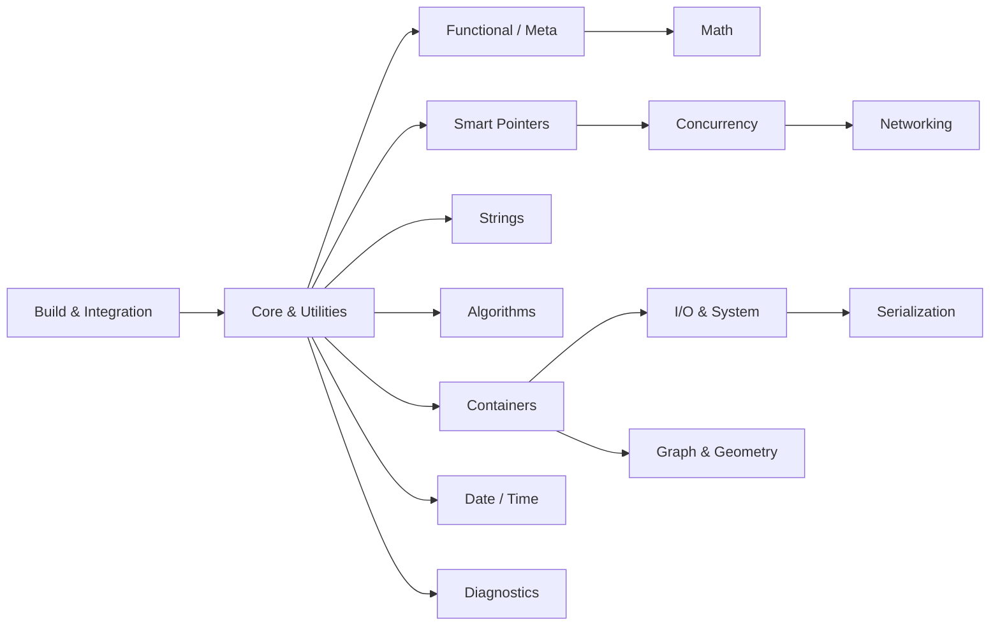

# Boost Knowledge Base

Boost is a collection of **peer-reviewed, portable C++ libraries** that sit one layer above the
standard library. Many of today's standard facilities — `shared_ptr`, `optional`, `variant`,
`filesystem`, `thread`, `<random>`, `<chrono>` — were first prototyped in Boost and later
standardised. These docs cover the libraries you actually reach for in real projects: what each one
solves, when to prefer it over the standard equivalent, and the gotchas that bite people.

:::info How this is organised
Roughly outside-in: **Introduction → Build & Integration** get you compiling against Boost; the
middle sections (**Core**, **Smart Pointers**, **Containers**, **Strings**, **Algorithms**) are the
day-to-day utilities; the later sections (**Concurrency**, **I/O**, **Networking**, **Serialization**,
**Graph**, **Diagnostics**) are the larger, domain-specific libraries. Each folder is self-contained
— follow the cross-links between pages.
:::

## Sections

|   | Section | What it covers |
|---|---------|----------------|
| <Icon icon="lucide:book-open" inline /> | [Introduction](./00-overview/what-is-boost.md) | What Boost is, its philosophy, installing it, header-only vs compiled, relation to the standard |
| <Icon icon="lucide:hammer" inline /> | [Build & Integration](./01-build-and-integration/cmake-integration.md) | `b2` (Boost.Build), CMake, vcpkg/Conan, `Boost.Config` portability macros |
| <Icon icon="lucide:puzzle" inline /> | [Core & Utilities](./02-core-utilities/boost-optional.md) | `Core`, `Utility`, `Assert`, `Optional`, `Variant`, `Any`, `lexical_cast` |
| <Icon icon="lucide:memory-stick" inline /> | [Smart Pointers & Memory](./03-smart-pointers-and-memory/smart-ptr-overview.md) | `shared_ptr`, `intrusive_ptr`, `scoped_ptr`, `Pool`, `Align` |
| <Icon icon="lucide:boxes" inline /> | [Containers](./04-containers/boost-container.md) | `Container`, `Unordered`, `MultiIndex`, `Bimap`, `Intrusive`, `circular_buffer` |
| <Icon icon="lucide:type" inline /> | [Strings & Text](./05-strings-and-text/string-algo.md) | `String Algo`, `Format`, `Tokenizer`, `Regex`, `Spirit` |
| <Icon icon="lucide:repeat" inline /> | [Algorithms, Iterators & Ranges](./06-algorithms-iterators-ranges/boost-algorithm.md) | `Algorithm`, `Range`, `Iterator` adaptors, `BOOST_FOREACH` |
| <Icon icon="lucide:sigma" inline /> | [Functional & Metaprogramming](./07-functional-and-metaprogramming/boost-function.md) | `Function`, `Bind`, `Phoenix`, `Hana`, `MPL`, `Fusion`, `TypeTraits` |
| <Icon icon="lucide:calculator" inline /> | [Math & Numerics](./08-math-and-numerics/boost-math.md) | `Math`, `Multiprecision`, `Random`, `Rational`, numeric conversion, `Accumulators`, uBLAS |
| <Icon icon="lucide:waypoints" inline /> | [Concurrency & Async](./09-concurrency-and-async/boost-thread.md) | `Thread`, `Atomic`, `Asio`, `Lockfree`, `Fiber`, `Coroutine2`, `Interprocess` |
| <Icon icon="lucide:hard-drive" inline /> | [I/O & System](./10-io-and-system/boost-filesystem.md) | `Filesystem`, `Iostreams`, `Program_options`, `Process`, `DLL`, `System` |
| <Icon icon="lucide:network" inline /> | [Networking](./11-networking/asio-networking.md) | TCP/UDP with `Asio`, HTTP/WebSocket with `Beast` |
| <Icon icon="lucide:database" inline /> | [Serialization & Data](./12-serialization-and-data/boost-serialization.md) | `Serialization`, `PropertyTree`, `JSON` |
| <Icon icon="lucide:clock" inline /> | [Date, Time & Units](./13-date-time-and-units/date-time.md) | `Date_Time`, `Chrono`, `Units` (dimensional analysis) |
| <Icon icon="lucide:git-fork" inline /> | [Graph & Geometry](./14-graph-and-geometry/boost-graph.md) | The Boost Graph Library, `Geometry`, `Polygon` |
| <Icon icon="lucide:flask-conical" inline /> | [Diagnostics & Testing](./15-diagnostics-and-testing/boost-test.md) | `Boost.Test`, `Stacktrace`, `Log` |
| <Icon icon="lucide:braces" inline /> | [Language Tools & Misc](./16-language-tools/boost-preprocessor.md) | `Preprocessor`, `UUID`, `Signals2` |

## How the pieces relate

## Suggested reading paths

- <Icon icon="lucide:rocket" inline /> **New to Boost:** [What is Boost](./00-overview/what-is-boost.md) → [Installation](./00-overview/installation.md) → [CMake integration](./01-build-and-integration/cmake-integration.md) → [Optional](./02-core-utilities/boost-optional.md) → [smart pointers](./03-smart-pointers-and-memory/smart-ptr-overview.md). Enough to use Boost in a real build.
- <Icon icon="lucide:arrow-left-right" inline /> **Coming from the standard library:** read [Boost and the standard](./00-overview/boost-and-the-standard.md), then the Boost versions of facilities you already know — [Optional](./02-core-utilities/boost-optional.md), [Variant](./02-core-utilities/boost-variant.md), [Filesystem](./10-io-and-system/boost-filesystem.md), [Thread](./09-concurrency-and-async/boost-thread.md) — to see what Boost adds beyond `std`.
- <Icon icon="lucide:network" inline /> **Networking / servers:** [Asio](./09-concurrency-and-async/boost-asio.md) → [Asio networking](./11-networking/asio-networking.md) → [Beast](./11-networking/boost-beast.md) → [JSON](./12-serialization-and-data/boost-json.md).
- <Icon icon="lucide:cpu" inline /> **Systems / performance:** [Intrusive](./04-containers/boost-intrusive.md), [Lockfree](./09-concurrency-and-async/boost-lockfree.md), [Interprocess](./09-concurrency-and-async/boost-interprocess.md), [Pool](./03-smart-pointers-and-memory/boost-pool.md) and [Stacktrace](./15-diagnostics-and-testing/boost-stacktrace.md).

:::tip Conventions used across these docs
- Examples assume a recent Boost (1.7x+) and compile against C++17 or later; version notes are tagged inline where they matter.
- Admonitions flag the important bits: `info` for context, `tip` for guidance, `note` for asides, `warning`/`danger` for foot-guns.
- Where a Boost library has since been standardised, the page says so and points at the [`std` equivalent](../cpp/09-standard-library/utilities.md) so you can choose deliberately.
- Diagrams are Mermaid; tables prefer plain words over decorative symbols.
:::
