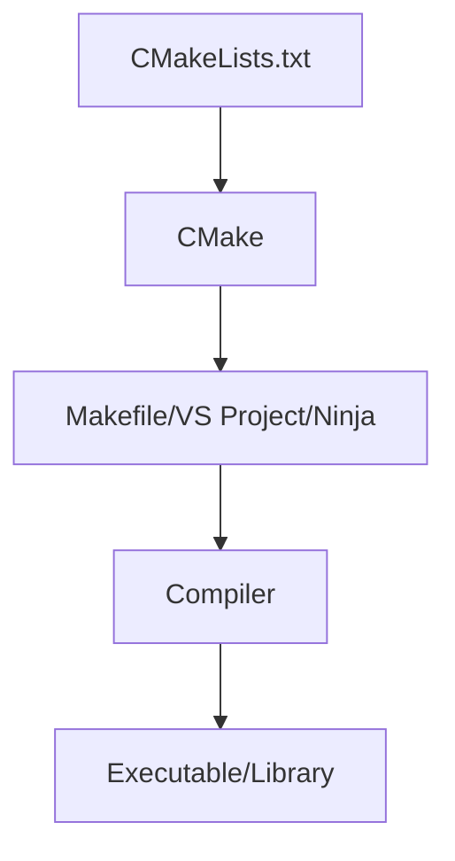

# What is CMake?

## Overview

CMake is a **cross-platform build system generator**. It doesn't build your code directly - instead,
it generates native build files (Makefiles, Visual Studio projects, Ninja files, etc.) for your
platform.

:::info Key Concept
CMake is a **meta-build system**. You write platform-independent configuration files, and CMake
translates them into platform-specific build instructions.
:::

## Why Use CMake?

### 1. **Cross-Platform Compatibility**

Write once, build anywhere:

- Linux (Unix Makefiles, Ninja)
- Windows (Visual Studio, MinGW)
- macOS (Xcode, Unix Makefiles)

### 2. **Modern C++ Support**

- Automatic dependency management
- Target-based configuration
- Package discovery and integration

### 3. **Industry Standard**

Used by major projects:

- LLVM/Clang
- Qt
- OpenCV
- Boost (partially)

## How CMake Works



:::success The CMake Workflow

1. **Configure**: `cmake -S . -B build` - Generate build files
2. **Build**: `cmake --build build` - Compile your project
3. **Install**: `cmake --install build` - Install binaries
   :::

## Basic Example

Here's the simplest possible CMake project:

```cmake showLineNumbers  title="CMakeLists.txt"
cmake_minimum_required(VERSION 3.15)
project(HelloWorld)

add_executable(hello main.cpp)
```

```cpp title="main.cpp"
#include <iostream>

int main() {
    std::cout << "Hello, CMake!" << std::endl;
    return 0;
}
```

**Building:**

```shell title="Terminal"
mkdir build
cd build
cmake ..
cmake --build .
./hello
```

## CMake vs Other Build Systems

| Feature         | CMake       | Make        | Autotools  |
|-----------------|-------------|-------------|------------|
| Cross-platform  | ✅ Excellent | ❌ Unix-only | ⚠️ Complex |
| Learning curve  | ⚠️ Moderate | ✅ Simple    | ❌ Steep    |
| IDE integration | ✅ Excellent | ❌ Limited   | ❌ Limited  |
| Modern C++      | ✅ Yes       | ❌ Manual    | ❌ Manual   |

:::warning Remember
CMake files are named `CMakeLists.txt` (case-sensitive!) and must be in your project root and
subdirectories.
:::
