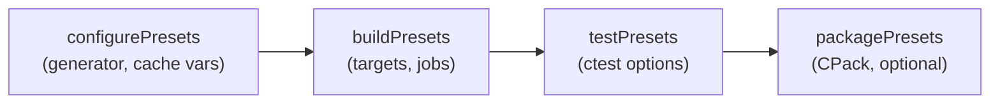

# CMake Presets

`CMakePresets.json` captures your configure, build, and test settings in a checked-in JSON file, so a
long command line like `cmake -S . -B build -DCMAKE_BUILD_TYPE=Release -DCMAKE_TOOLCHAIN_FILE=... -G Ninja`
collapses to `cmake --preset release`. Presets (CMake **3.19+**) are the modern replacement for the
brittle wrapper shell scripts teams used to share build configurations.

:::tip Why presets matter
One file means **you, your CI, and everyone's IDE configure the build identically**. Visual Studio,
VS Code, and CLion all read `CMakePresets.json` natively, so "works on my machine" stops being a
configuration problem.
:::

## The two files

| File | Checked in? | Purpose |
|------|-------------|---------|
| `CMakePresets.json` | **yes** | Project-wide presets shared by the whole team and CI |
| `CMakeUserPresets.json` | **no** (gitignore it) | Your personal presets — local paths, favourite generator |

`CMakeUserPresets.json` can `inherits` from the project file, so you override only what's personal.

## A minimal `CMakePresets.json`

```json title="CMakePresets.json"
{
  "version": 6,
  "configurePresets": [
    {
      "name": "default",
      "generator": "Ninja",
      "binaryDir": "${sourceDir}/build/${presetName}",
      "cacheVariables": { "CMAKE_EXPORT_COMPILE_COMMANDS": "ON" }
    },
    {
      "name": "debug",
      "inherits": "default",
      "cacheVariables": { "CMAKE_BUILD_TYPE": "Debug" }
    },
    {
      "name": "release",
      "inherits": "default",
      "cacheVariables": { "CMAKE_BUILD_TYPE": "Release" }
    }
  ],
  "buildPresets": [
    { "name": "debug",   "configurePreset": "debug" },
    { "name": "release", "configurePreset": "release" }
  ],
  "testPresets": [
    { "name": "debug", "configurePreset": "debug", "output": { "outputOnFailure": true } }
  ]
}
```

The `cacheVariables` block is exactly the `-D` cache entries you would have typed by hand — including
[`CMAKE_BUILD_TYPE`](./build-types.md) and any of your own [variables](./variables.md). `inherits`
keeps shared settings in one place.

## Using them

```bash title="Terminal"
cmake --preset release          # configure with the 'release' configurePreset
cmake --build --preset release  # build with the matching buildPreset
ctest --preset debug            # run tests with the 'debug' testPreset

cmake --list-presets            # see what's available
```

The preset types mirror the workflow stages:



:::warning Version field is required
The top-level `"version"` selects the JSON schema (v6 ships with CMake 3.25). If your CMake is older
than a preset feature you use, configuration fails with a schema error — bump
`cmake_minimum_required` or lower the version to match.
:::

## Summary

- `CMakePresets.json` turns long `cmake -D...` invocations into `cmake --preset name` — shared, reproducible, IDE-aware.
- Personal overrides go in `CMakeUserPresets.json` (gitignored), using `inherits`.
- Preset types follow the stages: configure → build → test → (package).
- `cacheVariables` are your `-D` cache entries, including `CMAKE_BUILD_TYPE`.

## Related

- [Build Types](./build-types.md) — what `CMAKE_BUILD_TYPE` selects
- [Variables](./variables.md) — cache variables you'd set in `cacheVariables`
- [CTest Basics](../06-testing/ctest-basics.md) — what `testPresets` drive
