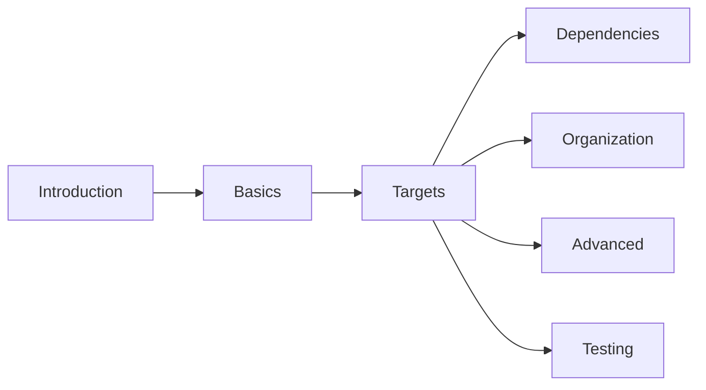

# CMake Knowledge Base

CMake is a **build-system generator**: you describe your project once in `CMakeLists.txt`, and CMake
emits the native build files (Makefiles, Ninja, Visual Studio, Xcode) for whatever platform you're
on. These docs cover **modern, target-based CMake (3.15+)** — the `target_*` style that replaced the
old global-variable approach — from first project to dependencies, testing, and the advanced bits.

:::info How this is organised
Roughly in learning order: **Intro → Basics → Targets** is the core you use every day; **Dependencies**,
**Organization**, **Advanced**, and **Testing** are the layers you add as projects grow. Each folder
is self-contained — follow the cross-links.
:::

## Sections

|   | Section | What it covers |
|---|---------|----------------|
| <Icon icon="lucide:book-open" inline /> | [Introduction](./00-intro/what-is-cmake.md) | What CMake is, installing it, your first project |
| <Icon icon="lucide:wrench" inline /> | [Basics](./01-basics/cmakelists-structure.md) | `CMakeLists.txt` structure, variables, commands, build types, presets |
| <Icon icon="lucide:target" inline /> | [Targets](./02-targets/executables.md) | Executables, libraries, target properties, linking |
| <Icon icon="lucide:package" inline /> | [Dependencies](./03-dependencies/find-package.md) | `find_package`, FetchContent, ExternalProject |
| <Icon icon="lucide:folder-tree" inline /> | [Project Organization](./04-project-organization/best-practices.md) | Multi-directory layouts, `add_subdirectory`, modern patterns |
| <Icon icon="lucide:drafting-compass" inline /> | [Advanced](./05-advanced/generator-expressions.md) | Generator expressions, functions/macros, find modules, custom commands |
| <Icon icon="lucide:flask-conical" inline /> | [Testing](./06-testing/ctest-basics.md) | CTest basics and integrating tests into the build |

## Suggested reading paths



- <Icon icon="lucide:rocket" inline /> **New to CMake:** [Introduction](./00-intro/what-is-cmake.md) → [Basics](./01-basics/cmakelists-structure.md) → [Targets](./02-targets/executables.md). Enough to build a real app.
- <Icon icon="lucide:package" inline /> **Pulling in a library:** [find_package](./03-dependencies/find-package.md) → [FetchContent](./03-dependencies/fetchcontent.md), then [linking](./02-targets/linking.md).
- <Icon icon="lucide:folder-tree" inline /> **Scaling a project:** [Subdirectories](./04-project-organization/subdirectories.md) → [Multi-Directory](./04-project-organization/multi-directory.md) → [Best Practices](./04-project-organization/best-practices.md).

## Quick reference

```cmake showLineNumbers title="CMakeLists.txt essentials"
cmake_minimum_required(VERSION 3.15)
project(MyProject VERSION 1.0 LANGUAGES CXX)

add_executable(myapp main.cpp)
add_library(mylib STATIC lib.cpp)

target_link_libraries(myapp PRIVATE mylib)          # who depends on whom
target_include_directories(myapp PRIVATE include/)  # scoped to this target
target_compile_features(myapp PRIVATE cxx_std_17)   # request a standard

find_package(Threads REQUIRED)
```

```bash title="Build workflow"
cmake -S . -B build -DCMAKE_BUILD_TYPE=Release   # configure
cmake --build build -j                           # build (parallel)
ctest --test-dir build                           # test
cmake --install build --prefix /usr/local        # install
```

:::tip Conventions used across these docs
- Examples target **CMake 3.15+** and the modern **target-based** style (`target_*` over global `set()`).
- The golden rule throughout: **set properties on targets with `PRIVATE`/`PUBLIC`/`INTERFACE` scope**, not globally.
- Admonitions flag the important bits: `info` context, `tip` guidance, `warning`/`danger` foot-guns.
:::
