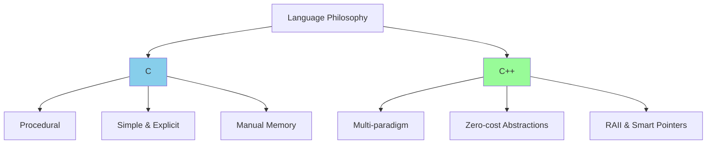
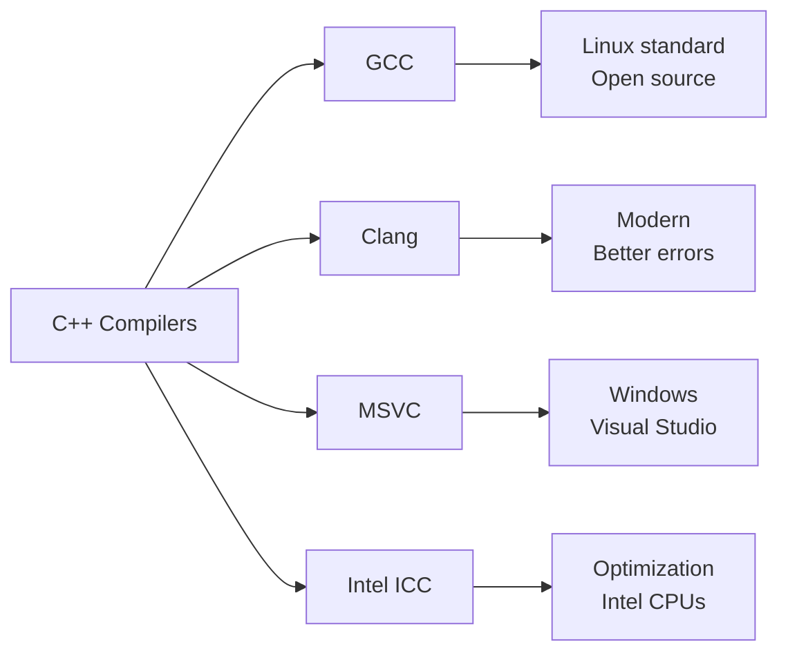
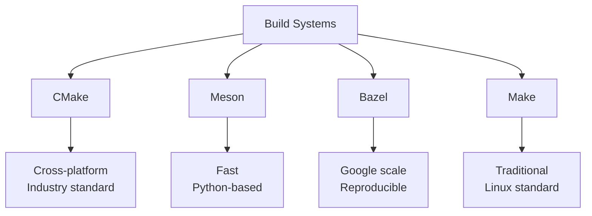
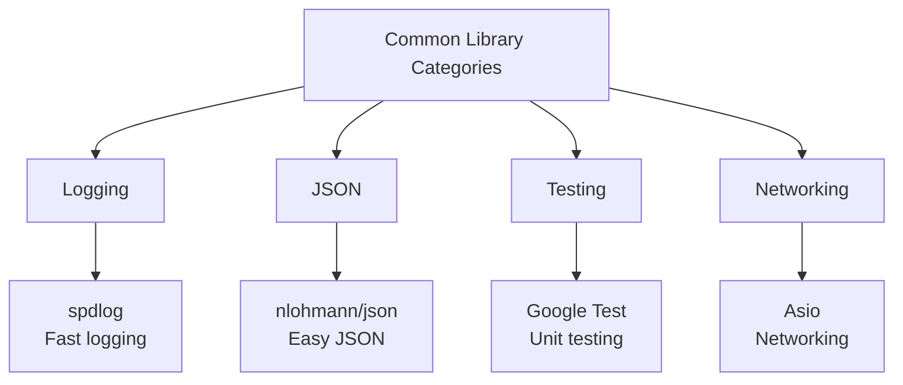
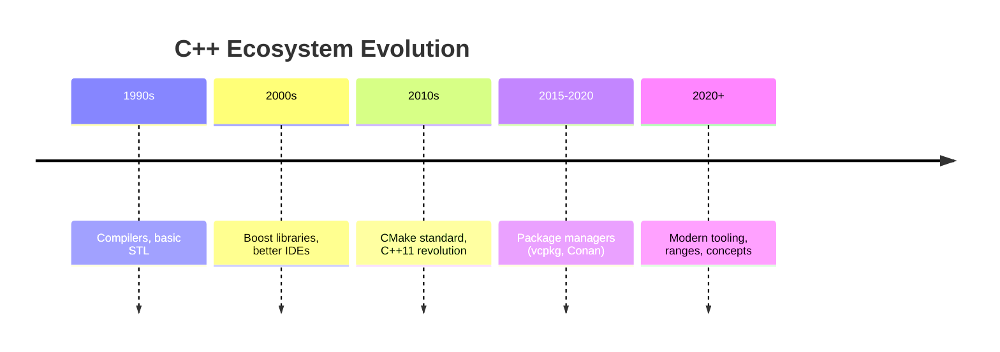

# C++ Ecosystem & C vs C++

The C++ ecosystem encompasses compilers, build systems, package managers, IDEs, libraries, and testing frameworks. Understanding this landscape is crucial for effective C++ development.

:::info Ecosystem Maturity
C++ has 40+ years of tooling evolution, resulting in diverse, battle-tested tools for every platform and use case.
:::

## C vs C++: Key Differences

While C++ began as "C with Classes," it has evolved into a distinct language with fundamentally different philosophies and features.

### Philosophy Comparison



### Core Differences

| Feature | C | C++ | Impact |
|---------|---|-----|--------|
| **Paradigm** | Procedural | Multi-paradigm (OOP, Generic, Functional) | C++ allows different problem-solving approaches |
| **Type Safety** | Weak | Stronger | C++ catches more errors at compile time |
| **Memory** | Manual malloc/free | RAII, smart pointers | C++ reduces memory leaks |
| **Namespaces** | No | Yes | C++ avoids name collisions |
| **Templates** | No | Yes | C++ enables generic programming |
| **Classes** | No (structs only) | Full OOP support | C++ provides encapsulation and inheritance |
| **Standard Library** | Minimal | Extensive (STL) | C++ provides ready-to-use data structures |

### Code Comparison

#### C Approach: Explicit and Procedural

```c
// C - Manual memory management and procedural style
#include <stdio.h>
#include <stdlib.h>
#include <string.h>

typedef struct {
    char* data;
    size_t length;
} String;

String* String_create(const char* text) {
    String* s = (String*)malloc(sizeof(String));
    if (!s) return NULL;
    
    s->length = strlen(text);
    s->data = (char*)malloc(s->length + 1);
    if (!s->data) {
        free(s);
        return NULL;
    }
    strcpy(s->data, text);
    return s;
}

void String_destroy(String* s) {
    if (s) {
        free(s->data);
        free(s);
    }
}

int main() {
    String* myString = String_create("Hello");
    if (!myString) return 1;
    
    printf("%s\n", myString->data);
    
    String_destroy(myString);  // Must manually free!
    return 0;
}
```

Every allocation requires manual deallocation. Forgetting `String_destroy` causes memory leaks. Error handling is verbose with explicit NULL checks.

#### C++ Approach: Abstraction and Automatic Management

```cpp showLineNumbers 
// C++ - RAII and object-oriented
#include <iostream>
#include <string>

class String {
    std::string data;
public:
    String(const std::string& text) : data(text) {}
    
    // Destructor automatically called
    ~String() {
        // std::string's destructor handles cleanup
    }
    
    const std::string& get() const { return data; }
};

int main() {
    String myString("Hello");  // Constructed
    
    std::cout << myString.get() << "\n";
    
    // Automatically destroyed when scope ends
    // No manual cleanup needed!
    return 0;
}

// Even simpler with std::string directly:
int main() {
    std::string myString = "Hello";
    std::cout << myString << "\n";
    return 0;  // Automatic cleanup
}
```

Memory is automatically managed through destructors. The string cleans itself up when it goes out of scope, eliminating manual memory management and the risk of leaks.

:::success Why This Matters
C forces you to think about memory management constantly. C++ lets you focus on solving problems, with the compiler ensuring resources are cleaned up.
:::

---

## Compilers

The compiler translates your C++ source code into machine code. Different compilers have different strengths and use cases.

### Major Compilers



#### GCC (GNU Compiler Collection)

**Strengths**: Industry standard on Linux, excellent optimization, wide platform support  
**Use Case**: Linux development, embedded systems, cross-compilation

```bash
# Compile with GCC
g++ -std=c++20 -Wall -Wextra -O3 main.cpp -o app

# -std=c++20: Use C++20 standard
# -Wall -Wextra: Enable comprehensive warnings
# -O3: Maximum optimization
```

The `-Wall -Wextra` flags are crucial—they enable warnings that catch common mistakes before they become bugs. The `-O3` flag enables aggressive optimizations that can make code 2-10x faster.

#### Clang/LLVM

**Strengths**: Fast compilation, excellent error messages, modular architecture, basis for many tools  
**Use Case**: Development (fast iteration), cross-platform projects, tooling (clang-format, clang-tidy)

```bash
# Compile with Clang
clang++ -std=c++20 -Wall -Wextra -O2 main.cpp -o app

# Better error messages help fix issues faster
```

Clang's error messages are significantly more readable than GCC's, showing you exactly what went wrong with helpful suggestions for fixes.

#### MSVC (Microsoft Visual C++)

**Strengths**: Windows integration, Visual Studio integration, Windows API support  
**Use Case**: Windows applications, DirectX games, Windows-specific features

```bash
# Compile with MSVC (from Developer Command Prompt)
cl /std:c++20 /EHsc /W4 /O2 main.cpp

# /EHsc: Enable exception handling
# /W4: Warning level 4 (high)
# /O2: Optimize for speed
```

MSVC integrates deeply with Windows debugging tools and provides the best support for Windows-specific APIs and DirectX.

---

## Build Systems

Modern C++ projects rarely use compiler commands directly. Build systems manage dependencies, track changes, and orchestrate multi-file compilation.

### CMake (Industry Standard)

CMake is the de facto standard for C++ build configuration. It generates native build files for various platforms and compilers.

```cmake showLineNumbers 
# CMakeLists.txt - Project configuration
cmake_minimum_required(VERSION 3.15)
project(MyApp VERSION 1.0 LANGUAGES CXX)

# Set C++ standard
set(CMAKE_CXX_STANDARD 20)
set(CMAKE_CXX_STANDARD_REQUIRED ON)

# Define executable
add_executable(myapp 
    src/main.cpp
    src/utils.cpp
    src/engine.cpp
)

# Include directories
target_include_directories(myapp PRIVATE include)

# Link libraries
target_link_libraries(myapp PRIVATE pthread)
```

CMake abstracts away platform differences. The same `CMakeLists.txt` works on Linux, Windows, and macOS, generating appropriate Makefiles, Visual Studio projects, or Xcode projects.

```bash
# Build with CMake
mkdir build && cd build
cmake ..              # Generate build files
cmake --build .       # Compile project
```

The out-of-source build (separate `build/` directory) keeps your source tree clean and allows multiple build configurations (Debug, Release) simultaneously.

### Other Build Systems



**Meson**: Faster than CMake, simpler syntax, growing adoption  
**Bazel**: Used by Google, handles massive projects, ensures reproducible builds  
**Make**: Traditional Unix tool, still used for simple projects or as CMake's backend

---

## Package Managers

C++ historically lacked a standard package manager, leading to "dependency hell." Modern package managers solve this.

### vcpkg (Microsoft)

Cross-platform package manager with 2000+ libraries, integrates seamlessly with CMake and Visual Studio.

```bash
# Install vcpkg
git clone https://github.com/Microsoft/vcpkg.git
cd vcpkg && ./bootstrap-vcpkg.sh

# Install libraries
./vcpkg install fmt spdlog nlohmann-json boost

# CMake integration
cmake -DCMAKE_TOOLCHAIN_FILE=[vcpkg]/scripts/buildsystems/vcpkg.cmake ..
```

Once installed, libraries are automatically found by CMake with simple `find_package()` commands. No manual path configuration needed.

```cmake showLineNumbers 
# Use installed libraries in CMakeLists.txt
find_package(fmt CONFIG REQUIRED)
find_package(spdlog CONFIG REQUIRED)

target_link_libraries(myapp PRIVATE fmt::fmt spdlog::spdlog)
```

### Conan (C++ Foundation)

Decentralized package manager with advanced dependency management, supports custom recipes, and works with any build system.

```bash
# Install Conan
pip install conan

# conanfile.txt - Dependency specification
[requires]
boost/1.82.0
fmt/10.0.0

[generators]
CMakeDeps
CMakeToolchain

# Install dependencies
conan install . --build=missing
```

Conan resolves dependency graphs, downloads prebuilt binaries (or builds from source), and generates CMake configuration files automatically.

### Comparison

| Feature | vcpkg | Conan | Manual |
|---------|-------|-------|--------|
| **Library Count** | 2000+ | 1500+ (ConanCenter) | Unlimited |
| **Build Integration** | CMake, MSBuild | Any build system | Manual |
| **Binary Caching** | ✅ Yes | ✅ Yes | ❌ No |
| **Custom Packages** | Create ports | Create recipes | N/A |
| **Learning Curve** | Easy | Moderate | N/A |

---

## IDEs and Editors

Your development environment significantly impacts productivity. C++ development benefits from powerful IDEs with code completion, refactoring, and debugging.

### Visual Studio (Windows)

The most powerful IDE for Windows C++ development, with excellent debugging, profiling, and IntelliSense.

**Features**:
- Visual debugger with time-travel debugging
- CPU and memory profilers
- IntelliSense (code completion)
- Integrated CMake support
- Git integration

**Best For**: Windows development, DirectX games, large enterprise projects

### Visual Studio Code

Lightweight, cross-platform editor that becomes a full C++ IDE with extensions.

**Required Extensions**:
```json
{
  "recommendations": [
    "ms-vscode.cpptools",      // C++ IntelliSense
    "ms-vscode.cmake-tools",   // CMake integration
    "llvm-vs-code-extensions.vscode-clangd",  // Better code analysis
    "vadimcn.vscode-lldb"      // Debugging
  ]
}
```

**Best For**: Cross-platform development, lightweight projects, quick editing

### CLion (JetBrains)

Commercial IDE with intelligent code assistance, excellent refactoring, and built-in CMake support.

**Strengths**: Smart code completion, powerful refactoring tools, integrated tools  
**Cost**: Paid (free for students/open source)  
**Best For**: Professional development, refactoring large codebases

---

## Essential Libraries

The C++ ecosystem includes thousands of libraries. These are the most important categories.

### Standard Library (STL)

Ships with every C++ compiler, providing fundamental data structures and algorithms.

```cpp showLineNumbers 
#include <vector>      // Dynamic arrays
#include <string>      // String handling
#include <map>         // Associative containers
#include <algorithm>   // Sorting, searching
#include <memory>      // Smart pointers
#include <thread>      // Multithreading
#include <filesystem>  // File operations (C++17)
#include <ranges>      // Range algorithms (C++20)
```

The STL is heavily optimized and battle-tested. Using `std::vector` is almost always faster than manual array management due to compiler optimizations.

### Boost Libraries

Extended functionality not (yet) in the standard. Many Boost libraries eventually become standard features.

```cpp showLineNumbers 
#include <boost/asio.hpp>        // Async I/O, networking
#include <boost/filesystem.hpp>  // File operations (pre-C++17)
#include <boost/program_options.hpp>  // Command-line parsing
#include <boost/serialization.hpp>    // Object serialization
```

Boost is the "second standard library" for C++. If a feature isn't in the standard library yet, it's probably in Boost.

### Essential Third-Party Libraries



**Logging**: `spdlog` (fast, header-only), `glog` (Google's logger)  
**JSON**: `nlohmann/json` (easy syntax), `rapidjson` (fastest)  
**Testing**: Google Test, Catch2, doctest  
**Networking**: Boost.Asio, POCO, libcurl  
**GUI**: Qt (cross-platform), wxWidgets  
**Graphics**: OpenGL, Vulkan, DirectX

---

## Testing Frameworks

Testing is critical for maintaining C++ codebases. Modern testing frameworks make writing tests straightforward.

### Google Test

Industry standard unit testing framework with rich assertion macros and test organization.

```cpp showLineNumbers 
#include <gtest/gtest.h>

// Test case organization
TEST(MathTests, Addition) {
    EXPECT_EQ(2 + 2, 4);
    EXPECT_NE(2 + 2, 5);
}

TEST(MathTests, Division) {
    EXPECT_DOUBLE_EQ(10.0 / 3.0, 3.333333, 0.0001);
    EXPECT_THROW(divide(10, 0), std::domain_error);
}

int main(int argc, char** argv) {
    testing::InitGoogleTest(&argc, argv);
    return RUN_ALL_TESTS();
}
```

Tests are grouped into test suites (first parameter) with individual test cases (second parameter). Rich assertions provide clear failure messages showing expected vs actual values.

### Catch2

Modern, header-only testing framework with natural assertion syntax.

```cpp showLineNumbers 
#define CATCH_CONFIG_MAIN
#include <catch2/catch.hpp>

TEST_CASE("Math operations", "[math]") {
    SECTION("Addition") {
        REQUIRE(2 + 2 == 4);
    }
    
    SECTION("Division") {
        REQUIRE_THROWS_AS(divide(10, 0), std::domain_error);
    }
}
```

Catch2's natural C++ expressions in assertions make tests more readable. Tags (like `[math]`) allow running specific test subsets.

---

## Static Analysis Tools

Static analyzers find bugs without running code, catching issues like memory leaks, null pointer dereferences, and undefined behavior.

### Clang-Tidy

LLVM-based linter with hundreds of checks for bugs, performance issues, and style violations.

```bash
# Run clang-tidy
clang-tidy main.cpp -- -std=c++20 -I./include

# Common checks
clang-tidy -checks='bugprone-*,performance-*,readability-*' main.cpp
```

Clang-tidy can detect issues like:
- Potential null pointer dereferences
- Memory leaks
- Inefficient copying (should use move)
- Style violations
- Deprecated API usage

### Cppcheck

Open-source static analyzer focused on detecting undefined behavior and bugs.

```bash
cppcheck --enable=all --std=c++20 src/
```

### AddressSanitizer (ASan)

Runtime instrumentation that detects memory errors during program execution.

```bash
# Compile with AddressSanitizer
g++ -fsanitize=address -g main.cpp -o app

# Run - crashes with detailed error on memory issues
./app
```

ASan detects:
- Use-after-free
- Buffer overflows
- Memory leaks
- Double-free bugs

:::success Production Workflow
1. **Develop** with warnings enabled (`-Wall -Wextra`)
2. **Analyze** with clang-tidy during development
3. **Test** with AddressSanitizer before commit
4. **CI/CD** runs all checks automatically
   :::

---

## Documentation Tools

### Doxygen

Standard documentation generator that extracts comments into HTML/PDF documentation.

```cpp showLineNumbers 
/**
 * @brief Calculates the factorial of a number
 * 
 * This function computes n! = n * (n-1) * ... * 2 * 1
 * 
 * @param n The number to calculate factorial for
 * @return The factorial of n
 * @throws std::domain_error if n < 0
 * 
 * @code
 * int result = factorial(5);  // Returns 120
 * @endcode
 */
int factorial(int n);
```

Doxygen parses specially formatted comments and generates browsable documentation with cross-references, class diagrams, and call graphs.

---

## Community and Resources

### Learning Resources

**Books**:
- "A Tour of C++" by Bjarne Stroustrup (creator of C++)
- "Effective Modern C++" by Scott Meyers
- "C++ Primer" by Stanley Lippman

**Websites**:
- [cppreference.com](https://cppreference.com) - Comprehensive language reference
- [CppCon YouTube](https://youtube.com/cppcon) - Conference talks
- [Compiler Explorer](https://godbolt.org) - See generated assembly

**Standards**:
- [isocpp.org](https://isocpp.org) - C++ Standards Committee
- [ISO C++ Guidelines](https://isocpp.github.io/CppCoreGuidelines/)

### Community

- **Reddit**: r/cpp, r/cpp_questions
- **Discord**: C++ Community (100k+ members)
- **Stack Overflow**: [c++] tag (1M+ questions)
- **Twitter/X**: #cpp hashtag

---

## Ecosystem Maturity Timeline



---

## Summary

The C++ ecosystem provides:

- ✅ **Multiple compilers** - GCC, Clang, MSVC for different needs
- ✅ **Modern build systems** - CMake as the standard
- ✅ **Package managers** - vcpkg and Conan ending dependency hell
- ✅ **Powerful IDEs** - Visual Studio, CLion, VS Code
- ✅ **Rich libraries** - From STL to specialized third-party
- ✅ **Testing & analysis** - Google Test, Catch2, ASan, clang-tidy
- ✅ **Active community** - Conferences, books, online resources

:::info Key Takeaway
C++ has evolved from a language with minimal tooling to one with a comprehensive, mature ecosystem rivaling any modern language. The key is knowing which tools to use for your specific needs.
:::

While C remains important for systems programming and embedded systems, C++ provides everything C does plus powerful abstractions that make development faster and safer without sacrificing performance.