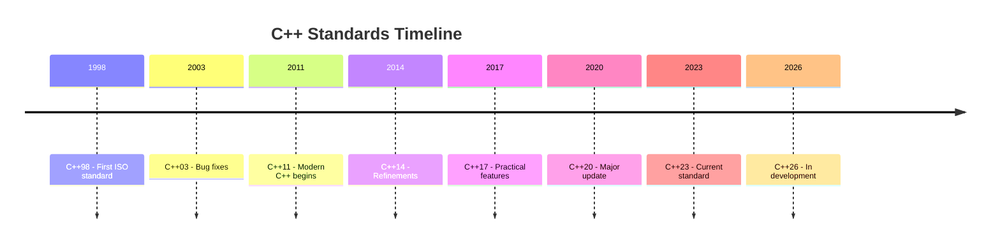
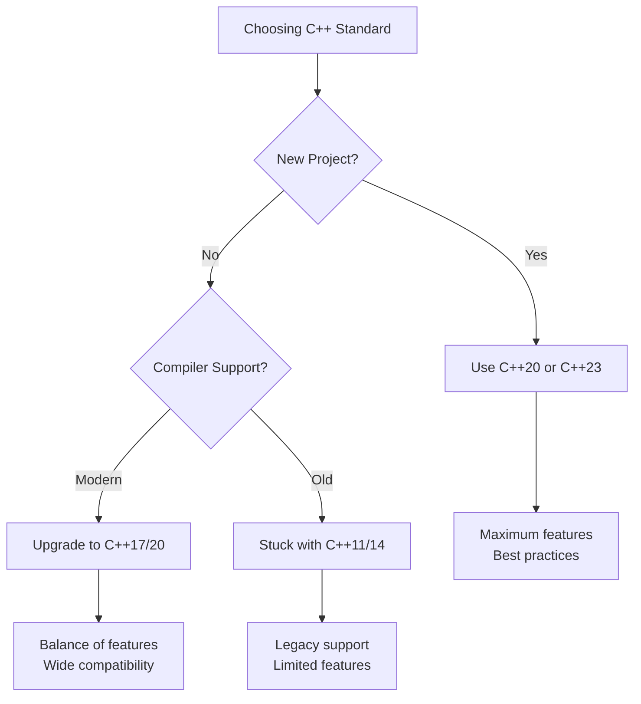

# Differences Between C++ Standards

C++ evolves through standardized versions released approximately every three years. Each standard adds features, fixes issues, and modernizes the language while maintaining backward compatibility.

:::info Standard Naming
C++ standards are named by their publication year: C++98, C++11, C++14, C++17, C++20, C++23. Before publication, they're called by the expected year (C++0x was expected in 200x, released in 2011).
:::

## Evolution Timeline



---

## C++98/03: The Foundation

The first standardized C++, establishing the core language and STL (Standard Template Library).

### Key Features

```cpp showLineNumbers 
// Templates - generic programming foundation
template<typename T>
class vector {
    T* data;
    size_t size;
    // ...
};

// STL containers
std::vector<int> numbers;
std::map<std::string, int> ages;
std::set<std::string> unique_names;

// Standard algorithms
std::sort(numbers.begin(), numbers.end());
std::find(numbers.begin(), numbers.end(), 42);
```

The STL introduced the concept of generic containers and algorithms that work together through iterators, revolutionizing C++ programming by providing reusable, type-safe components.

### Limitations

```cpp showLineNumbers 
// ❌ No type inference
std::vector<std::map<std::string, std::vector<int>>>::iterator it;  // Verbose!

// ❌ No lambda functions
bool isEven(int n) { return n % 2 == 0; }  // Separate function needed
std::count_if(vec.begin(), vec.end(), isEven);

// ❌ Manual memory management
Widget* ptr = new Widget();
// ... use ptr ...
delete ptr;  // Easy to forget!

// ❌ No nullptr
void* ptr = NULL;  // NULL is actually integer 0
```

:::warning Legacy Code
Much existing C++ code is still C++98/03. Understanding it is necessary for maintaining legacy systems.
:::

---

## C++11: The Modern C++ Revolution

C++11 was the most significant update, modernizing the language with features that changed how C++ is written. This is considered the start of "Modern C++."

### 1. auto - Type Inference

The `auto` keyword deduces types automatically, reducing verbosity and making code more maintainable. When you change a function's return type, code using `auto` doesn't need updates.

```cpp showLineNumbers 
// Before C++11
std::vector<std::map<std::string, int>>::iterator it = myMap.begin();

// C++11
auto it = myMap.begin();  // Type deduced automatically

// More examples
auto num = 42;              // int
auto price = 29.99;         // double
auto name = "Alice";        // const char*
auto names = std::vector<std::string>();  // std::vector<std::string>
```

### 2. Range-Based for Loop

Iterating through containers becomes dramatically simpler. The range-based for loop automatically handles begin/end iterators and dereferences values for you.

```cpp showLineNumbers 
std::vector<int> numbers = {1, 2, 3, 4, 5};

// Before C++11
for (std::vector<int>::iterator it = numbers.begin(); 
     it != numbers.end(); ++it) {
    std::cout << *it << "\n";
}

// C++11 - much cleaner
for (int num : numbers) {
    std::cout << num << "\n";
}

// With auto
for (auto num : numbers) {  // Works with any container
    std::cout << num << "\n";
}

// By reference to modify
for (auto& num : numbers) {
    num *= 2;  // Double each value
}
```

### 3. Lambda Expressions

Lambdas allow defining inline anonymous functions, eliminating the need for separate function definitions for simple operations. This makes STL algorithms much more convenient.

```cpp showLineNumbers 
std::vector<int> numbers = {1, 2, 3, 4, 5, 6};

// Before C++11 - needed separate function
bool isEven(int n) { return n % 2 == 0; }
auto count = std::count_if(numbers.begin(), numbers.end(), isEven);

// C++11 - inline lambda
auto count = std::count_if(numbers.begin(), numbers.end(), 
                          [](int n) { return n % 2 == 0; });

// Capturing variables from surrounding scope
int threshold = 10;
auto count_above = std::count_if(numbers.begin(), numbers.end(),
                                [threshold](int n) { return n > threshold; });
```

The `[threshold]` syntax captures the `threshold` variable by value, making it available inside the lambda. You can capture by reference with `[&threshold]` or capture everything with `[=]` (by value) or `[&]` (by reference).

### 4. Smart Pointers

Smart pointers automate memory management, eliminating the need for manual `delete` calls and preventing memory leaks. They use RAII to ensure resources are released when the smart pointer is destroyed.

```cpp showLineNumbers 
// Before C++11 - manual memory management
Widget* ptr = new Widget();
ptr->doSomething();
delete ptr;  // Forgetting this causes memory leak!

// C++11 - automatic memory management
auto ptr = std::make_unique<Widget>();
ptr->doSomething();
// Automatically deleted when ptr goes out of scope

// Shared ownership
auto shared1 = std::make_shared<Widget>();
auto shared2 = shared1;  // Reference counted
// Deleted when last shared_ptr is destroyed
```

`unique_ptr` provides exclusive ownership (cannot be copied, only moved), while `shared_ptr` uses reference counting to allow multiple owners. The object is deleted when the last `shared_ptr` is destroyed.

### 5. Move Semantics

Move semantics allow transferring resources instead of copying them, dramatically improving performance when working with large objects or containers.

```cpp showLineNumbers 
// Before C++11 - expensive copy
std::vector<int> createVector() {
    std::vector<int> vec(1000000);
    // ... populate ...
    return vec;  // Expensive copy!
}

// C++11 - efficient move
std::vector<int> createVector() {
    std::vector<int> vec(1000000);
    // ... populate ...
    return vec;  // Automatic move! Just transfers pointer
}

// Explicit move
std::vector<int> vec1 = {1, 2, 3};
std::vector<int> vec2 = std::move(vec1);  // Transfer ownership
// vec1 is now empty
```

Moving is essentially transferring the internal pointer rather than copying all elements. For a million-element vector, this changes from copying 4MB of data to copying just one 8-byte pointer.

### 6. nullptr

The `nullptr` keyword replaces NULL, providing type safety for null pointers. NULL was actually the integer 0, which could cause ambiguity in function overloading.

```cpp showLineNumbers 
// Before C++11
void func(int n) { }
void func(char* ptr) { }

func(NULL);  // Ambiguous! NULL is integer 0

// C++11
void func(int n) { }
void func(char* ptr) { }

func(nullptr);  // Calls func(char*) - unambiguous
```

### 7. Uniform Initialization

Brace initialization provides a consistent syntax for all initialization scenarios and prevents narrowing conversions (like assigning a double to an int).

```cpp showLineNumbers 
// Before C++11 - different syntaxes
int a = 5;
int arr[] = {1, 2, 3};
Widget w = Widget(10);

// C++11 - uniform syntax
int a{5};
int arr[]{1, 2, 3};
Widget w{10};
std::vector<int> vec{1, 2, 3, 4, 5};

// Prevents narrowing
int x = 7.7;      // OK, silently truncates
int y{7.7};       // ❌ Compilation error! Prevents bugs
```

### 8. Multithreading Support

C++11 finally added standardized threading support, making concurrent programming portable across platforms.

```cpp showLineNumbers 
#include <thread>
#include <mutex>

std::mutex mtx;
int counter = 0;

void increment() {
    std::lock_guard<std::mutex> lock(mtx);  // RAII lock
    ++counter;
}

int main() {
    std::thread t1(increment);
    std::thread t2(increment);
    
    t1.join();
    t2.join();
    
    std::cout << "Counter: " << counter << "\n";
}
```

Before C++11, you had to use platform-specific APIs (pthreads on Linux, Win32 threads on Windows). Now the same code works everywhere.

---

## C++14: Small Improvements

C++14 focused on refining C++11 features and fixing issues rather than adding major new capabilities.

### 1. Generic Lambdas

Lambda parameters can now use `auto`, making them work with any type. This creates a template function without the template syntax.

```cpp showLineNumbers 
// C++11 - specific type
auto add = [](int a, int b) { return a + b; };

// C++14 - generic lambda
auto add = [](auto a, auto b) { return a + b; };

add(5, 3);           // int
add(5.5, 2.3);       // double
add(std::string("Hello "), std::string("World"));  // string
```

The compiler generates a separate instantiation for each type used, just like templates.

### 2. Return Type Deduction

Functions can now use `auto` for return types, with the compiler deducing the type from return statements.

```cpp showLineNumbers 
// C++11 - must specify return type
auto multiply(int a, int b) -> int {
    return a * b;
}

// C++14 - return type deduced
auto multiply(int a, int b) {
    return a * b;  // Compiler deduces 'int'
}

// Works with complex types
auto createMap() {
    std::map<std::string, std::vector<int>> m;
    // ...
    return m;  // Type automatically deduced
}
```

### 3. Binary Literals and Digit Separators

Binary literals and digit separators improve readability when working with bit patterns and large numbers.

```cpp showLineNumbers 
// Binary literals
int mask = 0b11110000;  // 240 in decimal
int flags = 0b0001'0100'1000'1100;  // With separators

// Digit separators for readability
long big_num = 1'000'000'000;  // 1 billion
double pi = 3.141'592'653'589;
```

The separator (') has no effect on the value, it's purely for human readability. The compiler ignores it.

### 4. std::make_unique

C++11 had `std::make_shared` but forgot `std::make_unique`. C++14 fixed this oversight.

```cpp showLineNumbers 
// C++11 - inconsistent
auto shared = std::make_shared<Widget>(42);
auto unique = std::unique_ptr<Widget>(new Widget(42));  // Inconsistent!

// C++14 - consistent
auto shared = std::make_shared<Widget>(42);
auto unique = std::make_unique<Widget>(42);  // ✅ Better
```

`make_unique` is safer than using `new` directly because it's exception-safe and prevents accidentally creating raw pointers.

---

## C++17: Practical Features

C++17 added features that make everyday programming more convenient and expressive.

### 1. Structured Bindings

Unpack tuples, pairs, and structs into individual variables in a single declaration. This eliminates the need for `std::tie` or accessing members by index.

```cpp showLineNumbers 
// Before C++17
std::map<std::string, int> ages;
for (auto it = ages.begin(); it != ages.end(); ++it) {
    std::string name = it->first;
    int age = it->second;
    std::cout << name << ": " << age << "\n";
}

// C++17
std::map<std::string, int> ages;
for (const auto& [name, age] : ages) {
    std::cout << name << ": " << age << "\n";  // Much cleaner!
}

// Also works with tuples
auto [x, y, z] = std::make_tuple(1, 2.5, "hello");
```

### 2. if constexpr

Compile-time conditional compilation allows different code paths based on template parameters, eliminating the need for complex SFINAE tricks.

```cpp showLineNumbers 
template<typename T>
void process(T value) {
    if constexpr (std::is_integral_v<T>) {
        // This block compiled only for integral types
        std::cout << "Integer: " << value << "\n";
    } else if constexpr (std::is_floating_point_v<T>) {
        // This block compiled only for floating point
        std::cout << "Float: " << value << "\n";
    } else {
        // This block compiled for other types
        std::cout << "Other: " << value << "\n";
    }
}
```

The condition is evaluated at compile time, and only the matching branch is compiled. This is different from a regular `if`, which evaluates at runtime.

### 3. std::optional

Represents a value that may or may not exist, eliminating the need for special sentinel values or pointers to indicate absence.

```cpp showLineNumbers 
// Before C++17 - using special values or exceptions
int parseInt(const std::string& str) {
    try {
        return std::stoi(str);
    } catch (...) {
        return -1;  // Special value to indicate error
    }
}

// C++17 - explicit optional
std::optional<int> parseInt(const std::string& str) {
    try {
        return std::stoi(str);
    } catch (...) {
        return std::nullopt;  // Explicitly no value
    }
}

// Usage
auto result = parseInt("123");
if (result.has_value()) {
    std::cout << "Value: " << result.value() << "\n";
} else {
    std::cout << "Parsing failed\n";
}

// With default value
int val = result.value_or(0);
```

### 4. std::filesystem

Finally, a standard way to interact with the filesystem across all platforms, replacing platform-specific APIs.

```cpp showLineNumbers 
#include <filesystem>
namespace fs = std::filesystem;

// Check if file exists
if (fs::exists("data.txt")) {
    std::cout << "File exists\n";
}

// Iterate directory
for (const auto& entry : fs::directory_iterator("/path/to/dir")) {
    std::cout << entry.path() << "\n";
}

// Create directories
fs::create_directories("path/to/nested/dirs");

// File size
auto size = fs::file_size("data.txt");
```

Before C++17, you had to use POSIX APIs on Linux, Windows APIs on Windows, or third-party libraries like Boost.Filesystem.

### 5. std::string_view

A non-owning view into a string, avoiding unnecessary copies when you only need to read string data.

```cpp showLineNumbers 
// Before C++17 - copies string
void printString(const std::string& str) {  // May copy if passed char*
    std::cout << str << "\n";
}

// C++17 - no copy
void printString(std::string_view str) {  // Never copies
    std::cout << str << "\n";
}

// Works with all string types
printString("literal");                    // No copy
printString(std::string("hello"));         // No copy
printString(buffer);                       // No copy (if buffer is char*)
```

`string_view` stores only a pointer and length, making it cheap to pass around. However, you must ensure the underlying string outlives the view.

---

## C++20: Massive Update

C++20 is the biggest update since C++11, adding four major features and dozens of smaller improvements.

### 1. Concepts

Concepts provide named constraints on template parameters, replacing cryptic SFINAE error messages with clear requirements.

```cpp showLineNumbers 
// Before C++20 - SFINAE hell
template<typename T>
typename std::enable_if<std::is_integral<T>::value, T>::type
add(T a, T b) {
    return a + b;
}

// C++20 - readable concepts
template<std::integral T>  // T must be an integral type
T add(T a, T b) {
    return a + b;
}

// Or using requires clause
template<typename T>
requires std::integral<T>
T add(T a, T b) {
    return a + b;
}

// Custom concept
template<typename T>
concept Numeric = std::integral<T> || std::floating_point<T>;

template<Numeric T>
T multiply(T a, T b) {
    return a * b;
}
```

When you call `add("hello", "world")`, you get a clear error: "constraints not satisfied: 'const char*' does not satisfy 'integral'" instead of pages of template instantiation errors.

### 2. Ranges

Ranges provide a composable way to work with sequences, making algorithms more readable and allowing lazy evaluation.

```cpp showLineNumbers 
#include <ranges>
namespace rg = std::ranges;
namespace vw = std::views;

std::vector<int> numbers = {1, 2, 3, 4, 5, 6, 7, 8, 9, 10};

// Before C++20 - verbose
std::vector<int> result;
std::copy_if(numbers.begin(), numbers.end(), std::back_inserter(result),
            [](int n) { return n % 2 == 0; });
std::transform(result.begin(), result.end(), result.begin(),
              [](int n) { return n * 2; });

// C++20 - pipeline style (no intermediate storage!)
auto result = numbers 
    | vw::filter([](int n) { return n % 2 == 0; })  // Keep evens
    | vw::transform([](int n) { return n * 2; });   // Double them
    
// Lazy evaluation - only computed when accessed
for (int n : result) {
    std::cout << n << "\n";
}
```

Ranges use lazy evaluation, so the filtering and transformation happen on-the-fly as you iterate, without creating intermediate vectors.

### 3. Coroutines

Coroutines allow functions to suspend and resume execution, enabling async/await patterns and generators.

```cpp showLineNumbers 
#include <coroutine>
#include <iostream>

// Generator coroutine
generator<int> fibonacci() {
    int a = 0, b = 1;
    while (true) {
        co_yield a;  // Suspend and return value
        auto next = a + b;
        a = b;
        b = next;
    }
}

// Usage
for (int value : fibonacci()) {
    if (value > 100) break;
    std::cout << value << "\n";
}
```

The `co_yield` keyword suspends the function, saving its state. When iteration continues, execution resumes right after `co_yield` with all local variables intact.

### 4. Modules

Modules replace the preprocessor-based `#include` system, improving compile times and eliminating header file issues.

```cpp showLineNumbers 
// Before C++20 - header file (widget.h)
#ifndef WIDGET_H
#define WIDGET_H
class Widget {
    void doSomething();
};
#endif

// C++20 - module interface (widget.cppm)
export module widget;

export class Widget {
    void doSomething();
};

// Usage - much faster compilation
import widget;  // No preprocessor, direct import

int main() {
    Widget w;
    w.doSomething();
}
```

Modules compile once and are reused, unlike headers which are reprocessed in every source file. Large projects can see 10-50% compile time improvements.

### 5. Three-Way Comparison (Spaceship Operator)

The `<=>` operator generates all six comparison operators automatically.

```cpp showLineNumbers 
#include <compare>

class Point {
    int x, y;
public:
    // Before C++20 - define all 6 operators
    bool operator==(const Point& other) const { return x == other.x && y == other.y; }
    bool operator!=(const Point& other) const { return !(*this == other); }
    bool operator<(const Point& other) const { /* ... */ }
    bool operator>(const Point& other) const { /* ... */ }
    bool operator<=(const Point& other) const { /* ... */ }
    bool operator>=(const Point& other) const { /* ... */ }
    
    // C++20 - just one operator
    auto operator<=>(const Point& other) const = default;
};

Point p1{1, 2}, p2{3, 4};
bool equal = (p1 == p2);  // Generated automatically
bool less = (p1 < p2);    // Generated automatically
```

---

## C++23: Latest Standard

C++23 adds smaller features that improve quality of life.

### Key Features

```cpp showLineNumbers 
// 1. std::print - finally, a simple print function!
std::print("Hello, {}!\n", "World");
std::print("Value: {}, Hex: {:x}\n", 42, 42);

// 2. Multidimensional subscript operator
matrix[1, 2] = 5;  // Instead of matrix[1][2]

// 3. if consteval - compile-time vs runtime
if consteval {
    // Executed at compile-time
} else {
    // Executed at runtime
}

// 4. std::expected - error handling without exceptions
std::expected<int, std::string> divide(int a, int b) {
    if (b == 0) {
        return std::unexpected("Division by zero");
    }
    return a / b;
}

auto result = divide(10, 2);
if (result.has_value()) {
    std::cout << "Result: " << result.value() << "\n";
} else {
    std::cout << "Error: " << result.error() << "\n";
}
```

---

## Version Comparison Table

| Feature | C++98 | C++11 | C++14 | C++17 | C++20 | C++23 |
|---------|-------|-------|-------|-------|-------|-------|
| auto | ❌ | ✅ | ✅ | ✅ | ✅ | ✅ |
| Lambdas | ❌ | ✅ | ✅ Generic | ✅ | ✅ | ✅ |
| Smart pointers | ❌ | ✅ | ✅ make_unique | ✅ | ✅ | ✅ |
| Move semantics | ❌ | ✅ | ✅ | ✅ | ✅ | ✅ |
| Range-for | ❌ | ✅ | ✅ | ✅ | ✅ | ✅ |
| nullptr | ❌ | ✅ | ✅ | ✅ | ✅ | ✅ |
| constexpr | ❌ | ✅ Limited | ✅ | ✅ Relaxed | ✅ | ✅ |
| Structured bindings | ❌ | ❌ | ❌ | ✅ | ✅ | ✅ |
| optional/variant | ❌ | ❌ | ❌ | ✅ | ✅ | ✅ |
| filesystem | ❌ | ❌ | ❌ | ✅ | ✅ | ✅ |
| Concepts | ❌ | ❌ | ❌ | ❌ | ✅ | ✅ |
| Ranges | ❌ | ❌ | ❌ | ❌ | ✅ | ✅ |
| Coroutines | ❌ | ❌ | ❌ | ❌ | ✅ | ✅ |
| Modules | ❌ | ❌ | ❌ | ❌ | ✅ | ✅ |
| std::print | ❌ | ❌ | ❌ | ❌ | ❌ | ✅ |

---

## Which Standard Should You Use?



### Recommendations

**New Projects (2024+)**: Use C++20 or C++23
- Best features, modern practices
- Compiler support is good and improving

**Existing Projects**: Upgrade to at least C++17
- Significant improvements over C++11
- Wide compiler support
- Worth the migration effort

**Legacy Systems**: Stay on C++11 minimum
- Huge improvement over C++98
- Available on all modern compilers

:::success Minimum Modern Standard
Never use anything older than C++11. It's the baseline for "Modern C++" and is supported by all compilers since ~2015.
:::

---

## Summary

Each C++ standard builds on previous ones:

- **C++98/03**: Foundation - templates, STL
- **C++11**: Revolution - auto, lambdas, smart pointers, move semantics
- **C++14**: Refinement - generic lambdas, improved constexpr
- **C++17**: Practicality - structured bindings, optional, filesystem
- **C++20**: Transformation - concepts, ranges, coroutines, modules
- **C++23**: Polish - std::print, expected, improvements

The language continues to evolve, becoming more expressive and safer while maintaining its core principle: zero-overhead abstractions and maximum performance.