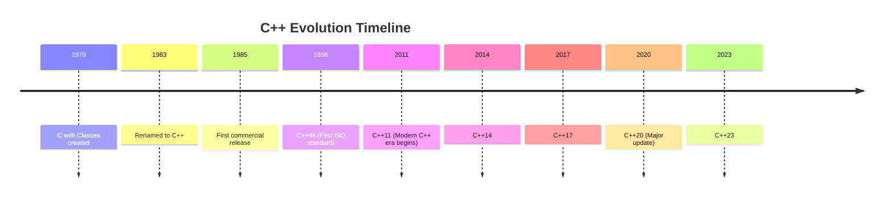
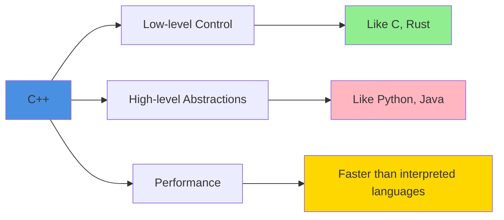

# What is C++?

C++ is a general-purpose, compiled programming language that extends C with object-oriented,
generic, and functional programming features. It provides low-level memory control while offering
high-level abstractions.

:::info Key Characteristics
**Multi-paradigm**: Supports procedural, OOP, generic, and functional programming  
**Performance**: Zero-overhead abstractions and direct hardware access  
**Compiled**: Translates to native machine code for maximum efficiency
:::

## History and Evolution

C++ was created by Bjarne Stroustrup at Bell Labs in 1979, initially called "C with Classes." The
language evolved from a simple extension of C into one of the most widely-used programming languages
in the world.



The name "C++" itself is a programmer's joke – the `++` operator in C increments a variable by one,
suggesting C++ is "one better" than C.

---

## Core Philosophy

### Zero-Overhead Principle

C++ follows the principle: "You don't pay for what you don't use." Features that you don't utilize
have zero runtime cost. This means abstractions like classes, templates, and inline functions
compile down to code as efficient as hand-written C or assembly.

```cpp showLineNumbers 
// High-level abstraction
std::vector<int> numbers = {1, 2, 3, 4, 5};
int sum = std::accumulate(numbers.begin(), numbers.end(), 0);

// Compiles to code as efficient as:
int arr[] = {1, 2, 3, 4, 5};
int sum = 0;
for(int i = 0; i < 5; i++) {
    sum += arr[i];
}
```

The compiler optimizes the high-level vector code to produce machine code nearly identical to the
manual loop, giving you both expressiveness and performance.

### Direct Hardware Access

Unlike higher-level languages, C++ allows direct manipulation of memory addresses, bit patterns, and
hardware registers. This makes it ideal for systems programming, embedded systems, and
performance-critical applications.

```cpp showLineNumbers 
// Direct memory manipulation
void* ptr = malloc(1024);              // Allocate raw memory
uint8_t* bytes = static_cast<uint8_t*>(ptr);
bytes[0] = 0xFF;                       // Write directly to memory address

// Bit-level operations
uint32_t flags = 0b00000000;
flags |= (1 << 3);                     // Set bit 3
bool isSet = (flags & (1 << 3)) != 0;  // Check bit 3
```

This level of control is essential when writing device drivers, game engines, or real-time systems
where every CPU cycle matters.

---

## Where C++ Excels

### 1. Systems Programming

C++ powers operating systems, compilers, and databases. Its ability to manage resources explicitly
while providing abstractions makes it perfect for building foundational software.

**Examples**: Linux kernel components, Windows core services, PostgreSQL, MySQL

### 2. Game Development

The gaming industry relies heavily on C++ for performance-critical game engines. Modern games need
to render complex 3D graphics at 60+ FPS while simulating physics, AI, and networking.

**Examples**: Unreal Engine, Unity (core), CryEngine, id Tech engines

```cpp showLineNumbers 
// Simplified game loop structure
class Game {
    void run() {
        while (isRunning) {
            float deltaTime = calculateDeltaTime();
            
            processInput();              // Handle keyboard/mouse
            update(deltaTime);           // Update game logic
            render();                    // Draw everything
            
            // All must complete in ~16ms for 60 FPS
        }
    }
};
```

Each frame must complete in approximately 16 milliseconds (60 FPS) or 8 milliseconds (120 FPS),
requiring extremely efficient code that C++ enables.

### 3. High-Performance Computing

Scientific simulations, financial trading systems, and data processing pipelines use C++ for its
speed. When processing millions of transactions per second or simulating weather patterns,
performance is non-negotiable.

**Examples**: Trading systems, particle physics simulations (CERN), machine learning frameworks (
TensorFlow core)

### 4. Embedded Systems

Resource-constrained devices like microcontrollers, IoT devices, and automotive systems use C++ for
direct hardware control and minimal memory footprint.

**Examples**: Automotive ECUs, medical devices, Mars rovers, Arduino advanced projects

---

## C++ vs Other Languages



| Aspect             | C++                 | Python             | Java                | Rust                      |
|--------------------|---------------------|--------------------|---------------------|---------------------------|
| **Speed**          | ⚡⚡⚡⚡⚡               | ⚡                  | ⚡⚡⚡                 | ⚡⚡⚡⚡⚡                     |
| **Memory Control** | Manual              | Automatic          | Automatic (GC)      | Ownership system          |
| **Learning Curve** | Steep               | Gentle             | Moderate            | Very steep                |
| **Safety**         | Manual              | Safe               | Safe                | Memory safe               |
| **Use Case**       | Systems, games, HPC | Scripting, ML, web | Enterprise, Android | Systems, safe concurrency |

Python's simplicity makes it great for rapid development, but C++ is 10-100x faster for
compute-intensive tasks. Java's garbage collector adds overhead that C++ avoids. Rust offers memory
safety guarantees but has a steeper learning curve.

---

## Key Features

### 1. Object-Oriented Programming

C++ supports classes, inheritance, polymorphism, and encapsulation. This allows modeling complex
systems as interacting objects with clear interfaces.

```cpp showLineNumbers 
class BankAccount {
private:
    double balance;                     // Encapsulated data
    
public:
    explicit BankAccount(double initial) : balance(initial) {}
    
    virtual void deposit(double amount) {  // Virtual for polymorphism
        if (amount > 0) {
            balance += amount;
        }
    }
    
    double getBalance() const { return balance; }
};

class SavingsAccount : public BankAccount {  // Inheritance
    double interestRate;
public:
    SavingsAccount(double initial, double rate) 
        : BankAccount(initial), interestRate(rate) {}
    
    void applyInterest() {
        deposit(getBalance() * interestRate);
    }
};
```

The encapsulation ensures `balance` cannot be directly modified, inheritance allows specialization,
and virtual functions enable runtime polymorphism.

### 2. Generic Programming (Templates)

Templates allow writing code that works with any type, enabling type-safe reusable algorithms and
data structures. The STL (Standard Template Library) is built entirely on templates.

```cpp showLineNumbers 
// Generic function works with any comparable type
template<typename T>
T max(T a, T b) {
    return (a > b) ? a : b;
}

// Used with different types at compile-time
int maxInt = max(10, 20);              // Instantiates max<int>
double maxDouble = max(3.14, 2.71);    // Instantiates max<double>
std::string maxStr = max(std::string("apple"), 
                         std::string("banana")); // max<std::string>
```

The compiler generates specialized versions of the function for each type used, maintaining type
safety while avoiding code duplication.

### 3. Standard Template Library (STL)

The STL provides battle-tested containers (vector, map, set), algorithms (sort, find, transform),
and iterators. These components work together seamlessly and are heavily optimized.

```cpp showLineNumbers 
#include <vector>
#include <algorithm>
#include <iostream>

std::vector<int> numbers = {5, 2, 8, 1, 9};

// STL algorithm with lambda
std::sort(numbers.begin(), numbers.end(), 
         [](int a, int b) { return a > b; });  // Sort descending

// STL algorithm with iterator
auto it = std::find(numbers.begin(), numbers.end(), 8);
if (it != numbers.end()) {
    std::cout << "Found at position: " 
              << std::distance(numbers.begin(), it) << "\n";
}
```

The vector automatically manages memory, `std::sort` uses an optimized IntroSort algorithm, and the
lambda provides a custom comparison inline without defining a separate function.

### 4. RAII (Resource Acquisition Is Initialization)

RAII ties resource lifetime to object lifetime, ensuring automatic cleanup even during exceptions.
This is C++'s answer to garbage collection, but with deterministic timing.

```cpp showLineNumbers 
{
    std::fstream file("data.txt");  // File opened in constructor
    file << "Hello, World!";
    
    if (error) {
        throw std::runtime_error("Error occurred");
    }
    
    // File automatically closed when 'file' goes out of scope,
    // even if exception is thrown above
}
```

The file is guaranteed to close regardless of how the scope exits (normal return, exception, early
return), preventing resource leaks.

### 5. Move Semantics (C++11)

Move semantics allow transferring resources instead of copying them, dramatically improving
performance when working with temporary objects or large data structures.

```cpp showLineNumbers 
std::vector<int> createLargeVector() {
    std::vector<int> vec(1000000);  // 1 million elements
    // ... populate vector ...
    return vec;  // Move, not copy!
}

std::vector<int> myVec = createLargeVector();  // No expensive copy
```

Without move semantics, returning the vector would require copying all 1 million elements. With
C++11, the vector's internal pointer is just transferred, making it essentially free.

---

## Modern C++ (C++11 and Beyond)

The 2011 standard modernized C++, making it safer and more expressive while maintaining performance.

### Before C++11

```cpp showLineNumbers 
// Manual memory management
Widget* ptr = new Widget();
// ... use ptr ...
delete ptr;  // Easy to forget!

// Verbose iterator loops
std::vector<int> vec;
for (std::vector<int>::iterator it = vec.begin(); 
     it != vec.end(); ++it) {
    std::cout << *it << "\n";
}

// No lambda functions
bool isEven(int n) { return n % 2 == 0; }
std::count_if(vec.begin(), vec.end(), isEven);
```

### After C++11

```cpp showLineNumbers 
// Automatic memory management
auto ptr = std::make_unique<Widget>();
// Automatically deleted when ptr goes out of scope

// Range-based for loop
std::vector<int> vec;
for (int value : vec) {
    std::cout << value << "\n";
}

// Lambda functions
auto count = std::count_if(vec.begin(), vec.end(), 
                          [](int n) { return n % 2 == 0; });
```

The modern version is safer (no manual delete), more readable (range-based for), and more concise (
lambdas), all without sacrificing performance.

---

## Common Misconceptions

:::danger Myth #1: "C++ is just C with classes"
**Reality**: C++ has diverged significantly from C. Modern features like RAII, move semantics,
templates, and constexpr make it a fundamentally different language.
:::

:::danger Myth #2: "C++ is too complex"
**Reality**: Modern C++ (C++11+) is simpler than legacy C++. Smart pointers replace manual memory
management, auto reduces boilerplate, and range-based for loops simplify iteration.
:::

:::danger Myth #3: "C++ is obsolete"
**Reality**: C++ powers Chrome, Firefox, Microsoft Office, Adobe Photoshop, game engines, and most
high-performance systems. It's consistently among the top 5 most-used languages.
:::

---

## Getting Started

### Minimal C++ Program

```cpp showLineNumbers 
#include <iostream>

int main() {
    std::cout << "Hello, C++!\n";
    return 0;
}
```

Every C++ program starts at the `main()` function. The `#include` preprocessor directive imports the
iostream library for console I/O. The `std::cout` object sends output to the console, and `\n`
creates a newline. The `return 0` indicates successful program execution to the operating system.

### Compilation

```bash
# Compile with g++
g++ -std=c++17 -Wall -O2 hello.cpp -o hello

# Run
./hello
```

The `-std=c++17` flag specifies the C++17 standard, `-Wall` enables all warnings to catch potential
issues, `-O2` enables optimizations, and `-o hello` names the output executable.

---

## Who Uses C++?

### Tech Giants

- **Google**: Chrome browser, TensorFlow, servers
- **Microsoft**: Windows OS, Office, Visual Studio
- **Facebook/Meta**: Backend infrastructure, Folly library
- **Amazon**: High-performance services, AWS components
- **Apple**: macOS/iOS internals, Safari WebKit

### Industries

- **Gaming**: AAA game studios (Naughty Dog, Rockstar, Epic Games)
- **Finance**: Trading platforms (Bloomberg, Goldman Sachs)
- **Automotive**: Tesla, Mercedes, BMW (embedded systems)
- **Aerospace**: NASA, SpaceX, Boeing
- **Scientific**: CERN, particle physics simulations

---

## Summary

C++ is a powerful, efficient language that combines:

- ✅ **Low-level control** - Direct hardware access, manual memory management
- ✅ **High-level abstractions** - Classes, templates, STL
- ✅ **Performance** - Compiles to native code, zero-overhead abstractions
- ✅ **Versatility** - Systems programming, games, scientific computing, embedded
- ✅ **Industry standard** - Used in critical infrastructure worldwide

:::success When to Choose C++

- Performance is critical
- Need direct hardware access
- Building systems software, game engines, or real-time applications
- Working with existing C++ codebases
- Want compile-time guarantees and zero-cost abstractions
  :::

C++ empowers developers to write software that's both expressive and blazingly fast, making it
irreplaceable in domains where performance matters most.