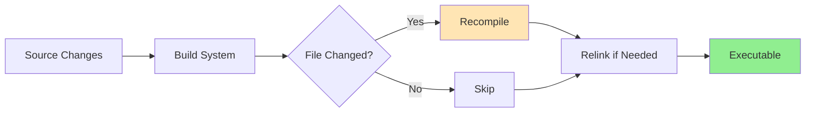
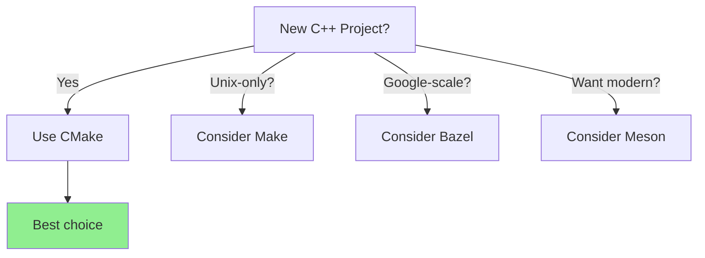

# Build Systems and CMake

Build systems automate compilation, dependency management, and linking. They track changes and rebuild only what's necessary, making large C++ projects manageable.

:::info Why Build Systems?
Manual compilation (`g++ *.cpp`) doesn't scale beyond a few files. Build systems handle dependencies, incremental builds, platform differences, and external libraries.
:::

## The Problem
```bash
# Manual compilation - tedious and error-prone
g++ -c main.cpp -o main.o
g++ -c utils.cpp -o utils.o
g++ -c math.cpp -o math.o
g++ main.o utils.o math.o -o app

# Change utils.cpp → must remember to recompile it and relink
# As project grows: hundreds of files, complex dependencies
# Which flags? Which order? Which libraries?
```

Build systems solve this by:
- Tracking dependencies automatically
- Rebuilding only changed files
- Handling platform differences
- Managing compiler flags and libraries
- Enabling parallel compilation

## Popular Build Systems

| System    | Use Case                          | Complexity       | Ecosystem  |
|-----------|-----------------------------------|------------------|------------|
| **CMake** | Cross-platform, industry standard | Moderate         | Largest    |
| **Make**  | Unix/Linux traditional            | Moderate         | Mature     |
| **Ninja** | Fast builds (backend)             | Easy (generated) | Growing    |
| **Meson** | Modern alternative                | Easy             | Good       |
| **Bazel** | Google-scale monorepos            | Steep            | Enterprise |

**Recommendation:** Use **CMake** for most C++ projects. It's the de facto standard with excellent IDE and tool support.

## CMake Basics

CMake is a meta-build system that generates native build files (Makefiles, Visual Studio projects, Xcode projects).

### Minimal CMakeLists.txt
```cmake
cmake_minimum_required(VERSION 3.15)
project(MyApp VERSION 1.0)

set(CMAKE_CXX_STANDARD 20)

add_executable(app
    src/main.cpp
    src/utils.cpp
)
```

### Build Process
```bash
# Configure (generate build system)
mkdir build && cd build
cmake ..

# Build
cmake --build .

# Or use generated Makefiles
make
```

CMake generates platform-specific build files:
- **Linux/macOS:** Makefiles
- **Windows:** Visual Studio solution (.sln)
- **macOS:** Xcode projects

### Key CMake Concepts
```cmake
# Executables
add_executable(app main.cpp utils.cpp)

# Libraries
add_library(mylib STATIC lib.cpp)
add_library(myshared SHARED lib.cpp)

# Include directories
target_include_directories(app PRIVATE include)

# Link libraries
target_link_libraries(app PRIVATE mylib pthread)

# Compiler options
target_compile_options(app PRIVATE -Wall -Wextra)

# Definitions
target_compile_definitions(app PRIVATE DEBUG_MODE)
```

### For Complete CMake Guide

This is a brief overview. For comprehensive CMake documentation including:
- Advanced configuration
- Package management
- Cross-compilation
- Custom targets
- Installation
- Testing integration

See the complete [CMake documentation](../../cmake/readme.md) in the build tools section.

## Make (Traditional)

Traditional Unix build system using Makefiles with rules and dependencies.

### Basic Makefile
```makefile
# Compiler and flags
CXX = g++
CXXFLAGS = -std=c++20 -Wall -O2

# Object files
OBJS = main.o utils.o math.o

# Target: dependencies
app: $(OBJS)
	$(CXX) $(OBJS) -o app

# Pattern rule
%.o: %.cpp
	$(CXX) $(CXXFLAGS) -c $< -o $@

clean:
	rm -f *.o app

.PHONY: clean
```

### Make Basics
```bash
make          # Build default target
make clean    # Run clean target
make -j8      # Parallel build (8 jobs)
make app      # Build specific target
```

**Advantages:**
- Standard on Unix
- Simple for small projects
- Fast incremental builds

**Disadvantages:**
- Platform-specific (Unix only)
- Manual dependency tracking
- Verbose for large projects

## Ninja (Fast Backend)

Designed for speed, usually generated by CMake or Meson.
```bash
# Use with CMake
cmake -G Ninja ..
ninja

# Or with default generator
cmake --build . --parallel
```

**Why Ninja?**
- 2-3x faster than Make
- Optimal build parallelization
- Better at incremental builds

Most projects use Ninja through CMake, not directly.

## Comparison

| Feature | CMake | Make | Ninja |
|---------|-------|------|-------|
| **Cross-platform** | Yes | No | Yes |
| **Learning curve** | Moderate | Moderate | Easy (generated) |
| **Speed** | Medium | Medium | Fast |
| **Ecosystem** | Largest | Mature | Growing |
| **IDE support** | Excellent | Good | Good |
| **Use case** | Primary | Traditional | Backend |

## Build System Workflow


Build systems track file timestamps and recompile only what changed.

## Common Build System Features

### Dependency Tracking
```cmake
# CMake automatically tracks:
# - Header dependencies
# - Library dependencies
# - Source file changes

target_link_libraries(app PRIVATE utils)  
# If utils changes, app relinks automatically
```

### Parallel Compilation
```bash
# CMake
cmake --build . --parallel 8

# Make
make -j8

# Ninja (automatic)
ninja
```

### Configuration
```cmake
# Options
option(BUILD_TESTS "Build tests" ON)
option(ENABLE_LOGGING "Enable logging" OFF)

if(BUILD_TESTS)
    add_subdirectory(tests)
endif()
```
```bash
# Configure
cmake -DBUILD_TESTS=OFF -DENABLE_LOGGING=ON ..
```

## Choosing a Build System

**For new C++ projects:**
- ✅ **CMake** - Industry standard, best choice for most projects
- ✅ **Meson** - Modern alternative, simpler syntax
- ❌ Make - Use only for Unix-only projects
- ❌ Bazel - Only for very large monorepos

**Quick decision guide:**


## Summary

Build systems automate C++ compilation:
- **Track dependencies** - rebuild only what changed
- **Parallel compilation** - use multiple cores
- **Platform abstraction** - same build script, all platforms
- **Library management** - handle external dependencies

**Recommendations:**
- **CMake** for most projects (cross-platform, standard)
- **Ninja** as backend for speed (with CMake)
- **Make** only for simple Unix-only projects

**Typical workflow:**
```bash
# Configure once
cmake -S . -B build -DCMAKE_BUILD_TYPE=Release

# Build (incremental)
cmake --build build --parallel

# Run
./build/app
```

Build systems transform C++ from unmanageable to maintainable, enabling large-scale software development.