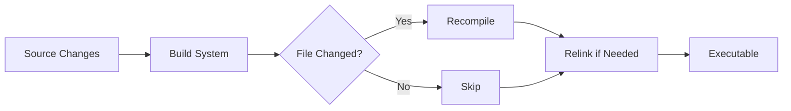

# Build Systems Overview

Build systems automate compilation, dependency management, and linking. They track changes and rebuild only what's necessary.

:::info Why Build Systems?
Manual compilation (`g++ *.cpp`) doesn't scale. Build systems handle dependencies, incremental builds, and cross-platform configuration.
:::

## The Problem

```bash
# Manual compilation - tedious and error-prone
g++ -c main.cpp -o main.o
g++ -c utils.cpp -o utils.o
g++ -c math.cpp -o math.o
g++ main.o utils.o math.o -o app

# Change utils.cpp → must remember to recompile it and relink
# As project grows: hundreds of files, complex dependencies
```

---

## Popular Build Systems

| System | Language | Use Case | Learning Curve |
|--------|----------|----------|----------------|
| **CMake** | CMake script | Cross-platform, industry standard | Moderate |
| **Make** | Makefile | Unix/Linux, traditional | Moderate |
| **Ninja** | Generated | Fast builds, used with CMake | Easy (auto-gen) |
| **Meson** | Python | Modern, fast | Easy |
| **Bazel** | Starlark | Google-scale, reproducible | Steep |
| **xmake** | Lua | Modern, cross-platform | Easy |

---

## CMake (Industry Standard)

Cross-platform meta-build system generating native build files.

```cmake
# CMakeLists.txt
cmake_minimum_required(VERSION 3.15)
project(MyApp VERSION 1.0)

set(CMAKE_CXX_STANDARD 20)

add_executable(app
    src/main.cpp
    src/utils.cpp
    src/math.cpp
)

target_include_directories(app PRIVATE include)
target_link_libraries(app PRIVATE pthread)
```

```bash
# Build
mkdir build && cd build
cmake ..
cmake --build .

# Output: Makefile (Linux), .sln (Windows), .xcodeproj (macOS)
```

**Pros**: Cross-platform, widely adopted, package manager integration  
**Cons**: Verbose syntax, learning curve

---

## Make (Traditional)

Unix build system using Makefiles with dependency rules.

```makefile
# Makefile
CXX = g++
CXXFLAGS = -std=c++20 -Wall -O2

OBJS = main.o utils.o math.o

app: $(OBJS)
	$(CXX) $(OBJS) -o app

main.o: main.cpp utils.h
	$(CXX) $(CXXFLAGS) -c main.cpp

utils.o: utils.cpp utils.h
	$(CXX) $(CXXFLAGS) -c utils.cpp

math.o: math.cpp math.h
	$(CXX) $(CXXFLAGS) -c math.cpp

clean:
	rm -f *.o app
```

```bash
make          # Build
make clean    # Clean
make -j8      # Parallel build (8 cores)
```

**Pros**: Simple, standard on Unix, fast  
**Cons**: Platform-specific, manual dependency tracking

---

## Ninja (Fast Backend)

Designed for speed, usually generated by CMake or Meson.

```bash
# Use with CMake
cmake -G Ninja ..
ninja

# 2-3x faster than Make for large projects
```

**Pros**: Very fast, optimal parallelization  
**Cons**: Not written by hand (generated)

---

## Meson (Modern Alternative)

Python-based build system focusing on speed and simplicity.

```python
# meson.build
project('myapp', 'cpp', version: '1.0')

executable('app',
    'src/main.cpp',
    'src/utils.cpp',
    'src/math.cpp',
    include_directories: include_directories('include'),
    install: true
)
```

```bash
meson setup build
meson compile -C build
```

**Pros**: Fast, clean syntax, good defaults  
**Cons**: Smaller ecosystem than CMake

---

## Build System Workflow



**Incremental Build**: Only changed files recompile.

---

## Choosing a Build System

**For new projects**:
- Cross-platform? → **CMake**
- Unix-only? → **Make** or **Meson**
- Speed priority? → **CMake + Ninja** or **Meson**

**For existing projects**:
- Follow project convention
- CMake dominates C++ ecosystem (2024)

---

## Key Features

### Dependency Tracking

```cmake
add_executable(app main.cpp)
target_link_libraries(app utils)  # app depends on utils
# If utils changes, app relinks automatically
```

### Parallel Compilation

```bash
make -j8         # Make: 8 parallel jobs
cmake --build . --parallel 8
ninja            # Automatically parallel
```

### Configuration

```cmake
option(BUILD_TESTS "Build tests" ON)

if(BUILD_TESTS)
    add_subdirectory(tests)
endif()
```

```bash
cmake -DBUILD_TESTS=OFF ..
```

---

## Common Commands

### CMake
```bash
cmake -S . -B build          # Configure
cmake --build build          # Build
cmake --build build --clean-first
cmake --install build        # Install
```

### Make
```bash
make                         # Build
make clean                   # Remove artifacts
make install                 # Install (needs sudo)
make -j$(nproc)             # Use all cores
```

---

## Summary

Build systems:
- **Automate** compilation, linking, dependency tracking
- **Optimize** with incremental and parallel builds
- **Configure** platform-specific settings

**Quick recommendations**:
- **CMake**: Industry standard, use for most projects
- **Make**: Simple projects, Unix-only
- **Ninja**: Backend for speed (with CMake/Meson)
- **Meson**: Modern alternative to CMake

```bash
# Typical CMake workflow
cmake -S . -B build -DCMAKE_BUILD_TYPE=Release
cmake --build build --parallel
./build/app
```