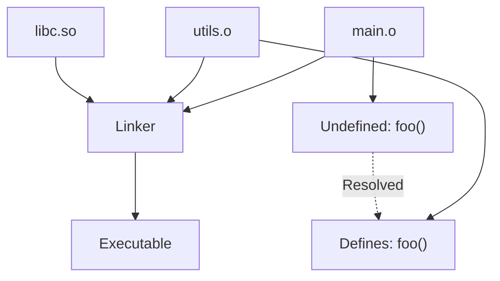

# C++ Compilation Pipeline

The C++ compilation process transforms source code into executable binary through four main stages: **preprocessing**, **compilation**, **assembly**, and **linking**.

:::info Single Command, Multiple Steps
`g++ main.cpp -o app` hides 4 distinct phases. Understanding each helps debug build errors and optimize compile times.
:::

## Complete Pipeline Overview


---

## Stage 1: Preprocessing

The preprocessor handles directives starting with `#` - includes, macros, conditional compilation. It produces pure C++ code with no preprocessor directives.

**Input**: Source files (.cpp, .h)  
**Output**: Preprocessed file (.i)  
**Tool**: cpp (C preprocessor)

```cpp
// main.cpp - before preprocessing
#include <iostream>
#define MAX 100

int main() {
    std::cout << MAX << "\n";
}
```

After preprocessing, `#include` is replaced with entire iostream contents (~10,000 lines), and `MAX` becomes literal `100`:

```bash
# See preprocessed output
g++ -E main.cpp -o main.i

# main.i (simplified)
# ... 10,000+ lines from iostream ...
int main() {
    std::cout << 100 << "\n";  // MAX expanded
}
```

The preprocessor performs text substitution: includes become file contents, macros become their definitions, `#ifdef` blocks are evaluated.

---

## Stage 2: Compilation

The compiler translates preprocessed C++ into assembly language. This is the "intelligence" phase - syntax checking, optimization, template instantiation.

**Input**: Preprocessed file (.i)  
**Output**: Assembly file (.s)  
**Tool**: cc1plus (compiler proper)

```bash
# Generate assembly
g++ -S main.cpp -o main.s

# Optimized assembly
g++ -S -O3 main.cpp -o main.s
```

```asm
# main.s (x86-64 assembly - simplified)
main:
    push    rbp
    mov     rbp, rsp
    mov     esi, 100          # MAX value
    mov     edi, OFFSET FLAT:std::cout
    call    std::ostream::operator<<
    mov     eax, 0
    pop     rbp
    ret
```

The assembly shows low-level operations: register manipulation, function calls, memory access. Optimization flags (`-O2`, `-O3`) dramatically change this output.

**Compilation does**:
- Syntax and semantic checking
- Template instantiation
- Function inlining decisions
- Optimization passes
- Type checking

---

## Stage 3: Assembly

The assembler converts human-readable assembly into machine code (binary). Each assembly instruction becomes actual CPU instructions.

**Input**: Assembly file (.s)  
**Output**: Object file (.o)  
**Tool**: as (assembler)

```bash
# Create object file
g++ -c main.cpp -o main.o

# Inspect object file contents
objdump -d main.o
nm main.o  # Show symbols
```

Object files contain:
- **Machine code**: Binary CPU instructions
- **Symbol table**: Function/variable names and addresses
- **Relocation information**: Where to patch addresses during linking
- **Debug info**: Source line mappings (if `-g` used)

```bash
# Object file structure (simplified)
main.o:
    .text section:    # Code
        <machine code bytes>
    .data section:    # Initialized data
        <data bytes>
    .bss section:     # Uninitialized data
    Symbol table:
        main (function, undefined: std::cout)
```

The object file has **undefined symbols** (like `std::cout`) that will be resolved during linking.

---

## Stage 4: Linking

The linker combines multiple object files and libraries into a single executable. It resolves symbol references and assigns final memory addresses.

**Input**: Object files (.o) + Libraries (.a, .so)  
**Output**: Executable binary  
**Tool**: ld (linker), or g++ (which calls ld)

```bash
# Link object files
g++ main.o utils.o -o app

# Link with libraries
g++ main.o -o app -lpthread -lm

# Static linking (include library code)
g++ main.o -o app -static

# Show what executable depends on
ldd app
```

**Linking does**:
1. **Symbol resolution**: Finds definitions for all function/variable references
2. **Relocation**: Assigns final memory addresses
3. **Library inclusion**: Adds code from static/dynamic libraries



---

## Complete Example

```cpp
// hello.cpp
#include <iostream>
#define GREETING "Hello"

int main() {
    std::cout << GREETING << "\n";
    return 0;
}
```

### Step-by-Step Compilation

```bash
# 1. Preprocessing only (-E stops after preprocessing)
g++ -E hello.cpp -o hello.i
# Result: hello.i contains iostream + code with GREETING expanded

# 2. Compilation to assembly (-S stops after compilation)
g++ -S hello.cpp -o hello.s
# Result: hello.s contains x86-64 assembly

# 3. Assembly to object (-c stops after assembly)
g++ -c hello.cpp -o hello.o
# Result: hello.o contains machine code + symbols

# 4. Linking to executable (no flag = complete pipeline)
g++ hello.o -o hello
# Result: hello is executable binary

# Or all at once
g++ hello.cpp -o hello
```

---

## Build Artifacts

| File | Extension | Stage | Content | Binary? |
|------|-----------|-------|---------|---------|
| Source | .cpp, .h | Input | C++ code | No |
| Preprocessed | .i | After preprocessing | Expanded C++ | No |
| Assembly | .s | After compilation | Assembly code | No |
| Object | .o, .obj | After assembly | Machine code + symbols | Yes |
| Static library | .a, .lib | Linking | Archive of .o files | Yes |
| Shared library | .so, .dll | Runtime | Shared object code | Yes |
| Executable | (no ext), .exe | Final | Runnable program | Yes |

---

## Optimization Impact

Different optimization levels produce vastly different code:

```cpp
int sum(int n) {
    int total = 0;
    for (int i = 1; i <= n; i++) {
        total += i;
    }
    return total;
}
```

```bash
# No optimization (-O0)
g++ -S -O0 sum.cpp
# Assembly: Full loop with increment, compare, jump

# Maximum optimization (-O3)
g++ -S -O3 sum.cpp
# Assembly: Formula (n * (n+1)) / 2 - no loop!
```

The `-O3` compiler recognizes the pattern and replaces the entire loop with a mathematical formula. This is why compiled C++ is fast.

---

## Common Issues by Stage

### Preprocessing Errors

```cpp
#include "missing.h"  // ❌ fatal error: missing.h: No such file or directory
#define X Y
#define Y X
int x = X;  // ❌ Infinite macro expansion
```

**Solution**: Check include paths, avoid circular macros.

### Compilation Errors

```cpp
int x = "hello";  // ❌ error: invalid conversion from 'const char*' to 'int'
template<typename T> T max(T a, T b);
max(5, 3.14);  // ❌ error: no matching function (int vs double)
```

**Solution**: Fix type errors, template arguments.

### Linking Errors

```cpp
// main.cpp
void foo();
int main() { foo(); }

// ❌ undefined reference to `foo()'
```

**Solution**: Add missing source files, link required libraries.

---

## Compilation Command Breakdown

```bash
g++ -std=c++20 -Wall -Wextra -O2 -g -I./include -L./lib -lmylib main.cpp -o app
```

| Flag | Purpose | Stage Affected |
|------|---------|----------------|
| `-std=c++20` | Use C++20 standard | Compilation |
| `-Wall -Wextra` | Enable warnings | Compilation |
| `-O2` | Optimization level 2 | Compilation |
| `-g` | Include debug info | Assembly |
| `-I./include` | Add include directory | Preprocessing |
| `-L./lib` | Add library directory | Linking |
| `-lmylib` | Link with libmylib | Linking |
| `-o app` | Output filename | Final |

---

## Speeding Up Compilation

### 1. Precompiled Headers

```cpp
// stdafx.h - rarely changing headers
#include <iostream>
#include <vector>
#include <map>
```

```bash
# Precompile header once
g++ -x c++-header stdafx.h -o stdafx.h.gch

# Use in compilation (faster)
g++ main.cpp -include stdafx.h
```

### 2. Parallel Compilation

```bash
# Compile multiple files in parallel
make -j8  # Use 8 cores
ninja     # Ninja build system (fast by default)
```

### 3. Incremental Builds

```bash
# Only recompile changed files
make      # Checks timestamps, rebuilds only necessary files
```

---

## Examining Build Output

```bash
# Show compilation stages
g++ -v main.cpp -o app

# Stop at each stage
g++ -E main.cpp          # Preprocessing only
g++ -S main.cpp          # + Compilation
g++ -c main.cpp          # + Assembly
g++ main.cpp -o app      # + Linking

# Verbose linking
g++ main.o -o app -Wl,--verbose

# Show included files
g++ -H main.cpp

# Show macro expansions
g++ -E -dM main.cpp
```

---

## Summary

The compilation pipeline:

1. **Preprocessing** (`#include`, `#define`) → Expands macros, includes files
2. **Compilation** (C++ → Assembly) → Syntax checking, optimization
3. **Assembly** (Assembly → Machine code) → Creates object files
4. **Linking** (Objects + Libraries → Executable) → Resolves symbols, creates binary


**Key Takeaways**:
- Each stage is independent and can be examined
- Errors at each stage have different causes
- Understanding stages helps debug build problems
- Optimization happens during compilation
- Linking resolves cross-file dependencies