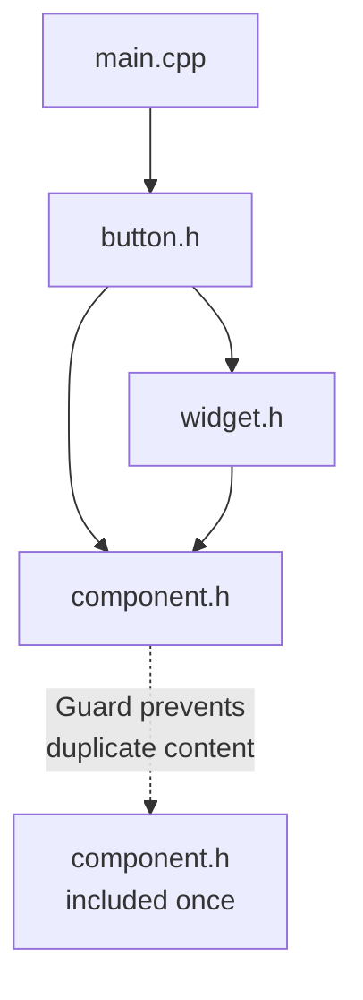

# Include Guards and #pragma once

Include guards prevent multiple inclusion of the same header file, avoiding redefinition errors. Two methods exist: traditional include guards and `#pragma once`.

:::info Problem Solved
Without guards, including a header twice causes "redefinition" errors. Guards ensure header contents appear only once per translation unit.
:::

## The Problem

```cpp
// widget.h (no guard)
class Widget {
    int value;
};

// main.cpp
#include "widget.h"
#include "widget.h"  // ❌ Error: redefinition of 'class Widget'
```

The preprocessor copies `widget.h` contents twice, causing duplicate class definition.

---

## Solution 1: Traditional Include Guards

```cpp
// widget.h
#ifndef WIDGET_H          // If not defined
#define WIDGET_H          // Define it

class Widget {
    int value;
public:
    Widget(int v);
    int getValue() const;
};

#endif  // WIDGET_H
```

**How it works**:
1. First inclusion: `WIDGET_H` not defined → define it and include content
2. Second inclusion: `WIDGET_H` already defined → skip content

### Guard Naming Convention

```cpp
// project/include/mylib/widget.h
#ifndef MYLIB_WIDGET_H
#define MYLIB_WIDGET_H
// ...
#endif

// project/include/mylib/utils/math.h
#ifndef MYLIB_UTILS_MATH_H
#define MYLIB_UTILS_MATH_H
// ...
#endif
```

**Best practice**: Use full path to avoid name collisions:
- Project name
- Path from include directory
- Filename
- All uppercase, underscores for separators

---

## Solution 2: #pragma once (Modern)

```cpp
// widget.h
#pragma once

class Widget {
    int value;
public:
    Widget(int v);
    int getValue() const;
};
```

**How it works**: Compiler tracks which files have `#pragma once` and includes them only once.

### Comparison

| Feature | Traditional Guards | #pragma once |
|---------|-------------------|--------------|
| **Standard** | ISO C++ standard | Non-standard but universal |
| **Portability** | 100% portable | Works on all modern compilers |
| **Speed** | Slightly slower | Faster (compiler-optimized) |
| **Errors** | Typos in macro names | Rare issues with symlinks |
| **Readability** | 3 lines | 1 line |
| **Maintenance** | Manual naming | Automatic |

:::success Recommendation
Use `#pragma once` for new code - it's simpler, faster, and universally supported. Use traditional guards only if you need standards compliance or encounter symlink issues.
:::

---

## How Guards Prevent Multiple Inclusion

### Scenario: Indirect Double Include

```cpp
// widget.h
#pragma once
#include "component.h"
class Widget { Component* c; };

// component.h
#pragma once
class Component {};

// button.h
#pragma once
#include "widget.h"
#include "component.h"  // component.h included again (safe with guard)
class Button : public Widget {};

// main.cpp
#include "button.h"
// Without guards: component.h included twice via different paths
// With guards: component.h content appears once
```



---

## Edge Cases

### Forgetting Include Guard

```cpp
// math.h (no guard - BAD)
inline int square(int x) {
    return x * x;
}

// file1.cpp
#include "math.h"  // OK

// file2.cpp
#include "math.h"  // OK

// Both include math.h, but:
// - inline functions can be defined multiple times (ODR exception)
// - Still wastes compilation time without guard
```

Even for inline functions, always use guards to avoid unnecessary reprocessing.

### Macro Name Collision

```cpp
// ❌ Bad: Generic name
// util.h
#ifndef UTIL_H  // Too common!
#define UTIL_H
// ...
#endif

// Another library's util.h uses same guard
// Second util.h silently skipped!

// ✅ Good: Specific name
// myproject/util.h
#ifndef MYPROJECT_UTIL_H_2024
#define MYPROJECT_UTIL_H_2024
// ...
#endif
```

### #pragma once with Symlinks

```bash
# Create symlink
ln -s actual.h link.h

# Include both
#include "actual.h"
#include "link.h"
```

Some compilers may include both if symlink points to same file. Traditional guards work correctly in this rare case.

---

## Implementation Details

### Traditional Guards

```cpp
// First inclusion
#ifndef WIDGET_H     // Not defined → condition TRUE
#define WIDGET_H     // Define it
class Widget {};     // Include content
#endif

// Second inclusion
#ifndef WIDGET_H     // Already defined → condition FALSE
// Content skipped
#endif
```

Preprocessor skips content on second pass - fast but still processes `#ifndef` check.

### #pragma once

```cpp
// First inclusion
#pragma once  // Compiler remembers: "Don't include this file again"
class Widget {};

// Second inclusion attempt
// Compiler: "Already saw this file with #pragma once, skip entirely"
// Doesn't even open the file!
```

Faster because compiler short-circuits before reading file contents.

---

## Mixing Both Methods

Can use both for maximum compatibility:

```cpp
// widget.h
#pragma once  // Fast path for modern compilers

#ifndef WIDGET_H  // Fallback for old compilers
#define WIDGET_H

class Widget {
    int value;
};

#endif  // WIDGET_H
```

Modern compilers use `#pragma once` (faster), old compilers fall back to guards.

---

## Header Generation

Some projects generate guard names automatically:

```bash
# Script to add guards to header
FILE="widget.h"
GUARD=$(echo "$FILE" | tr 'a-z.' 'A-Z_')

cat > "$FILE" << EOF
#ifndef ${GUARD}
#define ${GUARD}

// Header content

#endif  // ${GUARD}
EOF
```

Or use IDE features to auto-insert guards.

---

## Common Mistakes

### Guard Typo

```cpp
// widget.h
#ifndef WIDGET_H
#define WIDGTE_H  // ❌ Typo! Doesn't match
class Widget {};
#endif
```

Typo means guard never defined → multiple inclusion still occurs.

### Missing #endif

```cpp
// widget.h
#ifndef WIDGET_H
#define WIDGET_H
class Widget {};
// ❌ Missing #endif!

// Causes compilation errors in files that include this
```

### Incorrect Guard Scope

```cpp
// ❌ Guard around include, not content
// widget.h
#ifndef WIDGET_H
#define WIDGET_H
#endif

class Widget {};  // Outside guard! Still duplicates!
```

---

## Checking for Guards

```bash
# Check if header has include guard
grep -E "^#ifndef|^#define|^#endif" widget.h

# Check for pragma once
grep "^#pragma once" widget.h

# Find headers without guards (dangerous)
find . -name "*.h" -exec sh -c \
  'grep -L "#pragma once" {} | xargs grep -L "#ifndef"' \;
```

---

## Best Practices

:::success DO
- Use `#pragma once` for simplicity (modern projects)
- Use traditional guards if standards compliance required
- Make guard names unique (include full path)
- Check guards with `grep` or linters
  :::

:::danger DON'T
- Forget guards on any header file
- Use generic names like `UTIL_H`
- Have typos in guard macros
- Put guards around includes instead of content
  :::

---

## Modern Alternative: Modules (C++20)

C++20 modules eliminate the need for include guards:

```cpp
// widget.cppm (module interface)
export module widget;

export class Widget {
    int value;
public:
    Widget(int v);
};

// main.cpp
import widget;  // No #include, no guards needed

Widget w(42);
```

Modules are imported directly without preprocessing. No multiple inclusion problem. However, modules have limited compiler support (2024).

---

## Summary

Include guards prevent multiple inclusion:

**Traditional Guards**:
```cpp
#ifndef PROJECT_PATH_FILE_H
#define PROJECT_PATH_FILE_H
// Content
#endif
```

**Modern #pragma once**:
```cpp
#pragma once
// Content
```

**Key points**:
- Required for all headers
- `#pragma once` is simpler and faster
- Traditional guards are standards-compliant
- Both methods can coexist
- Without guards: redefinition errors

**Quick decision**:
- Modern project? → `#pragma once`
- Need strict ISO C++ compliance? → Traditional guards
- Maximum compatibility? → Both

```cpp
// Recommended modern header structure
#pragma once

#include <dependencies>

namespace myproject {
    // Declarations
}
```