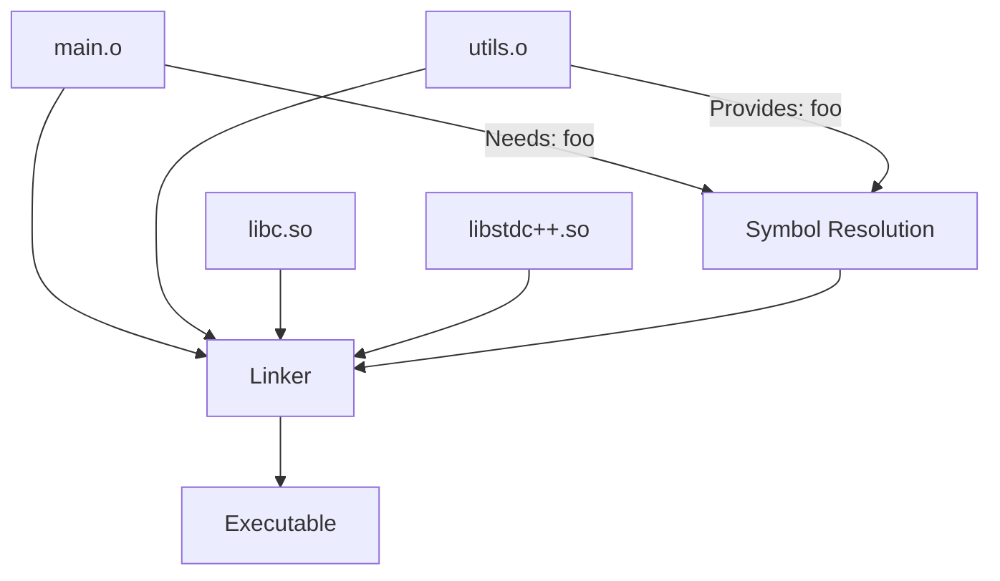

# Linking Process

The linker combines multiple object files and libraries into a single executable, resolving symbol references and assigning final memory addresses.

:::info Final Assembly
Linking is like assembling a jigsaw puzzle - each object file is a piece, and the linker puts them together into a complete picture.
:::

## What the Linker Does



**Three main tasks**:
1. **Symbol Resolution**: Match function/variable references with definitions
2. **Relocation**: Assign final memory addresses
3. **Library Inclusion**: Add code from static/dynamic libraries

---

## Symbol Resolution

### Example: Undefined Symbol

```cpp
// main.cpp
extern int getValue();  // Declaration only

int main() {
    return getValue();  // Calls external function
}

// utils.cpp
int getValue() {        // Definition
    return 42;
}
```

```bash
# Compile separately
g++ -c main.cpp -o main.o      # Creates undefined symbol: getValue
g++ -c utils.cpp -o utils.o    # Defines: getValue

# Link together
g++ main.o utils.o -o app      # ✅ Linker resolves getValue

# Missing definition
g++ main.o -o app              # ❌ undefined reference to `getValue()'
```

The linker searches all object files and libraries to find where `getValue` is defined.

---

## Linking Libraries

### Linking with System Libraries

```bash
# Link with pthread library
g++ main.o -o app -lpthread

# Link with math library
g++ main.o -o app -lm

# Multiple libraries
g++ main.o -o app -lpthread -lm -lz
```

The `-l` flag searches for `lib<name>.so` or `lib<name>.a` in library paths.

### Specifying Library Paths

```bash
# Add library search path
g++ main.o -o app -L./libs -lmylib

# Add runtime library path (for dynamic linking)
g++ main.o -o app -Wl,-rpath,./libs
```

**Search order**:
1. Directories in `-L` flags
2. Standard paths: `/usr/lib`, `/usr/local/lib`
3. Paths in `LD_LIBRARY_PATH` environment variable

---

## Relocation

The linker assigns final addresses to symbols and patches all references:

```cpp
// Before linking (relative address)
call   0x0  # Placeholder address

// After linking (absolute address)
call   0x401234  # Actual address in executable
```

```bash
# View symbol addresses in executable
nm app | grep main

# Output:
0000000000401130 T main  # main is at address 0x401130
```

---

## One Definition Rule (ODR)

C++ requires exactly one definition per symbol:

```cpp
// ❌ ODR violation
// file1.cpp
int global = 42;

// file2.cpp
int global = 100;  // Error: multiple definitions!
```

```bash
g++ file1.o file2.o -o app
# ❌ multiple definition of `global'
```

**Solution**: Use `extern` for declarations:

```cpp
// header.h
extern int global;  // Declaration

// file1.cpp
int global = 42;    // Definition (only one)

// file2.cpp
extern int global;  // Uses definition from file1.cpp
```

---

## Weak Symbols

Weak symbols allow multiple definitions, with linker choosing one:

```cpp
// Default implementation (weak)
__attribute__((weak))
void custom_handler() {
    // Default behavior
}

// User can override
void custom_handler() {
    // Custom behavior overrides weak symbol
}
```

Useful for providing default implementations that can be overridden.

---

## Link-Time Optimization (LTO)

Enables optimization across multiple source files:

```bash
# Compile with LTO
g++ -c -flto file1.cpp -o file1.o
g++ -c -flto file2.cpp -o file2.o

# Link with LTO (optimizes across files)
g++ -flto file1.o file2.o -o app
```

The linker can inline functions across translation units, improving performance by 10-30%.

---

## Common Linker Errors

### Undefined Reference

```cpp
// main.cpp
void foo();  // Declared but not defined
int main() { foo(); }
```

```bash
g++ main.cpp -o app
# ❌ undefined reference to `foo()'
```

**Solution**: Implement `foo()` or link the library containing it.

### Multiple Definitions

```cpp
// header.h (❌ Wrong - in header)
int global = 42;  // Defined in header

// file1.cpp
#include "header.h"

// file2.cpp
#include "header.h"
```

```bash
g++ file1.cpp file2.cpp -o app
# ❌ multiple definition of `global'
```

**Solution**: Declare in header, define in one .cpp:

```cpp
// header.h
extern int global;  // Declaration

// file1.cpp
int global = 42;    // Definition
```

### Wrong Library Order

```bash
# ❌ Wrong order
g++ -lmylib main.o  # Library before object that uses it

# ✅ Correct order
g++ main.o -lmylib  # Object files before libraries
```

Libraries must come **after** the object files that use them.

---

## Verbose Linking

```bash
# See what linker does
g++ -Wl,--verbose main.o -o app

# Show linked libraries
ldd app  # Linux
otool -L app  # macOS

# Show linker map (memory layout)
g++ -Wl,-Map=output.map main.o -o app
```

---

## Linker Scripts

Advanced: Control exact memory layout (embedded systems):

```ld
SECTIONS {
    .text 0x1000 : { *(.text) }    /* Code at 0x1000 */
    .data 0x2000 : { *(.data) }    /* Data at 0x2000 */
    .bss  0x3000 : { *(.bss) }     /* BSS at 0x3000 */
}
```

```bash
g++ -T custom.ld main.o -o app
```

---

## Summary

The linker:
- **Resolves symbols**: Matches references with definitions
- **Relocates code**: Assigns final addresses
- **Combines files**: Merges object files into executable
- **Adds libraries**: Includes external code
- **Enforces ODR**: Prevents duplicate definitions

**Common issues**:
- Undefined reference → Missing implementation or library
- Multiple definitions → Symbol defined in multiple files
- Wrong library order → Libraries must come last

```bash
# Complete linking example
g++ -c main.cpp utils.cpp               # Compile to objects
g++ main.o utils.o -o app -lpthread     # Link to executable
```

The result is a runnable binary with all symbols resolved and addresses finalized.