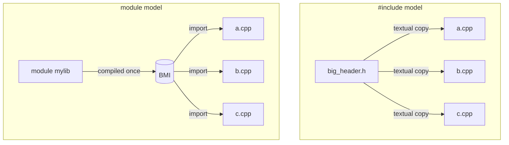

# Modules (C++20)

Modules are C++20's replacement for the textual `#include` model. Instead of the preprocessor
pasting header text into every translation unit, a module is **compiled once** into a binary module
interface (BMI) that consumers `import`. This fixes the header model's three chronic problems: slow
builds, macro leakage, and fragile include order.

:::info Prerequisite contrast
This page assumes the header model it replaces — see [Headers and Includes](./headers-and-includes.md)
and [Include Guards / pragma once](./include-guards-and-pragma-once.md). Modules make include guards
obsolete and macros no longer leak across the boundary.
:::

## The problem modules solve

With `#include`, every translation unit re-reads and re-parses the full text of every header it
pulls in (transitively). A common header parsed across 200 source files is parsed 200 times.



## A module in two files

**Interface unit** — declares what the module exports:

```cpp showLineNumbers
// math.ixx  (or .cppm — extension is toolchain-specific)
export module math;          // declares the module

export int add(int a, int b) {   // 'export' = visible to importers
    return a + b;
}

int helper() { return 42; }      // no 'export' = private to the module
```

**Consumer** — imports it by name, no path, no guard:

```cpp showLineNumbers
import math;                  // not #include "math.h"

int main() { return add(2, 3); }   // helper() is invisible here
```

## What `export` controls

Only `export`-ed names are visible to importers; everything else is module-local — true
encapsulation the header model never had.

```cpp showLineNumbers
export module widget;

export class Widget { /* ... */ };   // part of the public interface
export void configure(Widget&);

namespace detail {                   // entire namespace stays internal
    int compute();
}
```

Larger modules split into **partitions** (`export module widget:parts;`) and separate
**implementation units** (`module widget;` with no `export`), keeping the interface small while the
definitions live elsewhere — analogous to the header/source split, but without re-parsing.

## `import std;` (C++23)

C++23 ships the entire standard library as a module. One import replaces dozens of headers and
compiles dramatically faster:

```cpp showLineNumbers
import std;                   // the whole standard library

int main() {
    std::vector<int> v{1, 2, 3};
    std::println("{}", v.size());
}
```

## Why it's better — and the catch

:::tip Benefits
- **Faster builds** — an interface is compiled once, not re-parsed per includer.
- **Isolation** — macros and private declarations do not leak across `import`.
- **No include guards / ordering** — import order is irrelevant; no ODR landmines from header soup.
:::

:::warning Toolchain maturity
Modules need coordinated compiler **and** build-system support, because a module must be built before
anything that imports it (a dependency the build tool has to discover). Support in GCC, Clang, MSVC,
CMake, and Ninja is solid but still maturing. BMIs are **not portable** — compiler/version specific —
so they are a build artifact, never something you ship or check in.
:::

## Summary

- A module is compiled once into a BMI and `import`ed — replacing textual `#include`.
- `export` defines the public interface; everything else is module-local (real encapsulation).
- Macros and private names don't cross an `import`; include guards become unnecessary.
- `import std;` (C++23) pulls in the whole standard library, fast.
- The model is sound but depends on build-system support; BMIs are non-portable build artifacts.

## Related

- [Headers and Includes](./headers-and-includes.md) · [Include Guards / pragma once](./include-guards-and-pragma-once.md) — the model modules replace
- [Preprocessing](./preprocessing.md) · [Translation Units](./translation-units.md) · [Compilation Pipeline](./compilation-pipeline.md)
- [C++ Versions](../00-overview/cpp-versions.md) — what landed in C++20/23
