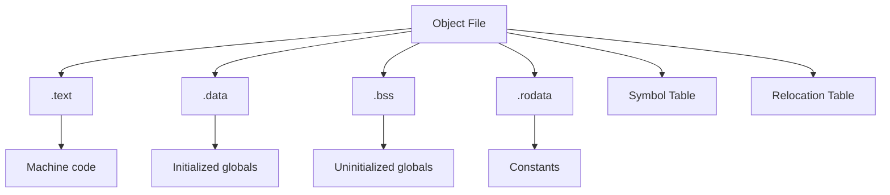

# Object Files and Symbols

Object files (.o, .obj) are compiled but not yet linked binary files containing machine code, data, and metadata for the linker.

:::info Intermediate Format
Object files are the bridge between compilation and linking - they contain everything needed to build an executable except resolved external references.
:::

## Object File Format

Different platforms use different formats:

| Platform | Format | Extension |
|----------|--------|-----------|
| Linux | ELF (Executable and Linkable Format) | .o |
| Windows | COFF/PE (Common Object File Format) | .obj |
| macOS | Mach-O | .o |

All formats contain similar information: code, data, symbols, and relocation info.

---

## Object File Sections



### .text Section (Code)

Contains executable machine code:

```cpp
int add(int a, int b) {
    return a + b;
}
```

```bash
# View disassembly
objdump -d file.o

# Output:
0000000000000000 <add>:
   0:   8d 04 37                lea    eax,[rdi+rsi]
   3:   c3                      ret
```

### .data Section (Initialized Data)

Contains initialized global and static variables:

```cpp
int global_var = 42;              // .data
static int static_var = 100;     // .data
const int writable_const = 5;    // .data (if modifiable)
```

```bash
# View data section
objdump -s -j .data file.o
```

### .bss Section (Uninitialized Data)

Contains uninitialized globals (Block Started by Symbol):

```cpp
int uninitialized;                // .bss
static int static_uninit;         // .bss
int array[1000];                  // .bss (zero-initialized)
```

**Why separate?** .bss doesn't occupy disk space - the loader allocates and zeroes memory at runtime. Saves file size.

### .rodata Section (Read-Only Data)

Contains constants and string literals:

```cpp
const char* msg = "Hello";        // "Hello" in .rodata
const int read_only = 42;         // .rodata
```

---

## Symbol Table

Maps names to addresses and types. The linker uses this to resolve references.

```cpp
// example.cpp
int global = 42;                  // Global symbol
static int local_static = 10;    // Local symbol
extern int external;              // Undefined symbol

void function() {                 // Function symbol
    // ...
}
```

```bash
# View symbols
nm example.o

# Output:
0000000000000000 D global          # D = defined data
0000000000000004 d local_static    # d = local data (static)
                 U external        # U = undefined
0000000000000000 T function        # T = text (function)
```

### Symbol Types

| Letter | Meaning | Scope |
|--------|---------|-------|
| T | Text (function) | Global |
| t | Text | Local (static) |
| D | Initialized data | Global |
| d | Initialized data | Local |
| B | Uninitialized (BSS) | Global |
| b | Uninitialized | Local |
| U | Undefined | External |
| W | Weak symbol | Can be overridden |

### Examining Symbols

```bash
# All symbols
nm file.o

# Only undefined symbols
nm -u file.o

# Only defined symbols
nm -U file.o

# Demangle C++ names
nm -C file.o

# Sort by address
nm -n file.o

# Show symbol sizes
nm -S file.o
```

---

## Symbol Binding

### Global vs Local Symbols

```cpp
// Global symbol (visible to linker)
int global_func() { return 42; }

// Local symbol (not visible to linker)
static int local_func() { return 42; }

// Anonymous namespace (local to translation unit)
namespace {
    int helper() { return 42; }  // Local symbol
}
```

Local symbols prevent name collisions and allow compiler optimizations.

### Weak Symbols

Allow providing default implementations:

```cpp
// Default implementation (weak)
__attribute__((weak))
void custom_allocator(size_t size) {
    // Default: use malloc
    return malloc(size);
}

// User can provide strong symbol to override
void custom_allocator(size_t size) {
    // Custom implementation replaces weak symbol
    return my_custom_alloc(size);
}
```

---

## Relocation Information

Object files contain placeholders where addresses need filling:

```cpp
extern int external_var;

int get_value() {
    return external_var;  // Address unknown at compile time
}
```

```bash
# View relocations
objdump -r file.o

# Output:
RELOCATION RECORDS FOR [.text]:
OFFSET           TYPE              VALUE
0000000000000003 R_X86_64_PC32     external_var-0x4
```

The linker fills in the actual address of `external_var` during linking.

### Relocation Types

```bash
R_X86_64_PC32      # 32-bit PC-relative (common for function calls)
R_X86_64_PLT32     # PLT (Procedure Linkage Table) for shared libs
R_X86_64_64        # 64-bit absolute address
R_X86_64_GOTPCREL  # GOT (Global Offset Table) relative
```

---

## Creating and Inspecting Object Files

```bash
# Compile to object file
g++ -c source.cpp -o source.o

# With debug info
g++ -c -g source.cpp -o source.o

# With optimization
g++ -c -O3 source.cpp -o source.o

# Position-independent code (for shared libraries)
g++ -c -fPIC source.cpp -o source.o
```

### Complete Inspection

```bash
# File type
file file.o
# Output: ELF 64-bit LSB relocatable, x86-64

# All sections
objdump -h file.o

# Disassemble code
objdump -d file.o

# View all data
objdump -s file.o

# Full analysis (Linux)
readelf -a file.o

# Size of sections
size file.o
# Output:
#    text    data     bss     dec     hex filename
#    1234     100      50    1384     568 file.o
```

---

## Symbol Visibility in Libraries

Control which symbols are exported:

```cpp
// header.h
#if defined(_WIN32)
    #define EXPORT __declspec(dllexport)
    #define IMPORT __declspec(dllimport)
#elif defined(__GNUC__)
    #define EXPORT __attribute__((visibility("default")))
    #define IMPORT
#else
    #define EXPORT
    #define IMPORT
#endif

// Public API
EXPORT void public_function();

// Internal (not exported)
void internal_helper();
```

```bash
# Compile with hidden visibility by default
g++ -fvisibility=hidden -c file.cpp

# View exported symbols
nm -D libmylib.so | grep " T "
```

Hiding internal symbols:
- Reduces library size
- Speeds up linking
- Prevents symbol conflicts
- Enables better optimization

---

## Common Issues

### Duplicate Symbols

```cpp
// header.h (❌ Wrong)
int global = 42;  // Defined in header

// file1.cpp
#include "header.h"

// file2.cpp  
#include "header.h"

// Link error: multiple definition of 'global'
```

**Solution**: Declare in header, define in one .cpp:

```cpp
// header.h
extern int global;  // Declaration

// file1.cpp
int global = 42;    // Definition
```

### Undefined Symbols

```cpp
// main.cpp
void missing_function();

int main() {
    missing_function();  // ❌ Undefined reference
}
```

**Solutions**:
1. Implement the function
2. Link the library containing it
3. Remove the call if not needed

---

## Archive Files (.a, .lib)

Static libraries are archives of object files:

```bash
# Create static library
ar rcs libmylib.a file1.o file2.o file3.o

# List contents
ar t libmylib.a
# Output:
# file1.o
# file2.o  
# file3.o

# Extract object file
ar x libmylib.a file1.o

# View symbols in archive
nm libmylib.a
```

The linker extracts only needed object files from archives.

---

## Debug Information

Object files can include debug info for debuggers:

```bash
# Compile with debug info
g++ -c -g source.cpp -o source.o

# View debug info
objdump -g source.o

# Show source line mappings
objdump -l source.o

# Detailed debug info (DWARF format)
readelf --debug-dump source.o
```

Debug info maps machine code back to source code for debuggers like GDB.

---

## Summary

Object files contain:
- **Machine code** (.text section)
- **Data** (.data, .bss, .rodata sections)
- **Symbol table** (names and addresses)
- **Relocation info** (where addresses need fixing)
- **Debug info** (optional, for debuggers)

**Key tools**:
```bash
nm file.o           # Symbol table
objdump -d file.o   # Disassembly
readelf -a file.o   # Complete info (Linux)
size file.o         # Section sizes
```

Object files are the intermediate format between compilation and linking - they're relocatable, contain unresolved references, and multiple objects combine to form executables or libraries.