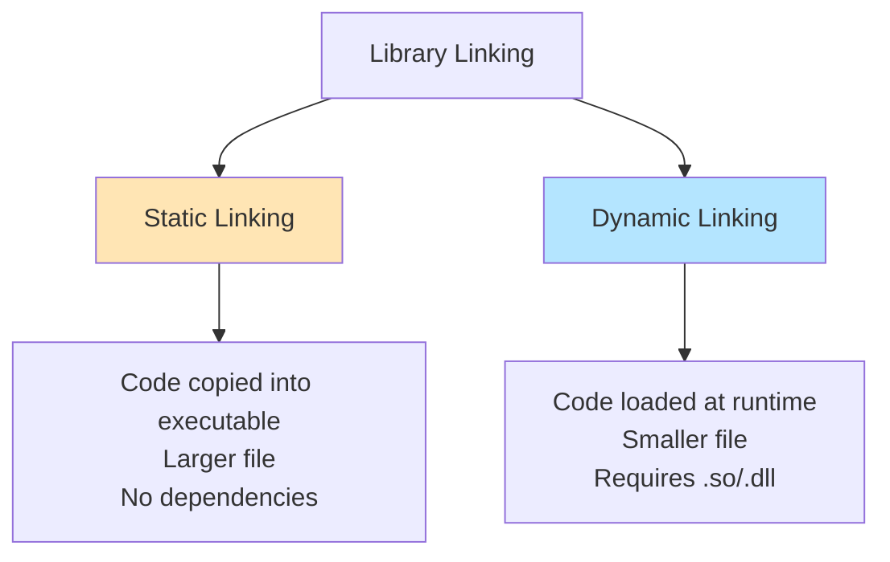

# Static vs Dynamic Linking

Linking can be **static** (library code copied into executable) or **dynamic** (library loaded at runtime). Each has trade-offs in size, deployment, and performance.

:::info Key Difference
**Static**: Self-contained executable, larger size  
**Dynamic**: Smaller executable, requires library files at runtime
:::

## Comparison Overview



| Aspect | Static (.a, .lib) | Dynamic (.so, .dll, .dylib) |
|--------|-------------------|------------------------------|
| **Size** | Large (includes library) | Small (references library) |
| **Dependencies** | None (self-contained) | Requires library files |
| **Updates** | Recompile needed | Library updates affect all |
| **Load Time** | Faster | Slower (runtime loading) |
| **Memory** | Duplicated per process | Shared between processes |
| **Deployment** | Easy (single file) | Complex (multiple files) |

---

## Static Linking

Library code is **copied** into the executable at link time.

### Creating Static Library

```bash
# Compile to object files
g++ -c utils.cpp -o utils.o
g++ -c math.cpp -o math.o

# Create static library (archive)
ar rcs libmylib.a utils.o math.o

# Verify contents
ar t libmylib.a
# Output:
# utils.o
# math.o
```

The `ar` tool bundles object files into an archive (`.a` on Unix, `.lib` on Windows).

### Linking Statically

```bash
# Link with static library
g++ main.cpp -o app -L. -lmylib

# Or explicitly
g++ main.cpp libmylib.a -o app

# Force static linking of all libraries
g++ main.cpp -o app -static -lmylib
```

The executable contains **all code** from `libmylib.a`:

```bash
ls -lh app
# app: 2.5 MB  (includes mylib code)
```

### Pros of Static Linking

✅ **No runtime dependencies** - works anywhere  
✅ **Faster startup** - no loading needed  
✅ **Versioning control** - exact library version embedded  
✅ **Easier deployment** - single file

### Cons of Static Linking

❌ **Large executable size** - includes all library code  
❌ **No updates** - must recompile to update library  
❌ **Memory duplication** - each process has own copy  
❌ **Longer link time** - more code to process

---

## Dynamic Linking

Library code is **loaded at runtime** from shared library files.

### Creating Shared Library

```bash
# Compile with position-independent code (-fPIC)
g++ -fPIC -c utils.cpp -o utils.o
g++ -fPIC -c math.cpp -o math.o

# Create shared library
g++ -shared utils.o math.o -o libmylib.so  # Linux
g++ -dynamiclib utils.o math.o -o libmylib.dylib  # macOS
cl /LD utils.obj math.obj /OUT:mylib.dll  # Windows
```

`-fPIC` (Position-Independent Code) allows the library to load at any memory address.

### Linking Dynamically

```bash
# Link with shared library
g++ main.cpp -o app -L. -lmylib

# Executable is smaller
ls -lh app
# app: 50 KB  (doesn't include mylib code)
```

### Runtime Loading

The executable records which libraries it needs:

```bash
# Linux: Show dynamic dependencies
ldd app
# Output:
# libmylib.so => /usr/lib/libmylib.so
# libc.so.6 => /lib/x86_64-linux-gnu/libc.so.6

# macOS
otool -L app

# Windows
dumpbin /DEPENDENTS app.exe
```

**At runtime**, the dynamic linker (`ld.so` on Linux) loads these libraries into memory.

### Library Search Paths

The loader searches:
1. Directories in executable's `RPATH` (embedded path)
2. `LD_LIBRARY_PATH` environment variable
3. System paths (`/usr/lib`, `/lib`)

```bash
# Set runtime search path during linking
g++ main.cpp -o app -L. -lmylib -Wl,-rpath,/path/to/libs

# Or set at runtime
export LD_LIBRARY_PATH=/path/to/libs:$LD_LIBRARY_PATH
./app
```

### Pros of Dynamic Linking

✅ **Small executable** - library code separate  
✅ **Shared memory** - one copy for all processes  
✅ **Easy updates** - replace library without recompiling  
✅ **Faster linking** - less code to process

### Cons of Dynamic Linking

❌ **Runtime dependencies** - requires library files  
❌ **Version conflicts** - "DLL hell"  
❌ **Slower startup** - library loading overhead  
❌ **Complex deployment** - must distribute libraries

---

## Symbol Visibility

Control which symbols are exported in shared libraries:

```cpp
// header.h
#ifdef _WIN32
    #define EXPORT __declspec(dllexport)
#else
    #define EXPORT __attribute__((visibility("default")))
#endif

// Only this function is visible
EXPORT void public_function();

// This is internal
void internal_helper();  // Not exported
```

```bash
# Hide all symbols by default
g++ -fvisibility=hidden -fPIC -c utils.cpp

# Show exported symbols
nm -D libmylib.so
```

Hiding internal symbols reduces library size and link time.

---

## Version Management

### Shared Library Versioning (Linux)

```bash
# Create versioned library
g++ -shared -Wl,-soname,libmylib.so.1 utils.o -o libmylib.so.1.0.0

# Create symlinks
ln -s libmylib.so.1.0.0 libmylib.so.1
ln -s libmylib.so.1 libmylib.so

# ls -l:
# libmylib.so -> libmylib.so.1
# libmylib.so.1 -> libmylib.so.1.0.0
# libmylib.so.1.0.0
```

- `libmylib.so` - Used by linker at compile time
- `libmylib.so.1` - Major version (ABI compatibility)
- `libmylib.so.1.0.0` - Full version (actual file)

**ABI compatibility**: Programs linked against `1.0.0` work with `1.0.1` (bug fixes) but not `2.0.0` (breaking changes).

---

## Plugin Systems

Dynamic loading allows loading code at runtime without relinking:

```cpp
#include <dlfcn.h>  // POSIX

// Load library at runtime
void* handle = dlopen("./plugin.so", RTLD_LAZY);
if (!handle) {
    std::cerr << "Error: " << dlerror() << "\n";
    return;
}

// Get function pointer
typedef void (*plugin_func_t)();
plugin_func_t plugin_func = (plugin_func_t)dlsym(handle, "plugin_init");

// Call plugin function
plugin_func();

// Unload library
dlclose(handle);
```

This enables plugin architectures where modules can be added without recompiling the main program.

---

## Practical Recommendations

### Use Static When

- Building standalone executables
- Embedding in restricted environments
- Controlling exact dependency versions
- Simplifying deployment

```bash
# Example: Static linking for distribution
g++ -O3 -static app.cpp -o app
strip app  # Remove debug symbols
# Single executable, works anywhere
```

### Use Dynamic When

- Library used by multiple programs
- Need to update libraries independently
- Memory efficiency matters
- Platform standard (Windows, Linux desktop)

```bash
# Example: Dynamic linking for shared use
g++ -fPIC -shared lib.cpp -o libmyapp.so
g++ app.cpp -o app -L. -lmyapp -Wl,-rpath,'$ORIGIN'
# Small app, shared library
```

### Hybrid Approach

```bash
# Link standard libraries dynamically, custom statically
g++ app.cpp libmylib.a -o app -lm -lpthread
# libmylib.a: static
# libm, libpthread: dynamic
```

---

## Troubleshooting

### Library Not Found

```bash
./app
# error: libmylib.so: cannot open shared object file
```

**Solutions**:
```bash
# 1. Set LD_LIBRARY_PATH
export LD_LIBRARY_PATH=./libs:$LD_LIBRARY_PATH

# 2. Install to system path
sudo cp libmylib.so /usr/local/lib
sudo ldconfig  # Update library cache

# 3. Use RPATH (embed path in executable)
g++ -Wl,-rpath,./libs main.cpp -o app
```

### Version Mismatch

```bash
./app
# version `GLIBCXX_3.4.26' not found
```

**Solution**: Recompile or update library version.

---

## Summary

**Static Linking**:
- Library code → executable (self-contained)
- Larger size, no dependencies, easy deployment
- Use for: standalone apps, controlled environments

**Dynamic Linking**:
- Library code → separate file (loaded at runtime)
- Smaller size, shared memory, requires library files
- Use for: shared libraries, system integration, plugins

**Choice depends on**:
- Deployment complexity tolerance
- Size constraints
- Update frequency
- Memory efficiency needs

```bash
# Quick decision helper
# Self-contained single binary? → Static
g++ -static app.cpp -o app

# System integration / plugins? → Dynamic
g++ -shared -fPIC lib.cpp -o lib.so
g++ app.cpp -o app -L. -llib
```