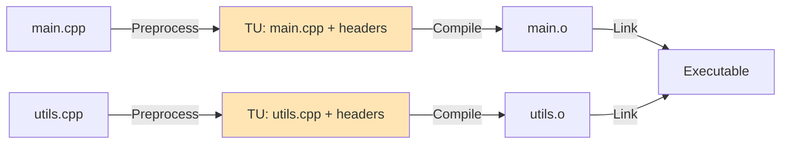

# Translation Units

A translation unit is a single source file plus all its included headers after preprocessing. It's the basic unit of compilation in C++.

:::info One File In, One Object Out
Each .cpp file becomes one translation unit, which compiles independently into one object file (.o).
:::

## What is a Translation Unit?

```cpp
// main.cpp (before preprocessing)
#include <iostream>
#include "utils.h"

int main() {
    std::cout << "Hello\n";
}

// After preprocessing = Translation Unit
// Contains: iostream contents + utils.h contents + main.cpp code
// This entire preprocessed result is ONE translation unit
```

**Translation Unit = Preprocessed Source File**

---

## Compilation Flow



Each .cpp file is independently preprocessed and compiled. They don't "see" each other until linking.

---

## Independent Compilation

```cpp
// math.cpp (Translation Unit 1)
int add(int a, int b) {
    return a + b;
}

// main.cpp (Translation Unit 2)
int add(int, int);  // Declaration
int main() {
    return add(5, 3);  // Uses declaration
}
```

```bash
# Compile separately
g++ -c math.cpp -o math.o    # TU1 compiles independently
g++ -c main.cpp -o main.o    # TU2 compiles independently

# Link together
g++ main.o math.o -o app     # Linker connects them
```

Each translation unit compiles without knowing about the others. The linker resolves references later.

---

## One Definition Rule (ODR)

**Rule**: Each symbol can have only ONE definition across all translation units.

### Valid: Definition in One TU

```cpp
// math.cpp (TU1)
int calculate(int x) {
    return x * 2;
}

// main.cpp (TU2)
int calculate(int);  // Declaration only
int main() {
    return calculate(5);
}
```

✅ One definition (`math.cpp`), multiple declarations allowed.

### Invalid: Multiple Definitions

```cpp
// file1.cpp (TU1)
int global = 42;

// file2.cpp (TU2)
int global = 100;  // ❌ ODR violation!

// Link error: multiple definition of 'global'
```

---

## Declarations vs Definitions

### Declarations (Multiple Allowed)

```cpp
// Can appear in multiple TUs
extern int global;           // Variable declaration
void function(int);          // Function declaration
class Widget;                // Forward declaration
```

### Definitions (One Only)

```cpp
// Must appear in exactly ONE TU
int global = 42;                    // Variable definition
void function(int x) { /*...*/ }    // Function definition
class Widget { int value; };        // Class definition
```

**Exception**: Inline functions and templates can be defined in headers (must be identical in all TUs).

---

## Header Files and TUs

Headers are textually included in multiple translation units:

```cpp
// utils.h
int square(int x);  // Declaration

// file1.cpp (TU1)
#include "utils.h"
// square declaration copied here

// file2.cpp (TU2)
#include "utils.h"
// square declaration copied here (same declaration, OK)

// utils.cpp (TU3)
#include "utils.h"
int square(int x) {  // Definition (ONE copy)
    return x * x;
}
```

Declarations can repeat; definitions cannot.

---

## Static vs Extern

### static Keyword

Makes symbols local to the translation unit (internal linkage):

```cpp
// file1.cpp
static int helper = 42;  // Local to file1.cpp
static void internal_func() {}  // Local to file1.cpp

// file2.cpp
static int helper = 100;  // Different variable! Local to file2.cpp
// No ODR violation - different symbols
```

Each TU gets its own copy. No conflicts at link time.

### extern Keyword

Declares a symbol defined elsewhere (external linkage):

```cpp
// globals.cpp
int shared_var = 42;  // Definition

// file1.cpp
extern int shared_var;  // Declaration
void foo() { shared_var = 10; }

// file2.cpp
extern int shared_var;  // Declaration
void bar() { shared_var = 20; }
```

All TUs share the same `shared_var` via linker.

---

## Inline Functions

Inline functions can be defined in headers without ODR violations:

```cpp
// header.h
inline int square(int x) {
    return x * x;
}

// file1.cpp
#include "header.h"  // square definition copied

// file2.cpp
#include "header.h"  // square definition copied again

// ✅ OK: Linker keeps one copy, discards duplicates
```

**Requirements**: All definitions must be **identical**. The linker picks one and discards the rest.

---

## Templates and TUs

Templates must be fully visible in each TU that uses them:

```cpp
// ❌ Wrong: Template split between header and source
// math.h
template<typename T>
T max(T a, T b);

// math.cpp
template<typename T>
T max(T a, T b) {
    return a > b ? a : b;
}

// main.cpp
#include "math.h"
max(5, 10);  // ❌ Linker error: undefined reference
```

**Why?** The compiler needs the template definition to instantiate `max<int>` in main.cpp's TU.

**Solution**: Define templates in headers:

```cpp
// math.h
template<typename T>
T max(T a, T b) {
    return a > b ? a : b;  // ✅ Definition in header
}
```

---

## Anonymous Namespaces

Modern alternative to `static` for internal linkage:

```cpp
// file.cpp
namespace {
    int internal_var = 42;  // Local to this TU
    void helper() {}        // Local to this TU
}

void public_func() {
    internal_var++;  // Can use internal symbols
}
```

Symbols in anonymous namespaces have internal linkage - not visible to other TUs.

---

## Translation Unit Size Impact

### Large Translation Units

```cpp
// main.cpp
#include <iostream>   // ~10,000 lines
#include <vector>     // ~5,000 lines
#include <algorithm>  // ~8,000 lines
#include <map>        // ~6,000 lines

int main() {
    std::cout << "Hello\n";
}
// TU size: ~30,000+ lines to compile!
```

**Impact**: Slower compilation. Every time main.cpp changes, 30,000+ lines recompile.

**Solution**: Forward declarations, separate headers, precompiled headers.

### Minimizing TU Size

```cpp
// ✅ Better: Forward declare when possible
// widget.h
class Database;  // Forward declaration (no need to include database.h)

class Widget {
    Database* db;  // Pointer/reference OK with forward declaration
public:
    void process();
};

// widget.cpp (only here include full header)
#include "database.h"
```

---

## Separate Compilation Benefits

```bash
# Change one file
vim main.cpp

# Only recompile that TU
g++ -c main.cpp -o main.o    # Fast!

# Relink (fast)
g++ main.o utils.o db.o -o app

# vs. recompiling everything:
g++ main.cpp utils.cpp db.cpp -o app  # Slow!
```

Separate compilation enables incremental builds - only modified TUs recompile.

---

## Checking Translation Unit Contents

```bash
# Preprocess to see TU contents
g++ -E main.cpp -o main.i

# See what gets included
g++ -H main.cpp
# Output:
# . /usr/include/c++/11/iostream
# .. /usr/include/x86_64-linux-gnu/c++/11/bits/c++config.h
# ...

# Count TU size
g++ -E main.cpp | wc -l
# Output: 32456 lines
```

---

## Summary

Translation Unit:
- **= Preprocessed source file** (source + all included headers)
- **Compiles independently** into object file
- **Must obey ODR**: One definition per symbol across all TUs
- **static/anonymous namespace**: Internal linkage (TU-local)
- **extern**: External linkage (shared across TUs)
- **inline/template**: Special rules (can repeat)

**Key concepts**:
```cpp
// Declaration (multiple TUs OK)
extern int var;
void func();

// Definition (ONE TU only)
int var = 42;
void func() {}

// Internal linkage (per-TU)
static int local;
namespace { int local; }

// Can repeat (compiler merges)
inline int square(int x) { return x*x; }
template<typename T> T max(T a, T b);
```

Understanding translation units is essential for managing compilation, avoiding ODR violations, and optimizing build times.