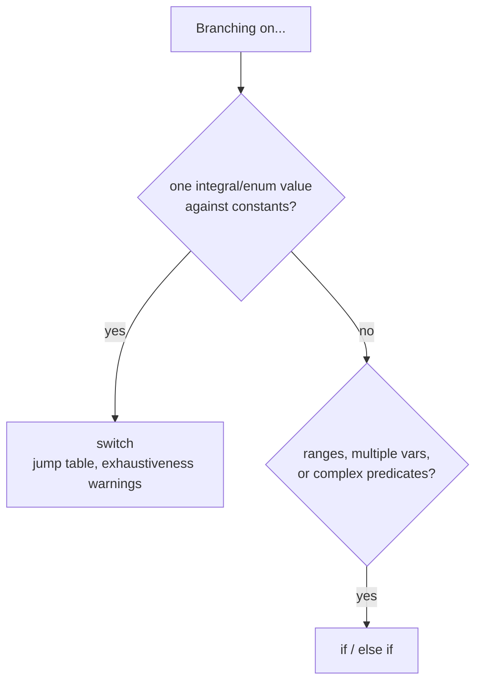

# Conditional Statements (`if`, `switch`)

Conditionals choose a branch at runtime. Modern C++ adds two things worth knowing beyond the basic
forms: **init-statements** (scope a variable to the condition) and **`if constexpr`** (branch at
*compile* time).

## `if` / `else`

```cpp showLineNumbers
if (score >= 90) {
    grade = 'A';
} else if (score >= 80) {   // chained — only reached if the first test failed
    grade = 'B';
} else {
    grade = 'C';
}
```

The condition is contextually converted to `bool`. Always brace the body, even one-liners — the
unbraced form is the source of the infamous "goto fail" class of bugs.

### Init-statement (C++17)

Declare a variable *and* test it in one statement; the variable is scoped to the `if`/`else` only.
This keeps short-lived results (lookups, locks, error codes) out of the enclosing scope.

```cpp showLineNumbers
if (auto it = cache.find(key); it != cache.end()) {
    use(it->second);        // 'it' is visible here...
} else {
    insert(key);            // ...and here...
}                           // ...but not after the if — no leaked name
```

### `if constexpr` (C++17)

The condition is evaluated by the compiler and the **discarded branch is not compiled** for the
instantiated type. Indispensable in templates, where the other branch may not even be valid code.

```cpp showLineNumbers
template <class T>
auto to_string(T v) {
    if constexpr (std::is_arithmetic_v<T>)
        return std::to_string(v);       // compiled only when T is numeric
    else
        return std::string{v};          // compiled only otherwise
}
```

## `switch`

A `switch` dispatches on an **integral or enum** value. It is not just sugar for `if` chains: the
compiler can lower a dense `switch` to a jump table (O(1)), which an `if`/`else if` ladder cannot.

```cpp showLineNumbers
switch (token) {
    case '+':
    case '-':                       // stacked labels share the body
        apply_additive(token);
        break;                      // REQUIRED — see fall-through below
    case '*':
        apply_multiplicative();
        break;
    default:                        // catch-all; put it last by convention
        report_unknown(token);
}
```

:::warning Fall-through is implicit
Without `break`, control falls into the next case. Occasionally intended, usually a bug. Mark the
deliberate cases with `[[fallthrough]];` (C++17) so the compiler stops warning *and* the intent is
documented:

```cpp
case 'a':
    prepare();
    [[fallthrough]];        // explicit: yes, fall into 'b'
case 'b':
    run();
    break;
```
:::

### Init-statement and enums

`switch` also takes a C++17 init-statement. With a scoped `enum`, list every enumerator and omit
`default` — the compiler will then warn when a new enumerator is added but unhandled:

```cpp showLineNumbers
switch (auto s = device.poll(); s) {
    case State::Idle:    spin();  break;
    case State::Active:  work();  break;
    case State::Faulted: reset(); break;
    // no default: -Wswitch flags any State you forgot
}
```

## `if`/`else` vs `switch`



## Summary

- Always brace bodies; use the C++17 init-statement to scope condition-local variables.
- `if constexpr` discards the dead branch at compile time — essential in templates.
- `switch` needs `break`; mark intentional fall-through with `[[fallthrough]]`.
- For scoped enums, drop `default` to get exhaustiveness warnings.
- Prefer `switch` for one value vs many constants; `if` for ranges and compound conditions.

## Related

- [Loops](./loops.md)
- [goto and Labels](./goto-and-labels.md)
- [Logical Operators](../operators/logical.md) — short-circuit in conditions
