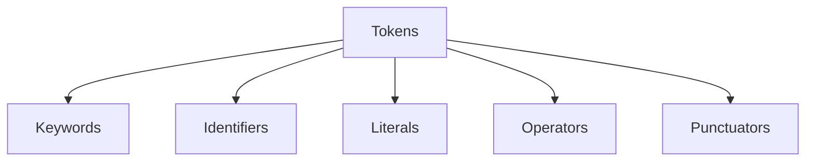

# Keywords and Tokens

Tokens are the smallest units of a C++ program. Keywords are reserved words with special meaning that cannot be used as identifiers.

:::info Lexical Analysis
The compiler breaks source code into tokens during lexical analysis (first phase of compilation).
:::

## Token Categories



---

## Keywords (Reserved Words)

C++ keywords have predefined meanings and cannot be used as variable/function names.

### C++98 Keywords (63)

```cpp showLineNumbers 
asm          auto        bool        break             case
catch        char        class       const             const_cast
continue     default     delete      do                double
dynamic_cast else        enum        explicit          export
extern       false       float       for               friend
goto         if          inline      int               long
mutable      namespace   new         operator          private
protected    public      register    reinterpret_cast  static
return       short       signed      sizeof            this
static_cast  struct      switch      template          typeid
throw        true        try         typedef           virtual
typename     union       unsigned    using             
void         volatile    wchar_t     while
```

### C++11 Added (12)

```cpp showLineNumbers 
alignas      alignof     char16_t    char32_t    constexpr
decltype     noexcept    nullptr     static_assert
thread_local
```

### C++20 Added (10)

```cpp showLineNumbers 
char8_t      concept     consteval   constinit   co_await
co_return    co_yield    requires    import      module
```

### Usage Examples

```cpp showLineNumbers 
// Control flow keywords
if, else, switch, case, default
for, while, do
break, continue, return, goto

// Type keywords
int, char, float, double, bool, void
auto, decltype (type deduction)

// OOP keywords
class, struct, public, private, protected
virtual, override, final
this, new, delete

// Template keywords
template, typename

// Exception keywords
try, catch, throw, noexcept

// C++11+ keywords
constexpr, nullptr, static_assert
```

---

## Identifiers

Names for variables, functions, classes, etc.

### Rules

```cpp showLineNumbers 
// Valid identifiers
int count;
int _private;
int value123;
int camelCase;
int snake_case;

// Invalid identifiers
int 123value;    // ❌ Cannot start with digit
int my-var;      // ❌ Hyphen not allowed
int class;       // ❌ Keyword
int my var;      // ❌ Space not allowed
```

**Rules**:
- Start with letter (a-z, A-Z) or underscore (`_`)
- Followed by letters, digits, underscores
- Cannot be keywords
- Case-sensitive (`value` ≠ `Value`)

### Naming Conventions

```cpp showLineNumbers 
// Variables: snake_case or camelCase
int user_count;
int userCount;

// Constants: UPPER_SNAKE_CASE
const int MAX_SIZE = 100;
constexpr double PI = 3.14159;

// Classes/Structs: PascalCase
class UserAccount;
struct DataPoint;

// Functions: camelCase or snake_case
void calculateSum();
void calculate_sum();

// Private members: prefix underscore
class Widget {
    int _value;      // Common convention
    int m_value;     // Alternative (m_ prefix)
};
```

### Reserved Names

Avoid these patterns (reserved for implementation):

```cpp showLineNumbers 
// ❌ Reserved by standard
_Capital     // Names starting with _ followed by capital
__double     // Names with double underscore
std::_impl   // Anything in std namespace starting with _

// ✅ OK
_lowercase   // OK in local scope
my_var_      // Trailing underscore OK
```

---

## Literals

Fixed values in source code.

### Integer Literals

```cpp showLineNumbers 
42           // Decimal
0b101010     // Binary (C++14)
052          // Octal (leading 0)
0x2A         // Hexadecimal

// Suffixes
42u          // unsigned
42l          // long
42ul         // unsigned long
42ll         // long long

// Digit separators (C++14)
1'000'000    // 1 million
0b1111'0000  // Binary with separator
```

### Floating-Point Literals

```cpp showLineNumbers 
3.14         // double
3.14f        // float
3.14L        // long double

1.5e10       // Scientific: 1.5 × 10^10
1.5e-5       // 0.000015

// Hexadecimal float (C++17)
0x1.2p3      // 1.125 × 2^3 = 9.0
```

### Character Literals

```cpp showLineNumbers 
'A'          // char
L'A'         // wchar_t
u'A'         // char16_t (C++11)
U'A'         // char32_t (C++11)
u8'A'        // char8_t (C++20)

// Escape sequences
'\n'         // Newline
'\t'         // Tab
'\\'         // Backslash
'\''         // Single quote
'\"'         // Double quote
'\0'         // Null character
'\x41'       // Hex (A)
'\101'       // Octal (A)
```

### String Literals

```cpp showLineNumbers 
"Hello"      // const char*
L"Hello"     // const wchar_t*
u"Hello"     // const char16_t* (C++11)
U"Hello"     // const char32_t* (C++11)
u8"Hello"    // const char8_t* (C++20)

// Raw string (C++11)
R"(Line 1
Line 2)"     // Preserves newlines, no escape processing

R"delimiter(Text with "quotes" and \ backslash)delimiter"

// Adjacent strings concatenate
"Hello, " "World"  // "Hello, World"
```

### Boolean Literals

```cpp showLineNumbers 
true         // Boolean true
false        // Boolean false
```

### Pointer Literal

```cpp showLineNumbers 
nullptr      // Null pointer (C++11)
NULL         // Old style (avoid, it's 0)
```

### User-Defined Literals (C++11)

```cpp showLineNumbers 
// Define custom suffix
constexpr long long operator"" _km(long long x) {
    return x * 1000;
}

auto distance = 5_km;  // 5000

// Standard library examples
using namespace std::literals;
auto str = "hello"s;      // std::string
auto dur = 5s;            // std::chrono::seconds
auto dur2 = 100ms;        // milliseconds
```

---

## Operators

### Arithmetic

```cpp showLineNumbers 
+  -  *  /  %           // Binary
+  -                    // Unary
++  --                  // Increment/decrement
```

### Comparison

```cpp showLineNumbers 
==  !=  <  >  <=  >=
<=>                     // Three-way comparison (C++20)
```

### Logical

```cpp showLineNumbers 
&&  ||  !               // AND, OR, NOT
and or not              // Alternative tokens (rare)
```

### Bitwise

```cpp showLineNumbers 
&  |  ^  ~              // AND, OR, XOR, NOT
<<  >>                  // Shift
```

### Assignment

```cpp showLineNumbers 
=  +=  -=  *=  /=  %=
&=  |=  ^=  <<=  >>=
```

### Other

```cpp showLineNumbers 
? :                     // Ternary
,                       // Comma
.  ->                   // Member access
::                      // Scope resolution
.*  ->*                 // Pointer-to-member
```

---

## Punctuators

```cpp showLineNumbers 
;                       // Statement terminator
,                       // Separator
:                       // Label, base class, initializer
::                      // Scope resolution
...                     // Variadic (C++11)
{}                      // Braces (blocks, initialization)
[]                      // Brackets (arrays, subscript)
()                      // Parentheses (grouping, calls)
<>                      // Angle brackets (templates, includes)
```

---

## Alternative Tokens

Rarely used text alternatives for operators:

```cpp showLineNumbers 
// Operator    Alternative
and            &&
or             ||
not            !
and_eq         &=
or_eq          |=
xor            ^
xor_eq         ^=
bitand         &
bitor          |
compl          ~
not_eq         !=

// Example
if (x > 0 and y < 10)  // Same as: x > 0 && y < 10
```

---

## Comments (Not Tokens)

Comments are removed during preprocessing:

```cpp showLineNumbers 
// Single-line comment

/* Multi-line
   comment */
```

---

## Summary

**Tokens**: Smallest units (keywords, identifiers, literals, operators, punctuators)

**Keywords**: Reserved words (`if`, `class`, `int`, etc.)
- C++98: 63 keywords
- C++11: +12 keywords
- C++20: +9 keywords

**Identifiers**: User-defined names
- Start with letter or `_`
- Case-sensitive
- Cannot be keywords

**Literals**: Fixed values
- Integers: `42`, `0x2A`, `0b101010`
- Floats: `3.14f`, `1.5e10`
- Chars: `'A'`, `'\n'`
- Strings: `"Hello"`, `R"(raw)"`
- Boolean: `true`, `false`
- Pointer: `nullptr`

```cpp showLineNumbers 
// Example with all token types
int         // keyword
count       // identifier
=           // operator
42          // literal
;           // punctuator
```